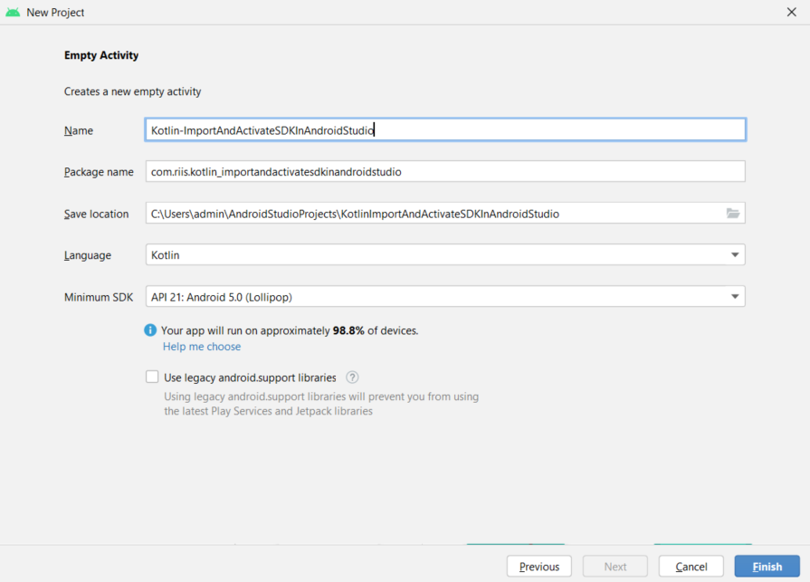

# Integrating DJI Android SDK into an Android Application

The tutorial below demonstrates how to import the DJI Android SDK into a new Android project. Similar steps can be taken for integrating the SDK into an existing application.

## Android Studio Project Setup

Screenshots in this section were generated while using Android Studio 3.0. It is recommended, however to use the latest version of Android Studio.

### Create a New Application

This application will be used solely to demonstrate how to integrate the DJI Android SDK into an Android Studio project.

*   Open Android Studio and on the start-up screen select **File -> New Project**

*   In the **New Project** screen:
    *   Set the device to **"Phone and Tablet"**.
    *   Set the template to **"Empty Activity"** and then press **"Next"**.

<p "center">
  
 </p>

*   On the next screen:
    * Set the **Application name** to your desired app name. In this example we will use "ImportSDKDemo".
    * The **Package name** is conventionally set to something like "com.companyName.applicationName". We will use "com.dji.importsdkdemo".
    * Set **Language** to Kotlin
    * Set **Minimum SDK** to API 19: Android 4.4 (KitKat)
    * Do NOT check the option to "Use legacy android.support.libraries"
    * Click **Finish** to create the project.

<p "center">
  
 </p>

> **Note:** **Package name** is the identifying string required to [generate an App Key](https://developer.dji.com/windows-sdk/documentation/quick-start/index.html#generate-an-app-key). The activity java, manifest xml and Gradle script code below assumes **Package name** is "com.riis.kotlin_importandactivatesdkinandroidstudio"


### Configure the Gradle Script

Double click on "build.gradle(Module: app)" in the project navigator to open it. Then add the following code to it:

```gradle
plugins {
    id 'com.android.application'
    id 'kotlin-android'
}

android {
    compileSdkVersion 31
    buildToolsVersion "30.0.3"

    defaultConfig {
        applicationId 'com.com.riis.kotlin_importandactivatesdkinandroidstudio'
        minSdkVersion 21
        targetSdkVersion 30
        versionCode 1
        multiDexEnabled true
        versionName "1.0"
        ndk {
            // On x86 devices that run Android API 23 or above, if the application is targeted with API 23 or
            // above, FFmpeg lib might lead to runtime crashes or warnings.
            abiFilters 'armeabi-v7a', 'x86', 'arm64-v8a'
        }

        testInstrumentationRunner "androidx.test.runner.AndroidJUnitRunner"
    }

    buildTypes {
        release {
            minifyEnabled false
            proguardFiles getDefaultProguardFile('proguard-android.txt'), 'proguard-rules.pro'
        }
        debug {
            shrinkResources false
            minifyEnabled false
            proguardFiles getDefaultProguardFile('proguard-android.txt'), 'proguard-rules.pro'
        }
    }
    compileOptions {
        sourceCompatibility JavaVersion.VERSION_1_8
        targetCompatibility JavaVersion.VERSION_1_8
    }
    kotlinOptions {
        jvmTarget = '1.8'
    }
    dexOptions {
        javaMaxHeapSize "4g"
    }

    packagingOptions {
        doNotStrip "*/*/libdjivideo.so"
        doNotStrip "*/*/libSDKRelativeJNI.so"
        doNotStrip "*/*/libFlyForbid.so"
        doNotStrip "*/*/libduml_vision_bokeh.so"
        doNotStrip "*/*/libyuv2.so"
        doNotStrip "*/*/libGroudStation.so"
        doNotStrip "*/*/libFRCorkscrew.so"
        doNotStrip "*/*/libUpgradeVerify.so"
        doNotStrip "*/*/libFR.so"
        doNotStrip "*/*/libDJIFlySafeCore.so"
        doNotStrip "*/*/libdjifs_jni.so"
        doNotStrip "*/*/libsfjni.so"
        doNotStrip "*/*/libDJICommonJNI.so"
        doNotStrip "*/*/libDJICSDKCommon.so"
        doNotStrip "*/*/libDJIUpgradeCore.so"
        doNotStrip "*/*/libDJIUpgradeJNI.so"
        exclude 'META-INF/rxjava.properties'
    }
}

dependencies {

    implementation('com.dji:dji-sdk:4.16')
    compileOnly('com.dji:dji-sdk-provided:4.16')

    implementation 'androidx.multidex:multidex:2.0.1'
    implementation 'com.squareup:otto:1.3.8'
    implementation 'com.google.android.material:material:1.5.0'

    implementation 'androidx.appcompat:appcompat:1.4.1'
    implementation 'androidx.core:core-ktx:1.7.0'
    implementation 'androidx.constraintlayout:constraintlayout:2.1.3'
    implementation 'androidx.recyclerview:recyclerview:1.2.1'
    implementation 'androidx.lifecycle:lifecycle-extensions:2.2.0'
    implementation 'androidx.annotation:annotation:1.3.0'
    implementation 'com.jakewharton:butterknife:10.2.3'
    annotationProcessor 'com.jakewharton:butterknife-compiler:10.2.3'
    implementation "androidx.core:core-ktx:1.7.0"
    implementation 'androidx.lifecycle:lifecycle-viewmodel-ktx:2.4.0'
    implementation 'org.jetbrains.kotlinx:kotlinx-coroutines-core:1.6.0-native-mt'
    implementation 'org.jetbrains.kotlinx:kotlinx-coroutines-android:1.6.0-native-mt'


}

// Please uncomment the following code if you use your own sdk version.
//apply from : "https://terra-1-g.djicdn.com/71a7d383e71a4fb8887a310eb746b47f/msdk/Android-CommonConfig/config_sample_all.gradle"
```

Next, double click on the "build.gradle(Project: app)" in the project navigator to open it and replace the contents with the following code:

```gradle
// Top-level build file where you can add configuration options common to all sub-projects/modules.
buildscript {
    ext.kotlin_version = '1.6.10'
    repositories {
        google()
        mavenCentral()
    }
    dependencies {
        classpath 'com.android.tools.build:gradle:7.0.4'
        classpath "org.jetbrains.kotlin:kotlin-gradle-plugin:$kotlin_version"

        // NOTE: Do not place your application dependencies here; they belong
        // in the individual module build.gradle files
    }
}

allprojects {
    repositories {
        google()
        mavenCentral()
    }
}

task clean(type: Delete) {
    delete rootProject.buildDir
}
```

Then, finally make sure in your settings.gradle you only have

```gradle
rootProject.name = "Kotlin-ImportAndActivateSDKInAndroidStudio"
include ':app'
```


In the code above, we implement the following features:

1.  Add the `packagingOptions` to prevent any unexpected crash of the application.
2.  Add the `compileOnly` and `implementation` dependencies to import the latest DJI Android UX SDK and SDK Maven dependency.

Once you finished the steps above, click the "Sync Now" option that pops up. Alternatively, select **File -> Sync Project with Gradle Files** and wait for Gradle project sync to finish.

### Double Check Maven Dependency

Select **File->Project Structure** in the Android Studio menu to open the "Project Structure" window. Then select the "app" module and click the **Dependencies** tab. You should see the latest DJI Android UX SDK compile and sdk provided dependencies are already imported.


## Application Registration

Now let's register our application with the **App Key** you apply from DJI Developer Website. If you are not familiar with the App Key, please check the [Get Started](https://developer.dji.com/mobile-sdk/documentation/quick-start/index.html).

### Implementing Application class
 
Right click on the 'com.riis.kotlin_importandactivatesdkinandroidstudio' module in the project navigator and select "New -> Kotlin Class/File" to create a new file, enter "MApplication" as the **Name** and then double click **Class**. Then replace the code with the following:

```kotlin
package com.riis.kotlin_importandactivatesdkinandroidstudio

import android.app.Application
import android.content.Context
import com.secneo.sdk.Helper

class MApplication: Application() {

    override fun attachBaseContext(base: Context?) {
        super.attachBaseContext(base)
        Helper.install(this)
    }
}
```

Here, we override the `attachBaseContext()` method to add the `Helper.install(MApplication.this);` line of code.

> Note: Since some of SDK classes now need to be loaded before using, the loading process is done by `Helper.install()`. Developer needs to invoke this method before using any SDK functionality. Failing to do so will result in unexpected crashes.

### Working on the MainActivity

Once we finished the steps above, let's open the "MainActivity.kt" file, and replace the code with the following:. Here we explain the important part of it:

```kotlin
package com.riis.kotlin_importandactivatesdkinandroidstudio

import android.Manifest
import android.content.Intent
import android.content.pm.PackageManager
import android.os.Build
import androidx.appcompat.app.AppCompatActivity
import android.os.Bundle
import android.os.Handler
import android.os.Looper
import android.util.Log
import android.widget.Toast
import androidx.core.app.ActivityCompat
import androidx.core.content.ContextCompat
import dji.common.error.DJIError
import dji.common.error.DJISDKError
import dji.sdk.base.BaseComponent
import dji.sdk.base.BaseProduct
import dji.sdk.sdkmanager.DJISDKInitEvent
import dji.sdk.sdkmanager.DJISDKManager
import java.util.concurrent.atomic.AtomicBoolean

class MainActivity : AppCompatActivity() {

    /**
     * The following class variables can be called without having to create an instance of the MainActivity class
     */
    companion object {
        private val TAG = "MainActivity"
        private const val FLAG_CONNECTION_CHANGE = "dji_sdk_connection_change"
        private lateinit var mProduct: BaseProduct
        private lateinit var mHandler: Handler //this allows you to send and process Message and Runnable objects associated with a thread's MessageQueue

        //array of permission strings defined in the AndroidManifest, which the app requires and may need to request the user for permission to use.
        private val REQUIRED_PERMISSION_LIST: Array<String> = arrayOf(
            Manifest.permission.VIBRATE,
            Manifest.permission.INTERNET,
            Manifest.permission.ACCESS_WIFI_STATE,
            Manifest.permission.WAKE_LOCK,
            Manifest.permission.ACCESS_COARSE_LOCATION,
            Manifest.permission.ACCESS_NETWORK_STATE,
            Manifest.permission.ACCESS_FINE_LOCATION,
            Manifest.permission.CHANGE_WIFI_STATE,
            Manifest.permission.WRITE_EXTERNAL_STORAGE,
            Manifest.permission.BLUETOOTH,
            Manifest.permission.BLUETOOTH_ADMIN,
            Manifest.permission.READ_EXTERNAL_STORAGE,
            Manifest.permission.READ_PHONE_STATE,
        )
        private const val REQUEST_PERMISSION_CODE = 125 //integer constant used when requesting app permissions
    }

    /**
     * Class Variables
     */
    private val missingPermission = ArrayList<String>()
    private val isRegistrationInProgress = AtomicBoolean(false) //This boolean can be accessed and updated by multiple threads

    /**
     * Creating the Activity
     */
    override fun onCreate(savedInstanceState: Bundle?) {
        super.onCreate(savedInstanceState)

        Log.d(TAG, "MainActivity created")

        //If the Android version running on the user's device is at least Android 6 (Marshmallow) or API level 23, check and request permissions.
        //Android versions below 6 automatically grants access to these permissions, which can be dangerous.
        if(Build.VERSION.SDK_INT >= Build.VERSION_CODES.M){
            checkAndRequestPermissions()
        }

        setContentView(R.layout.activity_main) //inflates the activity_main layout as the activity's view

        mHandler = Handler(Looper.getMainLooper()) //initiates a Handler that uses the app's main looper (runs on the UI thread)
    }

    /**
     * Checking and Requesting Permissions
     */
    private fun checkAndRequestPermissions(){
        //For each permission in the REQUIRED_PERMISSION_LIST, if the device has not already granted this permission, add it to the missingPermission list
        for(eachPermission in REQUIRED_PERMISSION_LIST){
            if(ContextCompat.checkSelfPermission(this, eachPermission) != PackageManager.PERMISSION_GRANTED){
                missingPermission.add(eachPermission)
                Log.d(TAG, "missing permission: $eachPermission")
            }
        }
        if(missingPermission.isEmpty()){ //if there are no missing permissions, start SDK registration
            startSDKRegistration()
        }else if(Build.VERSION.SDK_INT >= Build.VERSION_CODES.M){ //if there are missing permissions, request the user to grant the permissions
            showToast("Need to grant the permission")
            //Making the permission request. The result is handled in onRequestPermissionsResult()
            ActivityCompat.requestPermissions(this,
                missingPermission.toArray(arrayOfNulls<String>(missingPermission.size)),
                REQUEST_PERMISSION_CODE)
        }
    }

    /**
     * SDK Registration
     */
    private fun startSDKRegistration(){
        if(isRegistrationInProgress.compareAndSet(false, true)) { //if isRegistrationInProgress is false, set to true
            showToast("Registering, please wait...")

            //Getting an instance of the DJISDKManager and using it to register the app (requires API key in AndroidManifest)
            DJISDKManager.getInstance().registerApp(applicationContext, object: DJISDKManager.SDKManagerCallback {

                //checking registration
                override fun onRegister(error: DJIError?) {
                    error?.let{
                        //If registration is successful, start a connection to the DJI product.
                        if(error == DJISDKError.REGISTRATION_SUCCESS){
                            showToast("Register Success")
                            DJISDKManager.getInstance().startConnectionToProduct()
                        //If registration is unsuccessful, prompt user and log the registration error
                        }else{
                            showToast("Register sdk fails, please check the bundle id and network connection!")
                        }
                        Log.v(TAG, error.description)
                    }

                }

                //called when the remote controller disconnects from the user's mobile device
                override fun onProductDisconnect() {
                    Log.d(TAG, "onProductDisconnect")
                    showToast("Remote Controller Disconnected")
                    notifyStatusChange()
                }

                //called the remote controller connects to the user's mobile device
                override fun onProductConnect(product: BaseProduct?) {
                    Log.d(TAG, "onProductConnect newProduct: $product")
                    showToast("Remote Controller Connected")
                    notifyStatusChange()
                }

                //called when the DJI aircraft changes
                override fun onProductChanged(p0: BaseProduct?) {
                    if (p0.toString() == "None"){
                        showToast("aircraft disconnected")
                    }
                    else{
                        showToast("aircraft: $p0 connected")
                    }

                }
                
                //Called when a component object changes. This method is not called if the component is already disconnected
                override fun onComponentChange(
                    componentKey: BaseProduct.ComponentKey?,
                    oldComponent: BaseComponent?,
                    newComponent: BaseComponent?
                ) {
                    //Listen to connectivity changes in the new component
                    newComponent?.let{ it ->
                        it.setComponentListener {
                            Log.d(TAG, "onComponentConnectivityChanged: $it")
                            notifyStatusChange()
                        }
                    }

                    //Alert the user which component has changed, and mention what new component replaced the old component (can be null)
                    showToast("onComponentChange key: $componentKey, oldComponent: $oldComponent, newComponent: $newComponent")
                    Log.d(TAG, "onComponentChange key: $componentKey, oldComponent: $oldComponent, newComponent: $newComponent")

                }

                //called when loading SDK resources
                override fun onInitProcess(p0: DJISDKInitEvent?, p1: Int) {
                    //TODO
                }

                //Called when Fly Safe database download progress is updated
                override fun onDatabaseDownloadProgress(p0: Long, p1: Long) {
                    //TODO
                }

            })
        }

    }

    /**
     * Function used to notify the app of status changes
     */
    private fun notifyStatusChange(){
        mHandler.removeCallbacks(updateRunnable) //removes any pending posts of updateRunnable from the message queue
        mHandler.postDelayed(updateRunnable, 500) //adds a new updateRunnable to the message queue, which is executed 0.5 seconds after
    }

    /**
     * Runnable object (executable command) that sends a broadcast with a specific intent.
     */
    private val updateRunnable: Runnable = Runnable {
        val intent = Intent(FLAG_CONNECTION_CHANGE) //This intent lets the broadcast receiver (itself) know that a connection change has occurred.
        sendBroadcast(intent)
    }

    /**
     * Function displays a toast using provided string parameter
     */
    private fun showToast(text: String){
        val handler = Handler(Looper.getMainLooper())
        handler.post{
            Toast.makeText(applicationContext, text, Toast.LENGTH_LONG).show()
        }
    }

    /**
     * Asynchronous function handles the results of ActivityCompat.requestPermissions()
     */
    override fun onRequestPermissionsResult(
        requestCode: Int,
        permissions: Array<out String>,
        grantResults: IntArray
    ) {
        super.onRequestPermissionsResult(requestCode,
            permissions,
            grantResults)
        //For every permission in the missingPermissions list, if the permission is granted, remove it from the list
        if(requestCode == REQUEST_PERMISSION_CODE){
            grantResults.size
            val index = grantResults.size-1
            for(i in index downTo 0){
                if(grantResults[i] == PackageManager.PERMISSION_GRANTED){
                    missingPermission.remove(permissions[i])
                }
            }
        }
        //if there are no missing permissions, start SDK registration
        if(missingPermission.isEmpty()){
            startSDKRegistration()
        }else{
            showToast("Missing Permissions!!")
        }
    }


}
```

Here, we implement several features:

1.  In the `onCreate()` method, we request several permissions at runtime to ensure the SDK works well when the compile and target SDK version is higher than 22(Like Android Marshmallow 6.0 device and API 23). Then, we invoke the `registerApp()` method of `DJISDKManager` to register the application.

2.  Extend the `SDKManagerCallback` class and implement its two interface methods. You can use the `onRegister()` method to check the Application registration status and show text message to inform users. When the product is connected or disconnected, the `onProductConnect()` and `onProductDisconnect()` methods will be invoked. Moreover, we use the `onComponentChange()` method to check the component changes and invoke the `notifyStatusChange()` method to notify the changes.

>Note that we can use the DJI Android SDK class variables inside the `onCreate()` method of the `MainActivity` class after the `MApplication` class is created, which finished loading the SDK classes by invoking the `Helper.install()`.

### Modifying AndroidManifest file

Once you finished the steps above, let's open the "AndroidManifest.xml" file and add the following elements on top of the **application** element:

```xml    
<?xml version="1.0" encoding="utf-8"?>
<manifest xmlns:android="http://schemas.android.com/apk/res/android"
    xmlns:tools="http://schemas.android.com/tools"
    package="com.riis.kotlin_importandactivatesdkinandroidstudio">
    <!-- Permissions and features -->
    <uses-permission android:name="android.permission.BLUETOOTH" />
    <uses-permission android:name="android.permission.BLUETOOTH_ADMIN" />
    <uses-permission android:name="android.permission.VIBRATE" />
    <uses-permission android:name="android.permission.INTERNET" />
    <uses-permission android:name="android.permission.ACCESS_WIFI_STATE" />
    <uses-permission android:name="android.permission.WAKE_LOCK" />
    <uses-permission android:name="android.permission.ACCESS_COARSE_LOCATION" />
    <uses-permission android:name="android.permission.ACCESS_NETWORK_STATE" />
    <uses-permission android:name="android.permission.ACCESS_FINE_LOCATION" />
    <uses-permission android:name="android.permission.CHANGE_WIFI_STATE" />
    <uses-permission android:name="android.permission.MOUNT_UNMOUNT_FILESYSTEMS"
        tools:ignore="ProtectedPermissions" />
    <uses-permission android:name="android.permission.WRITE_EXTERNAL_STORAGE"
        tools:ignore="ScopedStorage" />
    <uses-permission android:name="android.permission.READ_EXTERNAL_STORAGE" />
    <uses-permission android:name="android.permission.SYSTEM_ALERT_WINDOW" />
    <uses-permission android:name="android.permission.READ_PHONE_STATE" />

    <uses-feature android:name="android.hardware.camera" />
    <uses-feature android:name="android.hardware.camera.autofocus" />

    <uses-feature
        android:name="android.hardware.usb.host"
        android:required="false" />
    <uses-feature android:name="android.hardware.usb.accessory" android:required="true" />

    <application
        android:name=".MApplication"
        android:allowBackup="true"
        android:icon="@mipmap/ic_launcher"
        android:label="@string/app_name"
        android:roundIcon="@mipmap/ic_launcher_round"
        android:supportsRtl="true"
        android:theme="@style/Theme.KotlinImportAndActivateSDKInAndroidStudio"
        tools:ignore="AllowBackup">

        <!-- DJI SDK -->
        <uses-library android:name="com.android.future.usb.accessory" />
        <uses-library android:name="org.apache.http.legacy" android:required="false" />
        <meta-data
            android:name="com.dji.sdk.API_KEY"
            android:value="140d1f5a977452d2a9e388ed" />

        <!-- DJI SDK -->

        <activity android:name=".MainActivity"
                android:screenOrientation="fullSensor"
                android:configChanges="orientation"
            android:exported="true">
            <intent-filter>
                <action android:name="android.intent.action.MAIN" />

                <category android:name="android.intent.category.LAUNCHER" />
            </intent-filter>

            <intent-filter>
                <action android:name="android.hardware.usb.action.USB_ACCESSORY_ATTACHED" />
            </intent-filter>
            <meta-data
                android:name="android.hardware.usb.action.USB_ACCESSORY_ATTACHED"
                android:resource="@xml/accessory_filter" />

        </activity>
    </application>

</manifest>

```
Here, we request permissions that the application must be granted in order for it to register DJI SDK correctly. Also, we declare the camera and USB hardware which are used by the application. We need to add the android:name=".MApplication" at the beginning of the application element. We also need to add the USB elements as childs of element on top of the "MainActivity" activity element as shown. It's not totally necessary right now as this app will run without a drone but in future apps it will prompt us to start the app when the controller is connected to the USB.

In the code above, you can substitute your **App Key** of the application for "Please enter your App Key here." in the **value** attribute under the `android:name="com.dji.sdk.API_KEY"` attribute. For the "accessory_filter.xml" file, right click on "res", select "New->Directory", and name it xml. Then, you can copy the "accessory_filter.xml" from this repository into this newly created folder.

>Note it is suggested that you create a variable in your local.properties for your DJI API Key and place the variable name in the manifest. This ensures that your API key will not be tracked by version control systems. To do this copy `DJI_API_KEY=your_dji_key` into local.properties. Then, copy the following into your build.gradle(:app) above the `android` section:
```gradle
Properties properties = new Properties()
properties.load(project.rootProject.file('local.properties').newDataInputStream())
def djiKey = properties.getProperty('DJI_API_KEY')
```
> Next, copy `manifestPlaceholders = [DJI_API_KEY: djiKey]` into the build.gradle(:app) in the `defaultConfig` section. Finally, you can access your local.properties variable in your Android Manifest as such:

```xml
<meta-data
    android:name="com.dji.sdk.API_KEY"
    android:value="${DJI_API_KEY}" />
```


The ImportSDKDemo project can now be run. You can download the sample code of this project from this Github repository.

As this application is only checking for registration and not interacting directly with a product, no product needs to be connected to the application for this to run. Therefore, the application can either be run on a mobile device (with or without a DJI product connected) or in the Android simulator. The application will need internet connectivity to perform registration successfully.

If the App Key was generated correctly and the Android simulator or mobile device has internet connectivity, then the following should be seen:

<p align="center">
   
</p>
