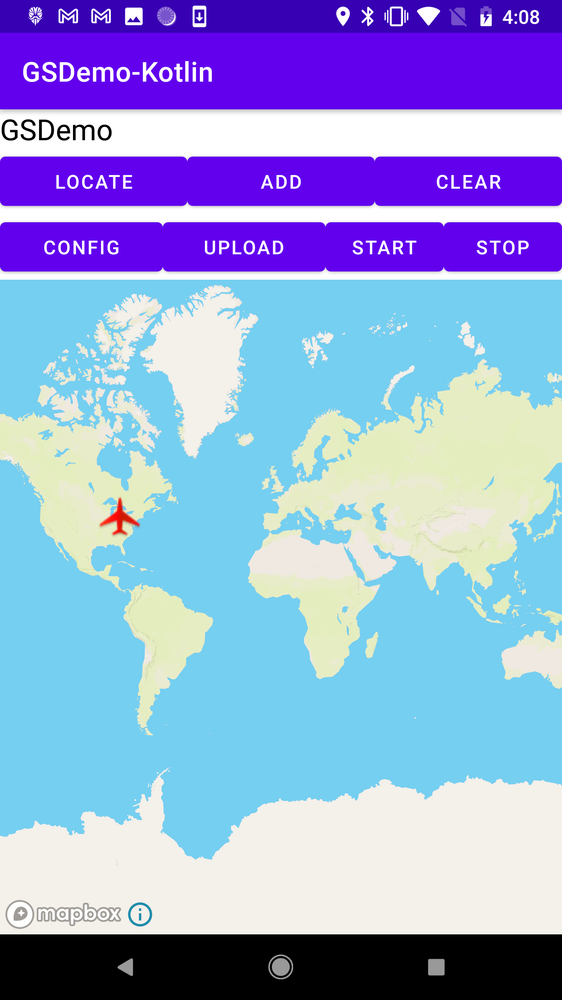
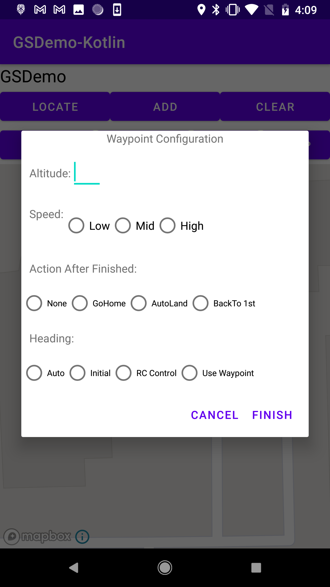
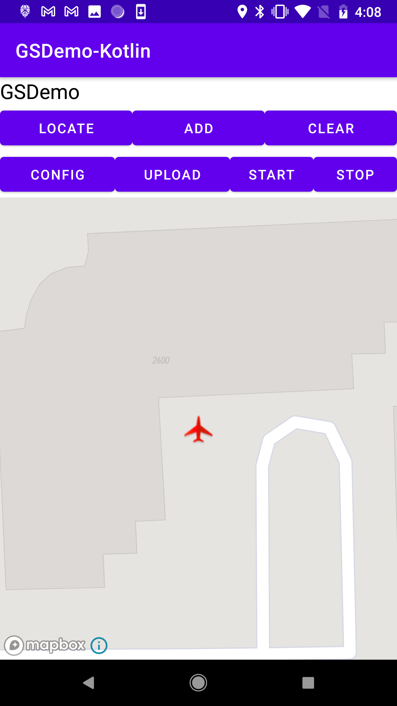
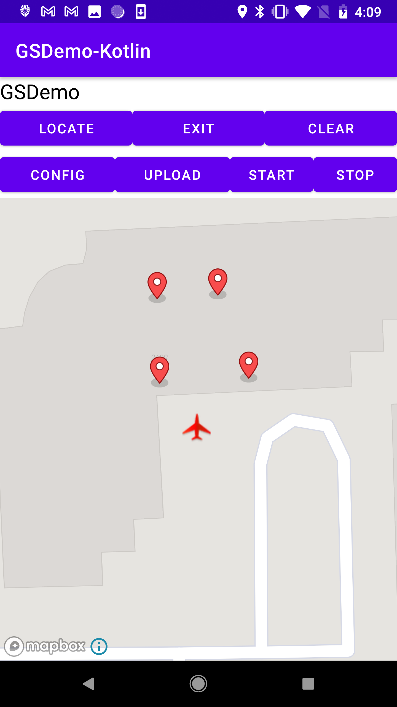
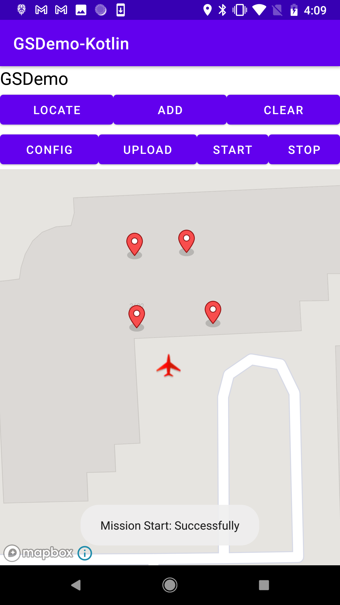
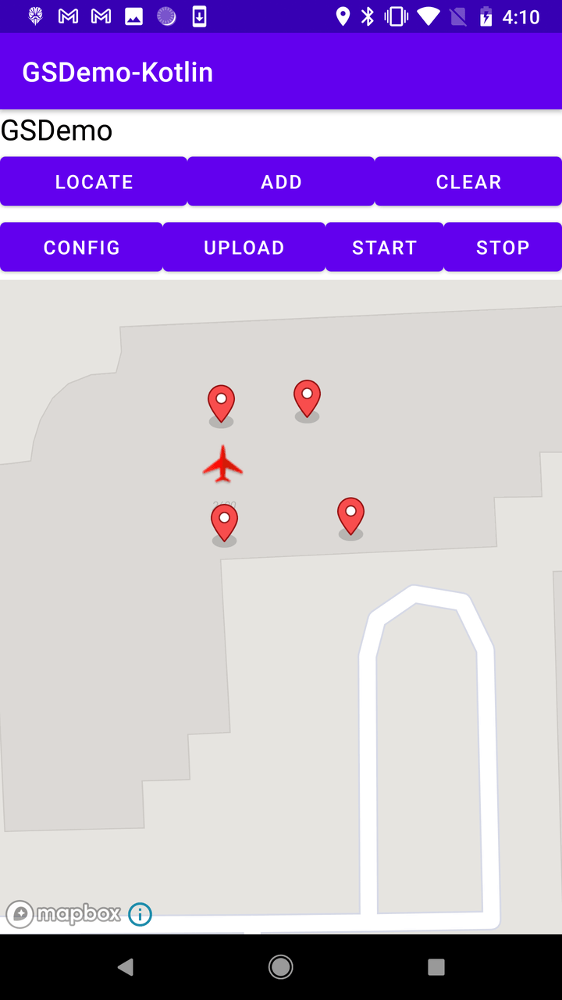

# Creating a MapView and Waypoint Application with MapBox

## DJI LAB 5 TUTORIAL KOTLIN

***`WARNING: THIS TUTORIAL ASSUMES YOU'VE COMPLETED THE PREVIOUS TUTORIALS`***

In this tutorial, you will learn how to implement the DJIWaypoint Mission feature and get familiar with the usages of MissionControl.

Also you will know how to test the Waypoint Mission API with DJI Assistant 2 Simulator too. So let's get started!

You can download the tutorial's final sample project from this [Github Page](https://github.com/riisinterns/drone-lab-six-mapview-waypoint).

> Note: In this tutorial, we will use Mavic Pro for testing, use Android Studio 3.0 for developing the demo application, and use the Mapbox API for navigating.

---

### Preparation

#### 1. Setup Android Development Environment

Throughout this tutorial we will be using the latest version of android studio, which you can download from here: <http://developer.android.com/sdk/index.html>.

---

### Initial Gradle and Manifest Setup

We can use the map view to display waypoints and show the flight route of the aircraft when waypoint mission is being executed. In this tutorial, we will be using MapBox.

#### 1. Create the project

Open Android Studio and select **File -> New -> New Project** to create a new project, named `"GSDemo-Kotlin"`. Enter the company domain and package name `(Here we use "com.riis.gsdemo_kotlin")` you want and press Next. Set the mimimum SDK version as `API 22: Android 5.1 (Lollipop)` for "Phone and Tablet" and press Next. Then select "Empty Activity" and press Next. Lastly, leave the Activity Name as "MainActivity", and the Layout Name as "activity_main", Press "Finish" to create the project.

#### 2. Install the Mapbox SDK

To complete this, follow the steps in the following link: <https://docs.mapbox.com/android/maps/guides/install/>. In order to do this, you'll need to configure your credentials and add the Mapbox SDK as a dependency. Be sure to do everything in this page aside from the "Add a Map" step at the bottom.

Once this is complete, please add the api access token as a raw string to `strings.xml`.

```xml

<resources>
    <string name="app_name">GSDemo-Kotlin</string>
    <string name="action_settings">Settings</string>
    <string name="disconnected">Disconnected</string>
    <string name="product_information">Product Information</string>
    <string name="connection_loose">Status: No Product Connected</string>
    <string name="model_not_available">Model Not Available</string>
    <string name="push_info">Push Info</string>
    <string name="sdk_version">DJI SDK Version: %1$s</string>
    <string name="mapbox_access_token">enter your key here</string>
</resources>
```

#### 3. Android Manifest Permissions

Specify the permissions of your application needs, by adding `<uses-permission>` elements as children of the `<manifest>` element in the `AndroidManifest.xml` file.

```xml
<uses-permission android:name="android.permission.BLUETOOTH" />
<uses-permission android:name="android.permission.BLUETOOTH_ADMIN" />
<uses-permission android:name="android.permission.VIBRATE" />
<uses-permission android:name="android.permission.INTERNET" />
<uses-permission android:name="android.permission.ACCESS_WIFI_STATE" />
<uses-permission android:name="android.permission.WAKE_LOCK" />
<uses-permission android:name="android.permission.ACCESS_COARSE_LOCATION" />
<uses-permission android:name="android.permission.ACCESS_NETWORK_STATE" />
<uses-permission android:name="android.permission.ACCESS_FINE_LOCATION" />
<uses-permission android:name="android.permission.CHANGE_WIFI_STATE" />
<uses-permission android:name="android.permission.MOUNT_UNMOUNT_FILESYSTEMS"
    tools:ignore="ProtectedPermissions" />
<uses-permission android:name="android.permission.WRITE_EXTERNAL_STORAGE"
    tools:ignore="ScopedStorage" />
<uses-permission android:name="android.permission.READ_EXTERNAL_STORAGE" />
<uses-permission android:name="android.permission.SYSTEM_ALERT_WINDOW" />
<uses-permission android:name="android.permission.READ_PHONE_STATE" />
```

#### 4. Adding Multidex Support with Gradle

In order to use Mapbox Service in our project, we need to add Multidex support to avoid the 64K limit with Gradle.

Modify the module-level `build.gradle` file configuration to include the support library and enable multidex output in both **defaultConfig** and **dependencies** parts, as shown in the following code snippet:

```gradle
android {
    compileSdkVersion 30
    buildToolsVersion "30.0.3"

    defaultConfig {
        ...
        minSdkVersion 22
        targetSdkVersion 30
        ...
        
        // Enabling multidex support.
        multiDexEnabled true
    }
    ...
}

dependencies {
  ...
  implementation 'androidx.multidex:multidex:2.0.0'
  implementation 'com.mapbox.mapboxsdk:mapbox-android-sdk:9.6.1'
}
```

In the code above, we declare the "compileSdkVersion", "buildToolsVersion", "minSdkVersion" and "targetSdkVersion". Furthermore, we add the compile `implementation 'com.mapbox.mapboxsdk:mapbox-android-sdk:9.6.1'` to the "dependencies" to support the mapbox service.

Then select **Tools->Android->Sync Project** with Gradle Files to sync the gradle files.

For more details about configuring your App for Multidex with Gradle, please check this link: <http://developer.android.com/tools/building/multidex.html>.

---

### Importing the DJI Dependencies

Please follow [Lab Two: Import and Activate SDK into Application](https://github.com/riisinterns/drone-lab-two-import-and-activate-sdk-in-android-studio) tutorial to learn how to import the Android SDK Maven Dependency for DJI.

---

### Creating App Layouts and Classes

#### 1. Working on the MApplication, DJIDemoApplication, and ConnectionActivity

Please check the [Creating an Camera Application](https://github.com/riisinterns/drone-lab-three-camera-demo) tutorial and its associated sample project for the detailed implementations of `MApplication`.

To improve the user experience, we had better create an activity to show the connection status between the DJI Product and the SDK, once it's connected, the user can press the **OPEN** button to enter the **MainActivity**. You can also check the [Creating an Camera Application](https://github.com/riisinterns/drone-lab-three-camera-demo) tutorial to learn how to implement the `ConnectionActivity` Class and Layout in this project (along with its viewmodel).

In order to create the `DJIDemoApplication.kt` singleton class, please add the following code to that file inside the com.riis.gsdemo_kotlin package:

```kotlin
package com.riis.gsdemo_kotlin

import dji.sdk.base.BaseProduct
import dji.sdk.camera.Camera
import dji.sdk.flightcontroller.FlightController
import dji.sdk.products.Aircraft
import dji.sdk.products.HandHeld
import dji.sdk.sdkmanager.DJISDKManager

object DJIDemoApplication {

    fun getProductInstance(): BaseProduct? {
        return DJISDKManager.getInstance().product
    }

    fun getCameraInstance(): Camera? {
        if (getProductInstance() == null) return null

        if (getProductInstance() is Aircraft) {
            return (getProductInstance() as Aircraft).camera
        } else if (getProductInstance() is HandHeld) {
            return (getProductInstance() as HandHeld).camera
        } else
            return null
    }

    fun getFlightController(): FlightController? {
        // returns flight controller, this is what you will use 
        // to tell the drone how to move
        val product = getProductInstance()?: return null
        if (product.isConnected) {
            if (product is Aircraft) {
                return product.flightController
            }
        }
        return null
    }

    fun isAircraftConnected(): Boolean {
        return getProductInstance() != null && getProductInstance() is Aircraft
    }

    fun isProductModuleAvailable(): Boolean {
        return (getProductInstance() != null)
    }

    fun isCameraModuleAvailable(): Boolean {
        return isProductModuleAvailable() && (getProductInstance()?.camera != null)
    }

    fun isPlaybackAvailable(): Boolean {
        return isCameraModuleAvailable() && (getProductInstance()?.camera?.playbackManager != null)
    }

}
```

This is a singleton class that is used to store the DJI SDK related objects.

* The `getProductInstance()` method is used to get the DJI Product instance.

* The `getCameraInstance()` method is used to get the DJI Camera instance.

* The `getFlightController()` method is used to get the DJI Flight Controller instance which is later used to tell the drone how to move.

* The `isAircraftConnected()` method is used to check if the DJI Product is connected.

* The `isProductModuleAvailable()` method is used to check if the DJI Product's modules can be accessed (ex. the camera).

* The `isCameraModuleAvailable()` method is used to check if the DJI Product's camera module can be accessed and then it returns it.

* The `isPlaybackAvailable()` method is used to check if the DJI Product's camera module has the playback manager and then it returns it.

#### 2. Implementing MainActivity

Open the `activity_main.xml` layout file and replace the code with the following:

```xml
<?xml version="1.0" encoding="utf-8"?>
<androidx.constraintlayout.widget.ConstraintLayout
    xmlns:android="http://schemas.android.com/apk/res/android"
    xmlns:app="http://schemas.android.com/apk/res-auto"
    xmlns:tools="http://schemas.android.com/tools"
    android:layout_width="match_parent"
    android:layout_height="match_parent"
    tools:context=".MainActivity">

    <Button
        android:id="@+id/btn_waypoint1"
        android:layout_width="wrap_content"
        android:layout_height="wrap_content"
        android:background="@drawable/round_btn"
        android:text="Waypoint 1.0"
        android:textColor="@color/colorWhite"
        android:textSize="20dp"
        app:layout_constraintVertical_chainStyle="packed"
        app:layout_constraintLeft_toLeftOf="parent"
        app:layout_constraintRight_toRightOf="parent"
        app:layout_constraintBottom_toTopOf="@+id/btn_waypoint2"
        app:layout_constraintTop_toTopOf="parent" />

    <Button
        android:id="@+id/btn_waypoint2"
        android:layout_width="wrap_content"
        android:layout_height="wrap_content"
        android:background="@drawable/round_btn"
        android:text="Waypoint 2.0"
        android:textColor="@color/colorWhite"
        android:textSize="20dp"
        android:layout_marginTop="50dp"
        app:layout_constraintBottom_toBottomOf="parent"
        app:layout_constraintLeft_toLeftOf="parent"
        app:layout_constraintRight_toRightOf="parent"
        app:layout_constraintTop_toBottomOf="@id/btn_waypoint1" />

</androidx.constraintlayout.widget.ConstraintLayout>
```

In the xml file, we implement the following UIs:

* Create a Constraint Layout to show two buttons arranged vertically.

* The first Button is used to navigate to the part of our application that uses DJI's Waypoint V1.0 in the demo.

* The second Button navigates to something similar except it uses Waypoint V2.0.

Next, copy the `aircraft.png` and `ic_launcher.png` image files from this Github sample project to the drawable folders inside the res folder.

Furthermore, open the `AndroidManifest.xml` file and ensure the following ".MainActivity" activity element exists within the application tag as shown below:

```xml
<activity android:name=".MainActivity" />
```

Finally, ensure that each of the buttons are setup so that you're able to navigate to `Waypoint1Activity.kt` and `Waypoint2Activity.kt` once they are pressed. Edit `MainActivity.kt` as follows:

```kotlin
package com.riis.gsdemo_kotlin

import android.content.Context
import android.content.Intent
import android.os.Bundle
import android.view.View
import androidx.appcompat.app.AppCompatActivity

class MainActivity : AppCompatActivity() {

    private val clickListener =
        View.OnClickListener { v: View -> 
            // based on what the user picks, it'll use either Waypoint 1 or 2
            when (v.id) {
                R.id.btn_waypoint1 -> startActivity(
                    this@MainActivity,
                    Waypoint1Activity::class.java
                )
                R.id.btn_waypoint2 -> startActivity(
                    this@MainActivity,
                    Waypoint2Activity::class.java
                )
            }
        }

    override fun onCreate(savedInstanceState: Bundle?) {
        super.onCreate(savedInstanceState)
        setContentView(R.layout.activity_main)
        findViewById<View>(R.id.btn_waypoint1).setOnClickListener(clickListener) 
        // set the listener to the previously defined clickListener
        findViewById<View>(R.id.btn_waypoint2).setOnClickListener(clickListener)
    }

    private fun startActivity(context: Context, activity: Class<*>?) { 
        // this will start the activity
        val intent = Intent(context, activity)
        context.startActivity(intent)
    }
}
```

Here's a preview of what your main activity is supposed to look like:


#### 3. Creating Waypoint1Activity

This activity is what is launched after clicking its associated button in the MainActivity. It's a simple activity that uses the DJI's Waypoint V1.0 functionality.

First, let's begin with its autgenerated layout file. Please edit `activity_waypoint1.xml` as follows:

```xml
<LinearLayout xmlns:android="http://schemas.android.com/apk/res/android"
    xmlns:tools="http://schemas.android.com/tools"
    android:layout_width="match_parent"
    android:layout_height="match_parent"
    android:orientation="vertical"
    android:background="#FFFFFF"
    xmlns:mapbox="http://schemas.android.com/apk/res-auto"
    tools:context=".MainActivity">

    <LinearLayout
        android:layout_width="match_parent"
        android:layout_height="wrap_content"
        android:orientation="horizontal">
        <TextView
            android:id="@+id/ConnectStatusTextView"
            android:layout_width="wrap_content"
            android:layout_height="wrap_content"
            android:text="GSDemo"
            android:gravity="center"
            android:textColor="#000000"
            android:textSize="21sp"
            />
    </LinearLayout>
    <LinearLayout
        android:layout_width="match_parent"
        android:layout_height="wrap_content"
        android:orientation="horizontal">
        <Button
            android:id="@+id/locate"
            android:layout_width="match_parent"
            android:layout_height="wrap_content"
            android:text="Locate"
            android:layout_weight="1"/>
        <Button
            android:id="@+id/add"
            android:layout_width="match_parent"
            android:layout_height="wrap_content"
            android:text="Add"
            android:layout_weight="1"/>
        <Button
            android:id="@+id/clear"
            android:layout_width="match_parent"
            android:layout_height="wrap_content"
            android:text="Clear"
            android:layout_weight="1"/>
    </LinearLayout>

    <LinearLayout
        android:layout_width="match_parent"
        android:layout_height="wrap_content"
        android:orientation="horizontal">
        <Button
            android:id="@+id/config"
            android:layout_width="match_parent"
            android:layout_height="wrap_content"
            android:text="Config"
            android:layout_weight="0.9"/>
        <Button
            android:id="@+id/upload"
            android:layout_width="match_parent"
            android:layout_height="wrap_content"
            android:text="Upload"
            android:layout_weight="0.9"/>
        <Button
            android:id="@+id/start"
            android:layout_width="match_parent"
            android:layout_height="wrap_content"
            android:text="Start"
            android:layout_weight="1"/>
        <Button
            android:id="@+id/stop"
            android:layout_width="match_parent"
            android:layout_height="wrap_content"
            android:text="Stop"
            android:layout_weight="1"/>
    </LinearLayout>

    <fragment
        android:id="@+id/map"
        android:layout_width="match_parent"
        android:layout_height="match_parent"
        class="com.mapbox.mapboxsdk.maps.SupportMapFragment" />

</LinearLayout>
```

In the xml file, we implement the following UIs:

* Create a LinearLayout to show a TextView with "GSDemo" title and put it on the top.

* Create two lines of Buttons: "LOCATE", "ADD", "CLEAR", "CONFIG", "UPLOAD", "START" and "STOP", place them horizontally.

* Lastly, we create a map view fragment and place it at the bottom.

Furthermore, open the `AndroidManifest.xml` file and ensure the following ".MainActivity" activity element exists within the application tag as shown below:

```xml
<activity android:name=".Waypoint1Activity" />
```

Now, if you check the `activity_waypoint1.xml` file, you should see something similar to the screenshot of MainActivity below (it's okay if you don't see the map view):



For the configuration dialogue layout let's create a new xml file named `dialog_waypointsetting.xml` in the layout folder by right-clicking on the "layout" folder and selecting **New->XML->Layout XML** File. Then replace the code with the [same file](https://github.com/riisinterns/drone-lab-five-mapview-waypoint/blob/main/app/src/main/res/layout/dialog_waypointsetting.xml) as the Github Demo Project. Since the content is too much, it won't be shown here.

This xml file will help to setup a textView to enter "Altitude" and create three RadioButton Groups for selecting **Speed**, **Action After Finished** and **Heading**.

Now, if you check the `dialog_waypointsetting.xml` file, yyou should see something similar to the screenshot of Waypoint Configuration Dialog below:



> NOTE: For a wholistic view of the code, please refer to [Waypoint1Activity](https://github.com/riisinterns/drone-lab-five-mapview-waypoint/blob/main/app/src/main/java/com/riis/gsdemo_kotlin/Waypoint1Activity.kt) located within the demo repository. Explore its comments to get a better understanding of the code. In the next section, we will edit `Waypoint1Activity.kt`.
---

### Implementing the Waypoint Activity

> NOTE: This section is a more in depth version of the previous section.

#### 1. Locating Aircraft on Mapbox Map

Before we implementing the waypoint mission feature, we should show the aircraft's location on the Mapbox Map and try to zoom in automatically to view the surrounding area of the aircraft.

Let's open `Wapoint1Activity.kt` file and declare the following variables first:

```kotlin
private var droneLocationLat: Double = 15.0
private var droneLocationLng: Double = 15.0
private var droneMarker: Marker? = null
```

Then, `override onCreate()` initializes the map instance with the access token while also adding it to the fragment view in the layout. It also initializes the UI (`initUI()`) and adds the waypoint mission operator listeners (`addListener()`).

```kotlin
override fun onCreate(savedInstanceState: Bundle?) {
    super.onCreate(savedInstanceState)
    Mapbox.getInstance(this, getString(R.string.mapbox_access_token)) 
    // this will get your mapbox instance using your access token
    setContentView(R.layout.activity_waypoint1) // use the waypoint1 activity layout

    initUi() // initialize the UI

    val mapFragment = supportFragmentManager.findFragmentById(R.id.map) as SupportMapFragment
    mapFragment.onCreate(savedInstanceState)
    mapFragment.getMapAsync(this)

    addListener() // will add a listener to the waypoint mission operator
}

override fun onResume() {
    super.onResume()
    initFlightController()
}

override fun onDestroy() {
    super.onDestroy()
    removeListener()
}
```

The `updateDroneLocation()` method is used to update the drone's location on the map.

```kotlin
private fun updateDroneLocation() { // this will draw the aircraft as it moves
    //Log.i(TAG, "Drone Lat: $droneLocationLat - Drone Lng: $droneLocationLng")
    if (droneLocationLat.isNaN() || droneLocationLng.isNaN())  { return }

    val pos = LatLng(droneLocationLat, droneLocationLng)
    // the following will draw the aircraft on the screen
    val markerOptions = MarkerOptions()
            .position(pos)
            .icon(IconFactory.getInstance(this).fromResource(R.drawable.aircraft))
    runOnUiThread {
        droneMarker?.remove()
        if (checkGpsCoordination(droneLocationLat, droneLocationLng)) {
            droneMarker = mapboxMap?.addMarker(markerOptions)
        }
    }
}
```

Next, let's implement the `initFlightController()` method which initilizes the flight controller with the aircraft's location and also invokes `updateDroneLocation()` in its state callback:

```kotlin
private fun initFlightController() { 
    // this will initialize the flight controller with predetermined data
    DJIDemoApplication.getFlightController()?.let { flightController ->
        flightController.setStateCallback { flightControllerState ->
            // set the latitude and longitude of the drone based on aircraft location
            droneLocationLat = flightControllerState.aircraftLocation.latitude
            droneLocationLng = flightControllerState.aircraftLocation.longitude
            runOnUiThread {
                updateDroneLocation() // this will be called on the main thread
            }
        }
    }
}
```

`updateDroneLocation()` is also invoked in the `override onClick()` method for the "Locate" button. Similarly, `cameraUpdate()` updates the map camera to follow the drone. This is also called alongside the method above it.

```kotlin
override fun onClick(v: View?) {
    when (v?.id) {
        R.id.locate -> { 
            // will draw the drone and move camera 
            // to the position of the drone on the map
            updateDroneLocation()
            cameraUpdate()
        }
        ...
    }
}
```

Below is the implementation of mentioned the `cameraUpdate()` method:

```kotlin
private fun cameraUpdate() { // update where you're looking on the map
    if (droneLocationLat.isNaN() || droneLocationLng.isNaN())  { return }
    val pos = LatLng(droneLocationLat, droneLocationLng)
    val zoomLevel = 18.0
    val cameraUpdate = CameraUpdateFactory.newLatLngZoom(pos, zoomLevel)
    mapboxMap?.moveCamera(cameraUpdate)
}
```

#### 2. Adding Waypoint Markers

Since you can see the drone clearly on the Mapbox now, you can add Markers on the map to show the waypoints of the Waypoint Mission. Let's continue to declare the `markers` variable first:

```kotlin
private var isAdd = false
private val markers: MutableMap<Int, Marker> = ConcurrentHashMap<Int, Marker>()
```

Then, implement the `override onMapClick()` and `markWaypoint()` methods as shown below:

```kotlin
private fun setResultToToast(string: String) {
    runOnUiThread { Toast.makeText(this, string, Toast.LENGTH_SHORT).show() }
}

override fun onMapClick(point: LatLng): Boolean {
    if (isAdd) { // if the user is adding waypoints
        markWaypoint(point) // this will mark the waypoint visually
        val waypoint = Waypoint(point.latitude, point.longitude, point.altitude.toFloat()) // this will create the waypoint object to be added to the mission

        if (waypointMissionBuilder == null){
            waypointMissionBuilder = WaypointMission.Builder().also { builder ->
                waypointList.add(waypoint) // add the waypoint to the list
                builder.waypointList(waypointList).waypointCount(waypointList.size)
            }
        } else {
            waypointMissionBuilder?.let { builder ->
                waypointList.add(waypoint)
                builder.waypointList(waypointList).waypointCount(waypointList.size)
            }
        }
    } else {
        setResultToToast("Cannot Add Waypoint")
    }
    return true
}

private fun markWaypoint(point: LatLng) {
    val markerOptions = MarkerOptions()
            .position(point)
    mapboxMap?.let {
        val marker = it.addMarker(markerOptions)
        markers.put(markers.size, marker)
    }
}
```

Here, the `override onMapClick()` method will be invoked when user tap on the Map View. When user tap on different position of the Map View, we will create a `MarkerOptions` object and assign the "LatLng" object to it, then invoke mapboxMap's `addMarker()` method by passing the `markerOptions` parameter to add the waypoint markers on the map.

Finally, let's implement the `override onClick()` and `enableDisableAdd()` methods to implement the **ADD** and **CLEAR** actions as shown below:

```kotlin
override fun onClick(v: View?) {
    when (v?.id) {
        R.id.locate -> { 
            // will draw the drone and move camera
            // to the position of the drone on the map
            updateDroneLocation()
            cameraUpdate()
        }
        R.id.add -> { // this will toggle the adding of the waypoints
            enableDisableAdd()
        }
        R.id.clear -> { // clear the waypoints on the map
            runOnUiThread {
                mapboxMap?.clear()
            }
        }
        ...
    }
}

private fun enableDisableAdd() { // toggle for adding or not
    if (!isAdd) {
        isAdd = true
        add.text = "Exit"
    } else {
        isAdd = false
        add.text = "Add"
    }
}
```

#### 3. Configurating the Waypoint Mission

Before we upload a Waypoint Mission, we should provide a way for user to configure it, like setting the flying altitude, speed, heading, etc. So let's declare several variables as shown below firstly:

```kotlin
companion object {
    const val TAG = "GSDemoActivity"

    private var waypointMissionBuilder: WaypointMission.Builder? = null 
    // you will use this to add your waypoints

    fun checkGpsCoordination(latitude: Double, longitude: Double): Boolean { 
        // this will check if your gps coordinates are valid
        return latitude > -90 && latitude < 90 && longitude > -180 && longitude < 180 && latitude != 0.0 && longitude != 0.0
    }
}

private var altitude = 100f
private var speed = 10f

private val waypointList = mutableListOf<Waypoint>()
private var instance: WaypointMissionOperator? = null
private var finishedAction = WaypointMissionFinishedAction.NO_ACTION
private var headingMode = WaypointMissionHeadingMode.AUTO
```

Here we declare the `altitude`, `speed`, `finishedAction` and `headingMode` variables and intialize them with a default value. We create a companion object for this activity which contains a `waypointMissionBuilder` variable and a `checkGPSCoordination()` method which checks the validity of the GPS coordinates. Finally we make an `instance` variable of type WaypointMissionOperator for setting up missions.

Next, replace the code of `showSettingDialog()` method with the following:

```kotlin
private fun showSettingsDialog() {
    val wayPointSettings = layoutInflater.inflate(R.layout.dialog_waypointsetting, null) as LinearLayout

    val wpAltitudeTV = wayPointSettings.findViewById<View>(R.id.altitude) as TextView
    val speedRG = wayPointSettings.findViewById<View>(R.id.speed) as RadioGroup
    val actionAfterFinishedRG = wayPointSettings.findViewById<View>(R.id.actionAfterFinished) as RadioGroup
    val headingRG = wayPointSettings.findViewById<View>(R.id.heading) as RadioGroup

    speedRG.setOnCheckedChangeListener { _, checkedId -> // set the speed to the selected option
        Log.d(TAG, "Select speed")
        when (checkedId) {
            R.id.lowSpeed -> {
                speed = 3.0f
            }
            R.id.MidSpeed -> {
                speed = 5.0f
            }
            R.id.HighSpeed -> {
                speed = 10.0f
            }
        }
    }

    actionAfterFinishedRG.setOnCheckedChangeListener { _, checkedId -> // set the action after finishing the mission
        Log.d(TAG, "Select finish action")

        when (checkedId) {
            R.id.finishNone -> {
                finishedAction = WaypointMissionFinishedAction.NO_ACTION
            }
            R.id.finishGoHome -> {
                finishedAction = WaypointMissionFinishedAction.GO_HOME
            }
            R.id.finishAutoLanding -> {
                finishedAction = WaypointMissionFinishedAction.AUTO_LAND
            }
            R.id.finishToFirst -> {
                finishedAction = WaypointMissionFinishedAction.GO_FIRST_WAYPOINT
            }
        }
    }

    headingRG.setOnCheckedChangeListener { _, checkedId -> // changes the heading

        Log.d(TAG, "Select heading")
        when (checkedId) {
            R.id.headingNext -> {
                headingMode = WaypointMissionHeadingMode.AUTO
            }
            R.id.headingInitDirec -> {
                headingMode = WaypointMissionHeadingMode.USING_INITIAL_DIRECTION
            }
            R.id.headingRC -> {
                headingMode = WaypointMissionHeadingMode.CONTROL_BY_REMOTE_CONTROLLER
            }
            R.id.headingWP -> {
                headingMode = WaypointMissionHeadingMode.USING_WAYPOINT_HEADING
            }

        }
    }

    AlertDialog.Builder(this) // creates the dialog
            .setTitle("")
            .setView(wayPointSettings)
            .setPositiveButton("Finish") { dialog, id ->
                val altitudeString = wpAltitudeTV.text.toString()
                altitude = nullToIntegerDefault(altitudeString).toInt().toFloat()
                Log.e(TAG, "altitude $altitude")
                Log.e(TAG, "speed $speed")
                Log.e(TAG, "mFinishedAction $finishedAction")
                Log.e(TAG, "mHeadingMode $headingMode")
                configWayPointMission()
            }
            .setNegativeButton("Cancel") { dialog, id -> dialog.cancel() }
            .create()
            .show()
}

private fun nullToIntegerDefault(value: String): String {
    var newValue = value
    if (!isIntValue(newValue)) newValue = "0"
    return newValue
}

private fun isIntValue(value: String): Boolean {
    try {
        var newValue = value.replace(" ", "")
        newValue.toInt()
    } catch (e: Exception) {
        return false
    }
    return true
}
```

Here, we implement the `setOnCheckedChangeListener()` method of "RadioGroup" class and pass different values to the `speed`, `finishedAction` and `headingMode` variables based on the item the user selects.

For the finished action of DJIWaypointMission, we provide several enum values here:

* **AUTO_LAND**: The aircraft will automatically land at the last waypoint.

* **CONTINUE_UNTIL_END**: If the user attempts to pull the aircraft back along the flight path as the mission is being executed, the aircarft will move towards the previous waypoint and will continue to do so until there are no more waypoint to move back to or the user has stopped attempting to move the aircraft back.

* **GO_FIRST_WAYPOINT**: The aircraft will go back to its first waypoint and hover in position.

* **GO_HOME**: The aicraft will go home when the mission is complete.

* **NO_ACTION**: No further action will be taken on completion of mission.

For the heading mode of DJIWaypointMission, we provide these enum values here:

* **AUTO**: Aircraft's heading will always be in the direction of flight.

* **CONTROL_BY_REMOTE_CONTROLLER**: Aircraft's heading will be controlled by the remote controller.

* **TOWARD_POINT_OF_INTEREST**: Aircraft's heading will always toward point of interest.

* **USING_INITIAL_DIRECTION**: Aircraft's heading will be set to the initial take-off heading.

* **USING_WAYPOINT_HEADING**: Aircraft's heading will be set to the previous waypoint's heading while travelling between waypoints.

Now, let's continue to implement the `getWaypointMissionOperator()` and `configWayPointMission()` methods as shown below:

```kotlin
private fun getWaypointMissionOperator(): WaypointMissionOperator? { // returns the mission operator
    if (instance == null) {
        if (DJISDKManager.getInstance().missionControl != null) {
            instance = DJISDKManager.getInstance().missionControl.waypointMissionOperator
        }
    }
    return instance
}

private fun configWayPointMission() {
    if (waypointMissionBuilder == null) {
        waypointMissionBuilder = WaypointMission.Builder().finishedAction(finishedAction) // initialize the mission builder if null
                .headingMode(headingMode)
                .autoFlightSpeed(speed)
                .maxFlightSpeed(speed)
                .flightPathMode(WaypointMissionFlightPathMode.NORMAL)
    }

    waypointMissionBuilder?.let { builder ->
        builder.finishedAction(finishedAction)
                .headingMode(headingMode)
                .autoFlightSpeed(speed)
                .maxFlightSpeed(speed)
                .flightPathMode(WaypointMissionFlightPathMode.NORMAL)

        if (builder.waypointList.size > 0) {
            for (i in builder.waypointList.indices) { // set the altitude of all waypoints to the user defined altitude
                builder.waypointList[i].altitude = altitude
            }
            setResultToToast("Set Waypoint attitude successfully")
        }
        getWaypointMissionOperator()?.let { operator ->
            val error = operator.loadMission(builder.build()) // load the mission
            if (error == null) {
                setResultToToast("loadWaypoint succeeded")
            } else {
                setResultToToast("loadWaypoint failed " + error.description)
            }
        }
    }
}
```

In the code above, we firstly get the `WaypointMissionOperator` instance in the `getWaypointMissionOperator()` method, then in the `configWayPointMission()` method, we check if `waypointMissionBuilder` is null and set its `finishedAction`, `headingMode`, `autoFlightSpeed`, `maxFlightSpeed` and `flightPathMode` variables of **WaypointMission.Builder**. Then we use a for loop to set each DJIWaypoint's altitude in the `waypointMissionBuilder`'s waypointsList. Next, we invoke the `loadMission()` method of WaypointMissionOperator and pass the `waypointMissionBuilder.build()` as its parameter to load the waypoint mission to the operator.

#### 4. Upload Waypoint Mission

Now, let's create the following methods to setup `WaypointMissionOperatorListener`:

```kotlin
override fun onCreate(savedInstanceState: Bundle?) {
    super.onCreate(savedInstanceState)
    ...
    addListener() // will add a listener to the waypoint mission operator
}

override fun onDestroy() {
    super.onDestroy()
    removeListener()
}

//Add Listener for WaypointMissionOperator
private fun addListener() {
    getWaypointMissionOperator()?.addListener(eventNotificationListener)
}

private fun removeListener() {
    getWaypointMissionOperator()?.removeListener(eventNotificationListener)
}

private val eventNotificationListener: WaypointMissionOperatorListener = object : WaypointMissionOperatorListener {
    override fun onDownloadUpdate(downloadEvent: WaypointMissionDownloadEvent) {}
    override fun onUploadUpdate(uploadEvent: WaypointMissionUploadEvent) {}
    override fun onExecutionUpdate(executionEvent: WaypointMissionExecutionEvent) {}
    override fun onExecutionStart() {}
    override fun onExecutionFinish(error: DJIError?) {
        setResultToToast("Execution finished: " + if (error == null) "Success!" else error.description)
    }
}
```

In the code above, we invoke the `addListener()` and `removeListener()` methods of WaypointMissionOperator to add and remove the `WaypointMissionOperatorListener` and then invoke the `addListener()` method at the bottom of the `override onCreate()` method and invoke the `removeListener()` method in the `onDestroy()` method.

Next, initialize the `WaypointMissionOperatorListener` instance and implement its `onExecutionFinish()` method to show a message to inform user when the mission execution finished.

Furthermore, let's set waypointList of **WaypointMission.Builder** when user tap on the map to add a waypoint in the `override onMapClick()` method and implement the `uploadWayPointMission()` method to upload mission to the operator as shown below:

```kotlin
override fun onMapClick(point: LatLng): Boolean {
    if (isAdd) { // if the user is adding waypoints
        markWaypoint(point) // this will mark the waypoint visually
        val waypoint = Waypoint(point.latitude, point.longitude, point.altitude.toFloat()) // this will create the waypoint object to be added to the mission

        if (waypointMissionBuilder == null){
            waypointMissionBuilder = WaypointMission.Builder().also { builder ->
                waypointList.add(waypoint) // add the waypoint to the list
                builder.waypointList(waypointList).waypointCount(waypointList.size)
            }
        } else {
            waypointMissionBuilder?.let { builder ->
                waypointList.add(waypoint)
                builder.waypointList(waypointList).waypointCount(waypointList.size)
            }
        }
    } else {
        setResultToToast("Cannot Add Waypoint")
    }
    return true
}

private fun uploadWaypointMission() { // upload the mission
    getWaypointMissionOperator()!!.uploadMission { error ->
        if (error == null) {
            setResultToToast("Mission upload successfully!")
        } else {
            setResultToToast("Mission upload failed, error: " + error.description + " retrying...")
            getWaypointMissionOperator()?.retryUploadMission(null)
        }
    }
}
```

Lastly, let's add the `R.id.upload` case checking in the `override onClick()` method:

```kotlin
R.id.upload -> { 
    // this will upload the mission
    // to the drone so that it can execute it
    uploadWaypointMission()
}
```

#### 5. Start and Stop Waypoint Mission

Once the mission finish uploading, we can invoke the `startMission()` and `stopMission()` methods of WaypointMissionOperator to implement the start and stop mission features as shown below:

```kotlin
private fun startWaypointMission() { // start mission
    getWaypointMissionOperator()?.startMission { error ->
        setResultToToast("Mission Start: " + if (error == null) "Successfully" else error.description)
    }
}

private fun stopWaypointMission() { // stop mission
    getWaypointMissionOperator()?.stopMission { error ->
        setResultToToast("Mission Stop: " + if (error == null) "Successfully" else error.description)
    }
}
```

Lastly, let's improve the `override onClick()` method to improve the clear button action and implement the start and stop button actions:

```kotlin
override fun onClick(v: View?) {
    when (v?.id) {
        R.id.locate -> { // will draw the drone and move camera to the position of the drone on the map
            updateDroneLocation()
            cameraUpdate()
        }
        R.id.add -> { // this will toggle the adding of the waypoints
            enableDisableAdd()
        }
        R.id.clear -> { // clear the waypoints on the map
            runOnUiThread {
                mapboxMap?.clear()
            }
        }
        R.id.config -> { // this will show the settings
            showSettingsDialog()
        }
        R.id.upload -> { // this will upload the mission to the drone so that it can execute it
            uploadWaypointMission()
        }
        R.id.start -> { // this will let the drone start navigating to the waypoints
            startWaypointMission()
        }
        R.id.stop -> { // this will immediately stop the waypoint mission
            stopWaypointMission()
        } else -> {}
    }
}
```

### Test Waypoint Mission with DJI Simulator

You've come a long way in this tutorial, and it's time to test the whole application.

**Important**: Make sure the battery level of your aircraft is more than 10%, otherwise the waypoint mission may fail!

Build and run the project to install the application into your android device. After that, please connect the aircraft to your PC or Mac running DJI Assistant 2 Simulator via a Micro USB cable. Then, power on the remote controller and the aircraft, in that order.

Next, press the **Simulator** button in the DJI Assistant 2 and feel free to type in your current location's latitude and longitude data into the simulator.


Then connect your android device to the remote controller using USB cable and run the application. Go back to the DJI Assistant 2 Simulator on your PC or Mac and press the **Start Simulating** button. A tiny red aircraft will appear on the map in your application, if you press the **LOCATE** button, the map view will zoom in to the region you are in and will center the aircraft:



Next, press the **Add** button and tap on the Map where you want to add waypoints, as shown below:



Once you press the **CONFIG** button, the **Waypoint Configuration** dialog will appear. Modify the settings as you want and press Finish button. Then press the **UPLOAD** button to upload the mission.

If upload mission success, press the **START** button to start the waypoint mission execution.

* upload:


* start:



Now you should see the aircraft move towards the waypoints you set previously on the map view, as shown below:



At the same time, you are able to see the Mavic Pro take off and start to fly in the DJI Assistant 2 Simulator.


When the waypoint mission finishes, an "Execution finished: Success!" message will appear and the Mavic Pro will start to go home!

Also, the remote controller will start beeping. Let's take a look at the DJI Assistant 2 Simulator now:


The Mavic Pro will eventually go home, land, and the beeping from the remote controller will stop. The application will go back to its normal status. If you press the **CLEAR** button, all the waypoints you previously set will be cleared. During the mission, if you'd ever like to stop the DJIWaypoint mission, you can do so by pressing the **STOP** button.

### Conclusion

In this tutorial, you’ve learned how to setup and use the DJI Assistant 2 Simulator to test your waypoint mission application, upgrade your aircraft's firmware to the developer version, use the DJI Mobile SDK to create a simple map view, modify annotations of the map view, show the aircraft on the map view by using GPS data from the DJI Assistant 2 Simulator. Next, you learned how to use the **WaypointMission.Builder** to configure waypoint mission settings, how to create and set the waypointList in the **WaypointMission.Builder**. Moreover, you learned how to use WaypointMissionOperator to **upload**, **start** and **stop** missions.

Congratulations! Now that you've finished the demo project, you can build on what you've learned and start to build your own waypoint mission application. You can improve the method which waypoints are added(such as drawing a line on the map and generating waypoints automatically), play around with the properties of a waypoint (such as heading, etc.), and adding more functionality. In order to make a cool waypoint mission application, you still have a long way to go. Good luck and hope you enjoy this tutorial!

---

## License

MIT
