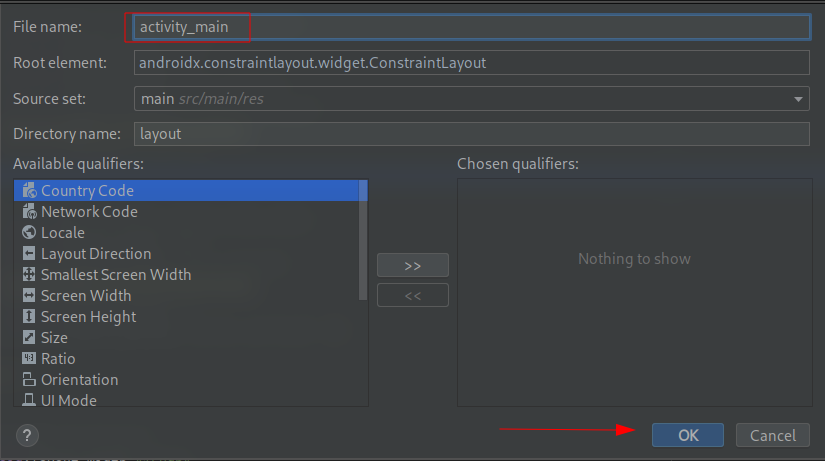
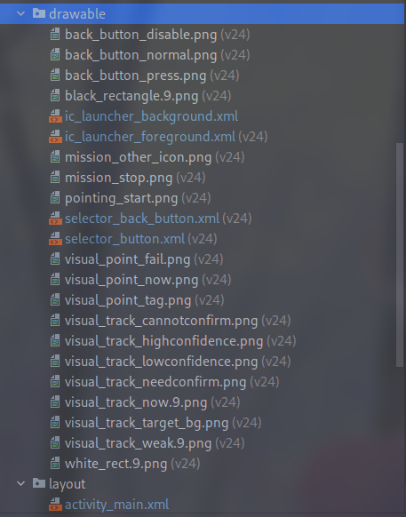

# Creating a TapFly and ActiveTrack Mission Application

***Supported Drones: Mavic Pro, Phantom 4 Pro, Phantom 4 Advanced, Spark, M200 and Inspire 2***

---

### Introduction

In this tutorial, you will learn how to use the TapFly and ActiveTrack Missions of the DJI Android SDK to create an application for the Mavic Pro. You will get familiar with the ActiveTrackOperator, TapFlyMissionOperator and the DJI Assistant 2 Simulator for indoor testing. So let's get started!

---

### TapFly Mission

Given a coordinate in the live video stream (which can come from a user tap), the aircraft will calculate and fly towards the coordinate's direction in the real world. During a flight, the aircraft will automatically detect and avoid obstacles. Also, the aircraft will stop flying in the direction if it reaches its radius limitation, the mission is stopped, the user pulls back on the pitch stick or if it comes to an obstacle it cannot bypass.

During the mission, you can use the remote controller's yaw stick to adjust the heading of the aircraft, which also adjusts the direction of flight to the new yaw.

[Here is a video](https://www.djivideos.com/watch/1230a9a3-2985-4262-9cc4-6ce09c765028) for you to get the first impression of the TapFly Mission.

---

### ActiveTrack Mission

An ActiveTrack Mission allows an aircraft to track a moving subject using the vision system and without a GPS tracker on the subject. To use an ActiveTrack mission:

The main camera is used to track the target, so the gimbal cannot be adjusted during an ActiveTrack mission. During the mission, the aircraft can be manually flown with pitch, roll and throttle to move around the subject being tracked.

[Here is a video](https://www.djivideos.com/watch/b90658c6-2dbe-4993-93e6-1a146c991eff) for you to get the first impression of the ActiveTrack Mission.

---

### Importing Gradle Dependencies

To start, we will first edit our **app-level** build.gradle file with the following:

```gradle
plugins {
    id 'com.android.application'
    id 'kotlin-android'
}

android {
    compileSdkVersion 31
    buildToolsVersion "30.0.3"

    defaultConfig {
        applicationId 'com.riis.livestream'
        minSdkVersion 19
        targetSdkVersion 31
        versionCode 1
        multiDexEnabled true
        versionName "1.0"
        ndk {
            // On x86 devices that run Android API 23 or above, if the application is targeted with API 23 or
            // above, FFmpeg lib might lead to runtime crashes or warnings.
            abiFilters 'armeabi-v7a', 'x86', 'arm64-v8a'
        }

        testInstrumentationRunner "androidx.test.runner.AndroidJUnitRunner"
    }

    buildTypes {
        release {
            minifyEnabled false
            proguardFiles getDefaultProguardFile('proguard-android.txt'), 'proguard-rules.pro'
        }
        debug {
            shrinkResources false
            minifyEnabled false
            proguardFiles getDefaultProguardFile('proguard-android.txt'), 'proguard-rules.pro'
        }
    }
    compileOptions {
        sourceCompatibility JavaVersion.VERSION_1_8
        targetCompatibility JavaVersion.VERSION_1_8
    }
    kotlinOptions {
        jvmTarget = '1.8'
    }
    dexOptions {
        javaMaxHeapSize "4g"
    }

    packagingOptions {
        doNotStrip "*/*/libdjivideo.so"
        doNotStrip "*/*/libSDKRelativeJNI.so"
        doNotStrip "*/*/libFlyForbid.so"
        doNotStrip "*/*/libduml_vision_bokeh.so"
        doNotStrip "*/*/libyuv2.so"
        doNotStrip "*/*/libGroudStation.so"
        doNotStrip "*/*/libFRCorkscrew.so"
        doNotStrip "*/*/libUpgradeVerify.so"
        doNotStrip "*/*/libFR.so"
        doNotStrip "*/*/libDJIFlySafeCore.so"
        doNotStrip "*/*/libdjifs_jni.so"
        doNotStrip "*/*/libsfjni.so"
        doNotStrip "*/*/libDJICommonJNI.so"
        doNotStrip "*/*/libDJICSDKCommon.so"
        doNotStrip "*/*/libDJIUpgradeCore.so"
        doNotStrip "*/*/libDJIUpgradeJNI.so"
        exclude 'META-INF/*'
    }
}

dependencies {

    implementation 'androidx.multidex:multidex:2.0.1'
    implementation 'com.squareup:otto:1.3.8'
    implementation('com.dji:dji-sdk:4.14.1', {
        /**
         * Uncomment the "library-anti-distortion" if your app does not need Anti Distortion for Mavic 2 Pro and Mavic 2 Zoom.
         * Uncomment the "fly-safe-database" if you need database for release, or we will download it when DJISDKManager.getInstance().registerApp
         * is called.
         * Both will greatly reducing the size of the APK.
         */
        exclude module: 'library-anti-distortion'
        //exclude module: 'fly-safe-database'
    })
    implementation 'com.google.android.material:material:1.3.0'

    implementation 'androidx.appcompat:appcompat:1.0.0'
    implementation 'androidx.core:core:1.0.0'
    implementation 'androidx.constraintlayout:constraintlayout:1.1.3'
    implementation 'androidx.recyclerview:recyclerview:1.0.0'
    implementation 'androidx.lifecycle:lifecycle-extensions:2.0.0-rc01'
    implementation 'androidx.annotation:annotation:1.0.0'
    implementation 'com.jakewharton:butterknife:10.0.0'
    annotationProcessor 'com.jakewharton:butterknife-compiler:10.0.0'
    implementation "androidx.core:core-ktx:+"
    implementation "androidx.lifecycle:lifecycle-viewmodel-ktx:2.0.0-rc01"
    implementation "org.jetbrains.kotlin:kotlin-stdlib-jdk7:1.6.0"
    implementation "org.jetbrains.kotlinx:kotlinx-coroutines-core:1.3.9"
    implementation "org.jetbrains.kotlinx:kotlinx-coroutines-android:1.3.9"


}

// Please uncomment the following code if you use your own sdk version.
apply from: "https://terra-1-g.djicdn.com/71a7d383e71a4fb8887a310eb746b47f/msdk/Android-CommonConfig/config_sample_all.gradle"
```

Next we will edit our **project-level** build.gradle and add the following:

```gradle
// Top-level build file where you can add configuration options common to all sub-projects/modules.
buildscript {
    ext.kotlin_version = '1.6.0'
    repositories {
        google()
        mavenCentral()
    }
    dependencies {
        classpath "com.android.tools.build:gradle:4.1.2"
        classpath "org.jetbrains.kotlin:kotlin-gradle-plugin:$kotlin_version"

        // NOTE: Do not place your application dependencies here; they belong
        // in the individual module build.gradle files
    }
}

allprojects {
    repositories {
        google()
        mavenCentral()
        jcenter() // Warning: this repository is going to shut down soon
    }
}

task clean(type: Delete) {
    delete rootProject.buildDir
}
```

---

## Building the Layouts of Activities

### 1. Implementing MApplication and ConnectionActivity

Please refer to [Lab Two](https://github.com/riisinterns/drone-lab-two-import-and-activate-sdk-in-android-studio) and [Lab Three](https://github.com/riisinterns/drone-lab-three-camera-demo) on detailed instructions on how to set this up.

---

### 2. Implementing DemoBaseActivity Class

Similarly, create a new Empty Activity class with the name of `DemoBaseActivity` in the `com.riis.kotlin_phantom4missions` package. Remember to deselect the "Generate Layout File". Replace the code with the following, remember to import the related classes as Android Studio suggests:

```kotlin
open class DemoBaseActivity : FragmentActivity(), SurfaceTextureListener {
    protected var mConnectStatusTextView: TextView? = null
    override fun onCreate(savedInstanceState: Bundle?) {
        super.onCreate(savedInstanceState)
        mConnectStatusTextView = findViewById<View>(R.id.ConnectStatusTextView) as TextView
    }

    override fun onSurfaceTextureAvailable(surface: SurfaceTexture, width: Int, height: Int) {}
    override fun onSurfaceTextureSizeChanged(surface: SurfaceTexture, width: Int, height: Int) {}
    override fun onSurfaceTextureDestroyed(surface: SurfaceTexture): Boolean {
        return false
    }

    override fun onSurfaceTextureUpdated(surface: SurfaceTexture) {}
}
```

We will use this activity class as our base class later. More details of the implementation will be done later.

---

### 3. Implementing MainActivity Class

Firstly, we will start with making our UI for the MainActivity Class.

Navigate to **res -> layout**, this is where you will create your layout.

Right-click layout, navigate **new -> Layout Resource File** and click it. You will see a pop up menu that will help you create your layout.

Set the name as `activity_main` and press **OK** without changing any other settings, we will be overwriting them in a moment.



Next, you will replace the xml in `activity_main.xml` with the following:

```xml
<LinearLayout xmlns:android="http://schemas.android.com/apk/res/android"
        android:layout_width="fill_parent"
        android:layout_height="fill_parent"
        android:keepScreenOn="true"
        android:orientation="vertical">

    <RelativeLayout
            android:id="@+id/main_title_rl"
            android:layout_width="fill_parent"
            android:layout_height="40dp"
            android:background="@android:color/black">

        <ImageButton
                android:id="@+id/ReturnBtnMain" android:layout_width="wrap_content"
                android:layout_height="35dp"
                android:layout_alignParentLeft="true"
                android:layout_centerVertical="true"
                android:layout_marginLeft="20dp"
                android:adjustViewBounds="true"
                android:background="@android:color/transparent"
                android:onClick="onReturn"
                android:scaleType="centerInside"
                android:src="@drawable/selector_back_button" />

        <TextView
                android:id="@+id/ConnectStatusTextView"
                android:layout_width="wrap_content"
                android:layout_height="wrap_content"
                android:layout_centerInParent="true"
                android:text="@string/title_activity_mainactivity"
                android:textColor="@android:color/white"
                android:textSize="21sp" />
    </RelativeLayout>

    <TextView
            android:id="@+id/version_tv"
            android:layout_width="match_parent"
            android:layout_height="wrap_content"
            android:text="Firmware version: N/A" />

    <ListView
            android:id="@+id/listView"
            android:layout_width="match_parent"
            android:layout_height="match_parent" />

</LinearLayout>
```

In the above xml, you've created your video surface, a timer, buttons to capture images and videos, and buttons to switch the capture mode of the drone. 

Next, copy all the image files from this Github sample project to the **drawable** folders inside the **res** folder.



Moreover, open the AndroidManifest.xml file and update the ".MainActivity" activity element with several attributes as shown below:

```xml
    <activity android:name=".MainActivity">
        <intent-filter>
            <action android:name="android.intent.action.MAIN" />
            <category android:name="android.intent.category.LAUNCHER" />
        </intent-filter>

        <intent-filter>
            <action android:name="android.hardware.usb.action.USB_ACCESSORY_ATTACHED" />
        </intent-filter>

        <meta-data
            android:name="android.hardware.usb.action.USB_ACCESSORY_ATTACHED"
            android:resource="@xml/accessory_filter" />
    </activity>
```

Furthermore, open the `strings.xml` file in the **values** folder and add the following string content:

```xml
    <string name="app_name">Kotlin-Phantom4Missions</string>
    <string name="title_activity_pointing_test">TapFly Sample</string>
    <string name="title_activity_tracking_test">ActiveTrack Sample</string>
    <string name="push_info">Push Info</string>
    <string name="title_activity_mainactivity">P4MissionsDemo</string>
    <string name="demo_desc_tracking">ActiveTrack Mission</string>
    <string name="demo_desc_pointing">TapFly Mission</string>
    <string name="popup_picker_finish">Finish</string>
    <string name="popup_picker_trigger">Trigger</string>
```

Lastly, let's create a new xml file named `demo_info_item.xml` in the layout folder by right-clicking on the `layout` folder and select **New->XML->Layout XML File**. Then replace the code of the file with the following:

```xml
<?xml version="1.0" encoding="utf-8"?>
<LinearLayout xmlns:android="http://schemas.android.com/apk/res/android"
        android:layout_width="match_parent"
        android:layout_height="match_parent"
        android:orientation="vertical">

    <TextView
            android:id="@+id/title"
            android:layout_width="fill_parent"
            android:layout_height="wrap_content"
            android:textSize="22sp"
            android:layout_marginTop="6dp"
            android:layout_marginBottom="3dp"
            android:layout_marginLeft="10dp" />

    <TextView
            android:id="@+id/desc"
            android:layout_width="fill_parent"
            android:layout_height="wrap_content"
            android:textSize="14sp"
            android:layout_marginBottom="6dp"
            android:layout_marginLeft="10dp"
            android:textColor="@color/black" />

</LinearLayout>
```

This xml file will help to setup the two TextViews with "title" and "desc" ids for the convertView of DemoListAdapter.

Now, if you check the activity_main.xml file, you can see the preview screenshot of MainActivity as shown below:


---

### 4. Creating the PointingTestActivity

Let's create a new Empty Activity class with the name of `PointingTestActivity` in the `com.riis.kotlin_phantom4missions` package. Replace the code with the following, remember to import the related classes as Android Studio suggests:

```kotlin
class PointingTestActivity : DemoBaseActivity(), SurfaceTextureListener,
    View.OnClickListener {
    private lateinit var mPushDrawerIb: ImageButton
    private lateinit var mPushDrawerSd: SlidingDrawer
    private lateinit var mStartBtn: Button
    private lateinit var mStopBtn: ImageButton
    private lateinit var mPushTv: TextView
    private lateinit var mBgLayout: RelativeLayout
    private lateinit var mRstPointIv: ImageView
    private lateinit var mAssisTv: TextView
    private lateinit var mAssisSw: Switch
    private lateinit var mSpeedTv: TextView
    private lateinit var mSpeedSb: SeekBar

    companion object {
        private const val TAG = "PointingTestActivity"
    }

    override fun onCreate(savedInstanceState: Bundle?) {
        setContentView(R.layout.activity_pointing_test)
        super.onCreate(savedInstanceState)
        initUI()
    }

    override fun onResume() {
        super.onResume()
    }

    override fun onDestroy() {
        super.onDestroy()
    }

    private fun initUI() {
        mPushDrawerIb = findViewById<View>(R.id.pointing_drawer_control_ib) as ImageButton
        mPushDrawerSd = findViewById<View>(R.id.pointing_drawer_sd) as SlidingDrawer
        mStartBtn = findViewById<View>(R.id.pointing_start_btn) as Button
        mStopBtn = findViewById<View>(R.id.pointing_stop_btn) as ImageButton
        mPushTv = findViewById<View>(R.id.pointing_push_tv) as TextView
        mBgLayout = findViewById<View>(R.id.pointing_bg_layout) as RelativeLayout
        mRstPointIv = findViewById<View>(R.id.pointing_rst_point_iv) as ImageView
        mAssisTv = findViewById<View>(R.id.pointing_assistant_tv) as TextView
        mAssisSw = findViewById<View>(R.id.pointing_assistant_sw) as Switch
        mSpeedTv = findViewById<View>(R.id.pointing_speed_tv) as TextView
        mSpeedSb = findViewById<View>(R.id.pointing_speed_sb) as SeekBar
        mPushDrawerIb.setOnClickListener(this)
        mStartBtn.setOnClickListener(this)
        mStopBtn.setOnClickListener(this)
        mSpeedSb.setOnSeekBarChangeListener(object : OnSeekBarChangeListener {
            override fun onProgressChanged(seekBar: SeekBar, progress: Int, fromUser: Boolean) {
                mSpeedTv.text = (progress + 1).toString()
            }

            override fun onStartTrackingTouch(seekBar: SeekBar) {}
            override fun onStopTrackingTouch(seekBar: SeekBar) {}
        })
    }

    override fun onReturn(view: View) {
        Log.d(TAG, "onReturn")
        finish()
    }

    override fun onClick(v: View) {
        if (v.id == R.id.pointing_drawer_control_ib) {
            if (mPushDrawerSd.isOpened) {
                mPushDrawerSd.animateClose()
            } else {
                mPushDrawerSd.animateOpen()
            }
            return
        }
    }

}
```

Here, we implement several features:

1. Declare the UI member variables like ImageButton, TextView, SeekBar, etc. Then override the `onCreate()` method to invoke the `initUI()` method to initialize the UI elements of the Activity.

2. In the `initUI()` method, we create the member variables by invoking the `fineViewById()` method and passing the related id value declared in the associated layout xml file. Then call the `setOnClickListener()` method by assigning `this` to it for all the Button member variables. Next implement the SeekBar's `setOnSeekBarChangeListener()` method and override the three interface methods of `OnSeekBarChangeListener`. Here we update the text value of SeekBar in the `onProgresshanged()` method.

3. Lastly, we override the `onClick()` method to implement the click action of the `mPushDrawerIb` ImageButton. When you press the `mPushDrawerIb`, it will add animations when open and close the `mPushDrawerSd`, which is a **SlidingDrawer**.

#### Working on PointingTestActivity Layout

Open the colors.xml file in the values folder and replace the content with the following:

```xml
<?xml version="1.0" encoding="utf-8"?>
<resources>
    <color name="purple_200">#FFBB86FC</color>
    <color name="purple_500">#FF6200EE</color>
    <color name="purple_700">#FF3700B3</color>
    <color name="teal_200">#FF03DAC5</color>
    <color name="teal_700">#FF018786</color>
    <color name="black">#FF000000</color>
    <color name="white">#FFFFFFFF</color>

    <color name="button_normal">#50808080</color>
    <color name="button_press">#5086BFFF</color>
    <color name="blue">#0000FF</color>
    <color name="title_dark">#212121</color>
</resources>
```

Here, we add button press and normal colors, white and black colors.

Then, update the styles.xml with the following code:

```xml
<resources>

    <style name="left_button_list_button">
        <item name="android:minHeight">@dimen/left_button_list_button_height</item>
        <item name="android:layout_width">@dimen/left_button_list_button_width</item>
        <item name="android:layout_height">wrap_content</item>
        <item name="android:paddingLeft">@dimen/left_button_list_button_padding_left</item>
        <item name="android:paddingRight">@dimen/left_button_list_button_padding_right</item>
        <item name="android:layout_marginLeft">@dimen/left_button_list_button_margin_left</item>
        <item name="android:layout_marginTop">@dimen/left_button_list_button_margin_top</item>
        <item name="android:background">@drawable/selector_button</item>
        <item name="android:textSize">@dimen/left_button_list_button_text_size</item>
        <item name="android:textColor">@color/white</item>
    </style>

    <!--
        Base application theme, dependent on API level. This theme is replaced
        by AppBaseTheme from res/values-vXX/styles.xml on newer devices.
    -->
    <style name="AppBaseTheme" parent="android:Theme.Light">
        <!--
            Theme customizations available in newer API levels can go in
            res/values-vXX/styles.xml, while customizations related to
            backward-compatibility can go here.
        -->
    </style>

    <!-- Application theme. -->
    <style name="AppTheme" parent="AppBaseTheme">
        <!-- All customizations that are NOT specific to a particular API-level can go here. -->
    </style>

    <style name="test_text">
        <item name="android:shadowColor">@color/black</item>
        <item name="android:shadowDx">2</item>
        <item name="android:shadowDy">1</item>
        <item name="android:shadowRadius">6</item>
        <item name="android:textSize">@dimen/test_log_textsize</item>
        <item name="android:textColor">@color/white</item>
    </style>

</resources>
```

Lastly, jump over to your associated layout in "layout/activity_ pointing_test.xml" file and replace everything with the same xml file from the tutorial's Github Sample Project, since the xml file's content is too much, we don't show them here.

---

### 5. Creating the TrackingTestActivity

#### Working on TrackingTestActivity Class

Once you finish the steps above, let's create a new Empty Activity class with the name of `TrackingTestActivity` in the `com.riis.kotlin_phantom4missions` package. Replace the code with the following:

```kotlin
class TrackingTestActivity : DemoBaseActivity(), SurfaceTextureListener,
    OnClickListener, OnTouchListener, CompoundButton.OnCheckedChangeListener,
    ActiveTrackMissionOperatorListener {
    private lateinit var mPushDrawerIb: ImageButton
    private lateinit var mPushInfoSd: SlidingDrawer
    private lateinit var mStopBtn: ImageButton
    private lateinit var mTrackingImage: ImageView
    private lateinit var mBgLayout: RelativeLayout
    private lateinit var mPushInfoTv: TextView
    private lateinit var mPushBackTv: TextView
    private lateinit var mGestureModeTv: TextView
    private lateinit var mPushBackSw: Switch
    private lateinit var mGestureModeSw: Switch
    private lateinit var mSendRectIV: ImageView
    private lateinit var mConfigBtn: Button
    private lateinit var mConfirmBtn: Button
    private lateinit var mRejectBtn: Button

    override fun onCreate(savedInstanceState: Bundle?) {
        setContentView(R.layout.activity_tracking_test)
        super.onCreate(savedInstanceState)
        initUI()
    }

    private fun initUI() {
        mPushDrawerIb = findViewById<View>(R.id.tracking_drawer_control_ib) as ImageButton
        mPushInfoSd = findViewById<View>(R.id.tracking_drawer_sd) as SlidingDrawer
        mStopBtn = findViewById<View>(R.id.tracking_stop_btn) as ImageButton
        mTrackingImage = findViewById<View>(R.id.tracking_rst_rect_iv) as ImageView
        mBgLayout = findViewById<View>(R.id.tracking_bg_layout) as RelativeLayout
        mPushInfoTv = findViewById<View>(R.id.tracking_push_tv) as TextView
        mSendRectIV = findViewById<View>(R.id.tracking_send_rect_iv) as ImageView
        mPushBackSw = findViewById<View>(R.id.tracking_pull_back_tb) as Switch
        mGestureModeSw = findViewById<View>(R.id.tracking_in_gesture_mode) as Switch
        mConfigBtn = findViewById<View>(R.id.recommended_configuration_btn) as Button
        mConfirmBtn = findViewById<View>(R.id.confirm_btn) as Button
        mRejectBtn = findViewById<View>(R.id.reject_btn) as Button
        mStopBtn.setOnClickListener(this)
        mBgLayout.setOnTouchListener(this)
        mPushDrawerIb.setOnClickListener(this)
        mConfigBtn.setOnClickListener(this)
        mConfirmBtn.setOnClickListener(this)
        mRejectBtn.setOnClickListener(this)
    }

    override fun onReturn(view: View) {
        Log.d(TAG, "onReturn")
        finish()
    }

    override fun onClick(v: View) {
        when (v.id) {
            R.id.tracking_stop_btn -> {}
            R.id.tracking_drawer_control_ib -> if (mPushInfoSd.isOpened) {
                mPushInfoSd.animateClose()
            } else {
                mPushInfoSd.animateOpen()
            }
            R.id.recommended_configuration_btn -> {}
            R.id.confirm_btn -> {}
            R.id.reject_btn -> {}
            else -> {}
        }
    }

    override fun onTouch(v: View, event: MotionEvent): Boolean {
        return true
    }

    companion object {
        private const val TAG = "TrackingTestActivity"
    }
}
```

> **Important**: Add the implementation of any methods as Android Studio suggests it

Here, we implement several features:

1. Declare the UI member variables like ImageButton, SlidingDrawer, SeekBar, etc. Then override the `onCreate()` method to invoke the `initUI()` method to initialize the UI elements of the Activity.

2. In the `initUI()` method, we create the member variables by invoking the `findViewById()` method and passing the related id value declared in the associated layout xml file. Then call the `setOnClickListener()` method by assigning "this" to it for all the Button member variables.

3. Lastly, we override the `onClick()` method to implement the click action of the `mStopBtn`, `mConfigBtn`, `mConfirmBtn`, `mRejectBtn` and `mPushDrawerIb` member variables. When you press the `mPushDrawerIb` ImageButton, it will add animation to open and close the `mPushInfoSd`.

Finally, jump over to your associated layout in layout/activity_ tracking_test.xml and replace everything with the same xml file from the tutorial's Github Sample Project, since the xml file's content is a lot, we don't show them here. For more details, please check the related xml file from the Github Sample Project of the demo project.

For the UI, we declare a main title, a return button, a connect status text view, a TextureView to show live video stream, an ImageView to show the tracking rectangle, etc. Here is a screenshot of the preview of TrackingTestActivity:


---

### 6. Preview the UI of the Application

Now, let's open the dimens.xml file and replace the code with the following:

```xml
<?xml version="1.0" encoding="utf-8"?>
<resources>
    <!-- left button list -->
    <dimen name="left_button_list_button_width">150dp</dimen>
    <dimen name="left_button_list_button_height">45dp</dimen>
    <dimen name="left_button_list_button_padding_left">5dp</dimen>
    <dimen name="left_button_list_button_padding_right">5dp</dimen>
    <dimen name="left_button_list_button_margin_left">10dp</dimen>
    <dimen name="left_button_list_button_margin_top">10dp</dimen>
    <dimen name="left_button_list_button_text_size">14sp</dimen>

    <dimen name="test_log_textsize">17sp</dimen>
</resources>
```

Next, open the AndroidManifest.xml file and modify the **.PointingTestActivity** and **.TrackingTestActivity** elements as shown below:

```xml
<activity
    android:name=".TrackingTestActivity"
    android:label="@string/title_activity_tracking_test"
    android:launchMode="singleInstance"
    android:screenOrientation="landscape"
    android:theme="@android:style/Theme.Holo.NoActionBar.Fullscreen" >
</activity>
<activity
    android:name=".PointingTestActivity"
    android:label="@string/title_activity_pointing_test"
    android:launchMode="singleInstance"
    android:screenOrientation="landscape"
    android:theme="@android:style/Theme.Holo.NoActionBar.Fullscreen" >
</activity>
```

In the code above, we modify the label, launchMode, screenOrientation and theme attributes for the two Activities.

We have gone through a long process to setup the UI of the application. Now, let's build and run the project and install it in your Android device to test it. If everything goes well, you may see something similar to the following animation:


### Registering the Application

After you finish the above steps, let's register our application with the **App Key** you apply from DJI Developer Website. If you are not familiar with the App Key, please check the [Get Started](https://developer.dji.com/mobile-sdk/documentation/quick-start/index.html).

Now let's open the `AndroidManifest.xml` file and add the following elements above the **application** element:

```xml
<uses-permission android:name="android.permission.BLUETOOTH" />
<uses-permission android:name="android.permission.BLUETOOTH_ADMIN" />
<uses-permission android:name="android.permission.VIBRATE" />
<uses-permission android:name="android.permission.INTERNET" />
<uses-permission android:name="android.permission.ACCESS_WIFI_STATE" />
<uses-permission android:name="android.permission.WAKE_LOCK" />
<uses-permission android:name="android.permission.ACCESS_COARSE_LOCATION" />
<uses-permission android:name="android.permission.ACCESS_NETWORK_STATE" />
<uses-permission android:name="android.permission.ACCESS_FINE_LOCATION" />
<uses-permission android:name="android.permission.CHANGE_WIFI_STATE" />
<uses-permission android:name="android.permission.MOUNT_UNMOUNT_FILESYSTEMS" />
<uses-permission android:name="android.permission.WRITE_EXTERNAL_STORAGE" />
<uses-permission android:name="android.permission.READ_EXTERNAL_STORAGE" />
<uses-permission android:name="android.permission.SYSTEM_ALERT_WINDOW" />
<uses-permission android:name="android.permission.READ_PHONE_STATE" />

<uses-feature android:name="android.hardware.camera" />
<uses-feature android:name="android.hardware.camera.autofocus" />
<uses-feature
    android:name="android.hardware.usb.host"
    android:required="false" />
<uses-feature
    android:name="android.hardware.usb.accessory"
    android:required="true" />

<application
    android:name=".MApplication"
    android:allowBackup="true"
    tools:replace="android:icon"
    android:icon="@drawable/ic_launcher"
    android:label="@string/app_name" >
```

Here, we add uses permissions and uses features for the app. They are required for registration.

Then add the following elements above the **MainActivity** activity element:

```xml
<!-- DJI SDK -->
        <uses-library android:name="com.android.future.usb.accessory" />
        <meta-data
            android:name="com.dji.sdk.API_KEY"
            android:value="Please enter your App Key here." />
        <activity
            android:name="dji.sdk.sdkmanager.DJIAoaControllerActivity"
            android:theme="@android:style/Theme.Translucent" >
            <intent-filter>
                <action android:name="android.hardware.usb.action.USB_ACCESSORY_ATTACHED" />
            </intent-filter>
            <meta-data
                android:name="android.hardware.usb.action.USB_ACCESSORY_ATTACHED"
                android:resource="@xml/accessory_filter" />
        </activity>
        <service android:name="dji.sdk.sdkmanager.DJIGlobalService" >
        </service>
<!-- DJI SDK -->
```

In the code above, we enter the **App Key** of the application under the `android:name="com.dji.sdk.API_KEY"` attribute. For more details of the `AndroidManifest.xml` file, please check the Github source code of the demo project.

Since we have implemented the registration in `DJIDemoApplication` and `MainActivity` files previously, we won't explain the details here.

Now, let's build and run the project and install it in your Android device to test it. If everything goes well, you should see the "success" textView like the following screenshot when you register the app successfully.


---

## Implementing the TapFly Mission

### Updating the DemoBaseActivity

Before we implement the TapFly Mission, we should update the DemoBaseActivity class to configure the live video streaming feature. Let's open the file and add the following codes to it:

```kotlin
    private val TAG = MainActivity::class.java.name
    protected var mReceivedVideoDataListener: VideoFeeder.VideoDataListener? = null
    protected var mCodecManager: DJICodecManager? = null
    private var mProduct: BaseProduct? = null

    //To store index chosen in PopupNumberPicker listener
    protected var INDEX_CHOSEN = mutableListOf<Int>(-1, -1, -1)
    protected var mVideoSurface: TextureView? = null
    protected var mConnectionStatusTextView: TextView? = null

    protected val mReceiver = (object : BroadcastReceiver() {
        override fun onReceive(context: Context?, intent: Intent?) {
            updateTitleBar()
            onProductChange()
        }

    })

    override fun onCreate(savedInstanceState: Bundle?) {
        super.onCreate(savedInstanceState)

        val filter = IntentFilter()
        filter.addAction("dji_sdk_connection_change")
        registerReceiver(mReceiver, filter)

        mVideoSurface = findViewById(R.id.video_previewer_surface)
        mConnectionStatusTextView = findViewById<TextView>(R.id.ConnectStatusTextView)

        if (mVideoSurface != null) {
            mVideoSurface?.surfaceTextureListener = this
        }

        mReceivedVideoDataListener = (VideoFeeder.VideoDataListener { videoBuffer, size ->
            if (mCodecManager != null) {
                mCodecManager?.sendDataToDecoder(videoBuffer, size)
            }
        })

    }
```

Here we declare a TextureView(`mVideoSurface` object) to show the live video stream data. We use the `video_previewer_surface` id from its layout xml file to create the object. This id should be the same as PointingTestActivity and TrackingTestActivity's layout settings. Then create the callback variable `mReceivedVideoDataListener` to implement the DJICamera's interface methods for receiving video data.

Moreover, we implement the `initPreviewer()` method as shown below to check product connection status and set the `mReceivedVideoDataListener` as the listener of VideoFeeder:

```kotlin
    private fun initPreviewer() {
        mProduct = try {
            getProductInstance()
        } catch (e: Exception) {
            null
        }

        if (mProduct == null) {
            mProduct?.isConnected?.let {
                if (!it) {
                    Log.d(TAG, "Disconnect")
                }
            }
        } else {
            if (mVideoSurface != null) {
                mVideoSurface?.surfaceTextureListener = this
            }

            if (mProduct != null) {
                (mProduct?.model?.equals(Model.UNKNOWN_AIRCRAFT))?.let {
                    if (!it) {
                        mReceivedVideoDataListener?.let { c ->
                            VideoFeeder.getInstance().primaryVideoFeed.addVideoDataListener(
                                c
                            )
                        }
                    }
                }
            }
        }
    }
```

For more details of the implementation, please check the `DemoBaseActivity.kt` file in this tutorial's Github sample project.

## Working on the PointingTestActivity

#### Showing the Live Video Stream

Now let's come back to the `PointingTestActivity.kt` class and override the `onCreate()` method firstly:

```kotlin
    override fun onCreate(savedInstanceState: Bundle?) {
        setContentView(R.layout.activity_pointing_test)
        super.onCreate(savedInstanceState)
        initUI()
    }
```

In the method shown above, we invoke the `setContentView()` method firstly to show the PointingTestActivity view. Then invoke the DemoBaseActivity class's `onCreate()` method to implement the live video stream showing methods. Lastly, invoke the `initUI()` to initialize all the UI elements.

#### Working on the TapFly Mission

##### Configure Mission

Before we start to create the `TapFlyMission` object, let's use the `TapFlyMissionOperator` to configure the following settings:

1. AutoFlightSpeed

You can set the aircraft's auto flight speed during the mission by invoking the `setAutoFlightSpeed()` method of `TapFlyMissionOperator`. The range for it is [1, 10] m/s.

2. isHorizontalObstacleAvoidanceEnabled

If you want to allow the aircraft to bypass or move around an obstacle by going to the left or right of the obstacle when executing TapFly mission, you can set this member variable to YES. Otherwise, the aircraft will only go over an obstacle to avoid it.

3. Target

This is where we should pass the coordinate transformation PointF object to, we can use the `getTapFlyPoint()` method to do the coordinate transformation and return the PointF object. It's the image point from the video feed where the vision system should calculate the flight direction from.

Now, let's implement the above settings in source code, in the `initUI()` method, let's improve the `setOnSeekBarChangeListener()` method of `mSpeedSb` as shown below:

```kotlin
        mSpeedSb.setOnSeekBarChangeListener(object : OnSeekBarChangeListener {
            override fun onProgressChanged(
                seekBar: SeekBar,
                progress: Int,
                fromUser: Boolean
            ) {

                mSpeedTv.text = (progress + 1).toString()
            }

            override fun onStartTrackingTouch(seekBar: SeekBar) {}
            override fun onStopTrackingTouch(seekBar: SeekBar) {
                getTapFlyOperator().setAutoFlightSpeed(
                    getSpeed()
                ) { error -> setResultToToast(if (error == null) "Set Auto Flight Speed Success" else error.description) }
            }
        })
```

In the code above, we invoke the `setAutoFlightSpeed()` method of `TapFlyMissionOperator` in the `onStopTrackingTouch()` method of `setOnSeekBarChangeListener()` to configure the auto flight speed for TapFly mission.

Next, let's implement the `initTapFlyMission()` method to initialize the `mTapFlyMission` variable and set the `isHorizontalObstacleAvoidanceEnabled` boolean value as shown below:

```kotlin
    private fun initTapFlyMission() {
        mTapFlyMission = TapFlyMission()
        mTapFlyMission.isHorizontalObstacleAvoidanceEnabled = mAssisSw.isChecked
        mTapFlyMission.tapFlyMode = TapFlyMode.FORWARD
    }
```

Here we use `FORWARD` value of the `TapFlyMode` enum, for more details of the `TapFlyMode`, please check this [documentation](https://developer.dji.com/api-reference/android-api/Components/Missions/DJITapFlyMission.html#djitapflymission_djitapflymode_inline).

Moreover, let's implement the following two methods to manage the mission coordinate transformations:

```kotlin
    private fun getTapFlyPoint(iv: View?): PointF? {
        if (iv == null) return null
        val parent = iv.parent as View
        var centerX = iv.left + iv.x + iv.width.toFloat() / 2
        var centerY = iv.top + iv.y + iv.height.toFloat() / 2
        centerX = if (centerX < 0) 0f else centerX
        centerX = if (centerX > parent.width) parent.width.toFloat() else centerX
        centerY = if (centerY < 0) 0f else centerY
        centerY = if (centerY > parent.height) parent.height.toFloat() else centerY
        return PointF(centerX / parent.width, centerY / parent.height)
    }

    private fun showPointByTapFlyPoint(
        point: PointF?,
        iv: ImageView?
    ) {
        if (point == null || iv == null) {
            return
        }
        val parent = iv.parent as View
        runOnUiThread {
            iv.x = point.x * parent.width - iv.width / 2
            iv.y = point.y * parent.height - iv.height / 2
            iv.visibility = View.VISIBLE
            iv.requestLayout()
        }
    }
```

We can use the `getTapFlyPoint()` method to transform the tap point position of Android View coordinate system to the video stream coordinate system. In contrast, we use the `showPointByTapFlyPoint()` method to transform the tap point position(We use `mRstPointIv` to represent it) from video stream coordinate system back to the Android View coordinate system and show it on screen.

Lastly, let's override the `onTouch()` method to track the **ACTION_UP** gesture of MotionEvent:

```kotlin
    override fun onTouch(v: View?, event: MotionEvent?): Boolean {
        if (v?.id == R.id.pointing_bg_layout) {
            event?.let { e ->
                when (e.action) {
                    MotionEvent.ACTION_UP -> {
                        mStartBtn.visibility = View.VISIBLE
                        mStartBtn.x = e.x - mStartBtn.width / 2
                        mStartBtn.y = e.y - mStartBtn.height / 2
                        mStartBtn.requestLayout()
                        mTapFlyMission.target = getTapFlyPoint(mStartBtn)
                    }
                    else -> {
                    }
                }
            }

        }
        return true
    }
```

Here, we update the `mStartBtn`'s position to the position user press. Then we invoke the `getTapFlyPoint()` method to do the coordinate transformation and pass it to TapFlyMission's `target` member variable.

#### Start and Stop Mission

Next, let's override the `onClick()` method to implement the click action of `mStartBtn` and `mStopBtn` buttons to start and stop the DJITapFlyMission:

```kotlin
    override fun onClick(v: View?) {
        v?.let { view ->
            if (view.id == R.id.pointing_drawer_control_ib) {
                if (mPushDrawerSd.isOpened) {
                    mPushDrawerSd.animateClose()
                } else {
                    mPushDrawerSd.animateOpen()
                }
                return
            }
            when (view.id) {
                R.id.pointing_start_btn -> getTapFlyOperator().startMission(mTapFlyMission) { error ->
                    setResultToToast(if (error == null) "Start Mission Successfully" else error.description)
                    if (error == null) {
                        setVisible(mStartBtn, false)
                    }
                }
                R.id.pointing_stop_btn -> getTapFlyOperator().stopMission { error ->
                    setResultToToast(
                        if (error == null) "Stop Mission Successfully" else error.description
                    )
                }
                else -> {
                    setResultToToast("TapFlyMission Operator is null")
                }
            }
        }

    }

```

In the code above, we use a switch statement to identify the `mStartBtn` and `mStopBtn` buttons' click action. In the 'mStartBtn' click action case, we invoke the `startMission()` method of `TapFlyMissionOperator` to start the mission and update the visibilities of the `mStartBtn` button.

In the `mStopBtn` click action case, we invoke the `stopMission()` method of `TapFlyMissionOperator` to stop the mission.

#### Add Listener to Receive Mission Events

During the TapFly mission execution, we can add a listener to receive the mission events for status infos. You can use this status infos to inform users of the results or update the UI interface.

Now, let's add the following code at the bottom of `onCreate()` method:

```kotlin
    override fun onCreate(savedInstanceState: Bundle?) {
        setContentView(R.layout.activity_pointing_test)
        super.onCreate(savedInstanceState)
        initUI()
        getTapFlyOperator().addListener { aggregation ->
            val executionState = aggregation?.executionState
            if (executionState != null) {
                showPointByTapFlyPoint(executionState.imageLocation, mRstPointIv)
            }
            val sb = StringBuffer()
            val errorInformation =
                (if (aggregation?.error == null) "null" else aggregation.let { it.error?.description + "\n" })
            val currentState =
                if (aggregation?.currentState == null) "null" else aggregation.currentState
                    .name
            val previousState =
                if (aggregation?.previousState == null) "null" else aggregation?.previousState?.name
            Utils.addLineToSB(sb, "CurrentState: ", currentState as Any)
            if (previousState != null) {
                Utils.addLineToSB(sb, "PreviousState: ", previousState)
            }
            Utils.addLineToSB(sb, "Error:", errorInformation)
            val progressState = aggregation?.executionState
            if (progressState != null) {
                Utils.addLineToSB(sb, "Heading: ", progressState.relativeHeading as Any)
                Utils.addLineToSB(sb, "PointX: ", progressState.imageLocation.x as Any)
                Utils.addLineToSB(sb, "PointY: ", progressState.imageLocation.y as Any)
                Utils.addLineToSB(
                    sb,
                    "BypassDirection: ",
                    progressState.bypassDirection.name
                )
                Utils.addLineToSB(sb, "VectorX: ", progressState.direction.x as Any)
                Utils.addLineToSB(sb, "VectorY: ", progressState.direction.y as Any)
                Utils.addLineToSB(sb, "VectorZ: ", progressState.direction.z as Any)
                setResultToText(sb.toString())
            }
            val missionState = aggregation?.currentState
            if (!(missionState == TapFlyMissionState.EXECUTING || missionState == TapFlyMissionState.EXECUTION_PAUSED
                        || missionState == TapFlyMissionState.EXECUTION_RESETTING)
            ) {
                setVisible(mRstPointIv, false)
                setVisible(mStopBtn, false)
            } else {
                setVisible(mStopBtn, true)
                setVisible(mStartBtn, false)
            }
        }

    }
```

In the code above, we implement the following features:

1. Invoke the `addListener()` method of `TapFlyMissionOperator` and implement the `onUpdate()` method to receive the TapFly mission events.
2. In the `onUpdate()` method, we firstly get the `TapFlyExecutionState` object `executionState` from the updated `aggregation` variable. Next, check if the `executionState` is null, if not, invoke the `showPointByTapFlyPoint()` method to update the position of the `mRstPointIv` image View (A green circle) on screen. This green circle represents the direction which Mavic Pro will fly towards.
3. Moreover, store the TapFly execution state infos into the StringBuffer `sb` and show it on the `mPushTv` TextView.
4. Lastly, we get the updated `TapFlyMissionState` and set visible property for `mRstPointIv`, `mStartBtn` and `mStopBtn`.

For more implementation details of the `PointingTestActivity` class, please check the Github source code.

Now let's build and run the project to install the app to your Android device, if everything goes well, you should be able to use the TapFly mission of Mavic Pro now.

> **Important**: Remember to switch the remote controller to **P** mode before you test the TapFly mission.

Here is a gif animation for you to get a better understanding of using the TapFly mission feature:


In the animation, when you tap on the screen, a green circle with a "GO" button appears, which is the direction you want Mavic Pro fly towards. Then, press the **GO** button, Mavic Pro will start to execute the TapFly mission and fly. When you want to stop the mission, just press the **X** button, Mavic Pro will stop immediately and hover there.

### Implementing ActiveTrack Mission

#### Working on the TrackingTestActivity

#### Showing the Live Video Stream

Now let's go to `TrackingTestActivity.kt` class and override the `onCreate()` method firstly:

```kotlin
    override fun onCreate(savedInstanceState: Bundle?) {
        setContentView(R.layout.activity_tracking_test)
        super.onCreate(savedInstanceState)
        initUI()
    }
```

In the method shown above, we invoke the `setContentView()` method firstly to show the TrackingTestActivity view. Then invoke the DemoBaseActivity class's `onCreate()` method to implement the live video stream showing methods. Lastly, invoke the `initUI()` to initialize all the UI elements.

### Working on the ActiveTrack Mission

#### Configure Mission

Before we start to create the `ActiveTrackMission` object, let's use the `ActiveTrackOperator` to configure the following settings:

* Enable/Disable Gesture Mode

Gesture mode allows the subject to confirm tracking as well as take pictures using gestures. Raise your arms in a **V**, the human subject can accept the confirmation to track them. Gesture mode can only be enabled when the aircraft is flying but not tracking a target. If the aircraft is already tracking a target, disabling gesture mode will stop the ActiveTrack mission.

You can [check this video](https://www.djivideos.com/watch/b45aa08d-0bd3-46df-a89e-e36f94dffbe9) to get a better understanding of the Gesture Mode.

Let's implement a method `initMissionManager()` which we will use to initialize our Mission Management attributes:

```kotlin
    private fun initMissionManager() {
        mActiveTrackOperator = MissionControl.getInstance().activeTrackOperator
        if (mActiveTrackOperator == null) {
            return
        }
        mActiveTrackOperator?.let { trackOperator ->
            trackOperator.addListener(this)
            mAutoSensingSw.isChecked = trackOperator.isAutoSensingEnabled
            mQuickShotSw.isChecked = trackOperator.isAutoSensingForQuickShotEnabled
            mGestureModeSw.isChecked = trackOperator.isGestureModeEnabled
            trackOperator.getRetreatEnabled(object :
                CommonCallbacks.CompletionCallbackWith<Boolean?> {
                override fun onSuccess(aBoolean: Boolean?) {
                    if (aBoolean != null) {
                        Log.e(TAG, "Retreat Not null")
                        mPushBackSw.isChecked = aBoolean
                        Log.e(TAG, "Retreat Enabled: $aBoolean")
                    }
                }

                override fun onFailure(error: DJIError) {
                    setResultToToast("can't get retreat enable state " + error.description)
                }
            })
        }
    }
```

Now let's call this function at the end of our `onCreate()` method:

```kotlin
    override fun onCreate(savedInstanceState: Bundle?) {
        setContentView(R.layout.activity_tracking_test)
        super.onCreate(savedInstanceState)
        initUI()
        initMissionManager()
    }

```

Now let's implement our onCheckChanges for our ActiveTrack Mission in the `onCheckedChanged()` method:

```kotlin
    override fun onCheckedChanged(
        compoundButton: CompoundButton,
        isChecked: Boolean
    ) {
        if (mActiveTrackOperator == null) {
            return
        }
        Log.e(TAG, "onCheckChanged after null check")
        when (compoundButton.id) {
            R.id.set_multitracking_enabled -> {
                startMode = ActiveTrackMode.TRACE
                quickShotMode = QuickShotMode.UNKNOWN
                setAutoSensingEnabled(isChecked)
            }
            R.id.set_multiquickshot_enabled -> {
                startMode = ActiveTrackMode.QUICK_SHOT
                quickShotMode = QuickShotMode.CIRCLE
                checkStorageStates()
                setAutoSensingForQuickShotEnabled(isChecked)
            }
            R.id.tracking_pull_back_tb -> mActiveTrackOperator?.let {
                it.setRetreatEnabled(
                    isChecked,
                    CommonCallbacks.CompletionCallback { error: DJIError? ->
                        if (error != null) {
                            runOnUiThread { mPushBackSw.isChecked = !isChecked }
                        }
                        setResultToToast("Set Retreat Enabled: " + if (error == null) "Success" else error.description)
                    })

            }
            R.id.tracking_in_gesture_mode -> mActiveTrackOperator?.let {
                it.setGestureModeEnabled(
                    isChecked,
                    CommonCallbacks.CompletionCallback { error: DJIError ->
                        runOnUiThread { mGestureModeSw.isChecked = !isChecked }
                        setResultToToast("Set GestureMode Enabled: " + error.description)
                    })
            }
            else -> {
            }
        }
        Log.e(TAG, "onCheckChanged after when")
    }
```

Next we'll implement our onClick functions in `onClick()`:

```kotlin
    override fun onClick(v: View) {
        if (mActiveTrackOperator == null) {
            Log.e(TAG, "mActive null")
            return
        }
        when (v.id) {
            R.id.recommended_configuration_btn -> {
                Log.e(TAG, "Config pressed")
                mActiveTrackOperator?.setRecommendedConfiguration(CommonCallbacks.CompletionCallback { error: DJIError ->
                    setResultToToast(
                        "Set Recommended Config " + error.description
                    )
                })
                runOnUiThread { mConfigBtn.visibility = View.GONE }
            }
            R.id.confirm_btn -> {
                mActiveTrackOperator?.let {
                    val isAutoTracking = isAutoSensingSupported &&
                            (it.isAutoSensingEnabled ||
                                    it.isAutoSensingForQuickShotEnabled)
                    if (isAutoTracking) {
                        startAutoSensingMission()
                        runOnUiThread {
                            mStopBtn.visibility = View.VISIBLE
                            mRejectBtn.visibility = View.VISIBLE
                            mConfirmBtn.visibility = View.INVISIBLE
                        }
                    } else {
                        trackingIndex = TrackingTestActivity.INVALID_INDEX
                        it.acceptConfirmation(CommonCallbacks.CompletionCallback { error: DJIError ->
                            setResultToToast(
                                error.description
                            )
                        })
                        runOnUiThread {
                            mStopBtn.visibility = View.VISIBLE
                            mRejectBtn.visibility = View.VISIBLE
                            mConfirmBtn.visibility = View.INVISIBLE
                        }
                    }
                }

            }
            R.id.tracking_stop_btn -> {
                trackingIndex = TrackingTestActivity.INVALID_INDEX

                mActiveTrackOperator?.stopTracking(CommonCallbacks.CompletionCallback { error: DJIError ->
                    setResultToToast(
                        error.description
                    )
                })


                runOnUiThread {
                    mTrackingImage.visibility = View.INVISIBLE
                    mSendRectIV.visibility = View.INVISIBLE
                    mStopBtn.visibility = View.INVISIBLE
                    mRejectBtn.visibility = View.INVISIBLE
                    mConfirmBtn.visibility = View.VISIBLE
                }
            }
            R.id.reject_btn -> {
                trackingIndex = TrackingTestActivity.INVALID_INDEX
                mActiveTrackOperator?.rejectConfirmation(CommonCallbacks.CompletionCallback { error: DJIError ->
                    setResultToToast(
                        error.description
                    )
                })
                runOnUiThread {
                    mStopBtn.visibility = View.VISIBLE
                    mRejectBtn.visibility = View.VISIBLE
                    mConfirmBtn.visibility = View.INVISIBLE
                }
            }
            R.id.tracking_drawer_control_ib -> if (mPushInfoSd.isOpened) {
                mPushInfoSd.animateClose()
            } else {
                mPushInfoSd.animateOpen()
            }
            else -> {
            }
        }
    }
```
Here, we can invoke the `setRecommendedConfiguration()` method of `ActiveTrackOperator` to set the recommended camera and gimbal configuration. Then in the completion callback, show a toast message to inform users of the results.

Here, we invoke the `acceptConfirmation()` method of `ActiveTrackOperator` to accept the confirmation and show a toast message to inform users of the results.o

Here, we invoke the `rejectConfirmation()` method of `ActiveTrackOperator` to reject the confirmation and stop the aircraft from following the target. Then show a toast message to inform users of the results.

Here, we invoke the `stopTracking()` method of `ActiveTrackOperator` to stop executing the ActiveTrack mission and show a toast message to inform users of the result.

#### Start the Mission

Once you finish the steps above, let's continue to implement the following methods to start the ActiveTrack mission:

```kotlin
    private fun getActiveTrackRect(iv: View): RectF {
        val parent = iv.parent as View
        return RectF(
            (iv.left.toFloat() + iv.x) / parent.width.toFloat(),
            (iv.top.toFloat() + iv.y) / parent.height.toFloat(),
            (iv.right.toFloat() + iv.x) / parent.width.toFloat(),
            (iv.bottom.toFloat() + iv.y) / parent.height.toFloat()
        )
    }

    private fun calcManhattanDistance(
        point1X: Double, point1Y: Double, point2X: Double,
        point2Y: Double
    ): Double {
        return Math.abs(point1X - point2X) + Math.abs(point1Y - point2Y)
    }

    override fun onTouch(v: View?, event: MotionEvent): Boolean {
    when (event.action) {
        MotionEvent.ACTION_DOWN -> {
            isDrawingRect = false
            downX = event.x
            downY = event.y
        }
        MotionEvent.ACTION_MOVE -> {
            if (calcManhattanDistance(
                    downX.toDouble(),
                    downY.toDouble(),
                    event.x.toDouble(),
                    event.y.toDouble()
                ) < MOVE_OFFSET && !isDrawingRect
            ) {
                trackingIndex = getTrackingIndex(downX, downY, targetViewHashMap)
                if (targetViewHashMap[trackingIndex] != null) {
                    targetViewHashMap[trackingIndex]?.setBackgroundColor(Color.RED)
                }
                return true
            }
            isDrawingRect = true
            mSendRectIV.visibility = View.VISIBLE
            val l = (if (downX < event.x) downX else event.x).toInt()
            val t = (if (downY < event.y) downY else event.y).toInt()
            val r = (if (downX >= event.x) downX else event.x).toInt()
            val b = (if (downY >= event.y) downY else event.y).toInt()
            mSendRectIV.x = l.toFloat()
            mSendRectIV.y = t.toFloat()
            mSendRectIV.layoutParams.width = r - l
            mSendRectIV.layoutParams.height = b - t
            mSendRectIV.requestLayout()
        }
        MotionEvent.ACTION_UP -> if (mGestureModeSw.isChecked) {
            setResultToToast("Please try to start Gesture Mode!")
        } else if (!isDrawingRect) {
            targetViewHashMap?.let {
                setResultToToast("Selected Index: $trackingIndex,Please Confirm it!")
                targetViewHashMap[trackingIndex]?.setBackgroundColor(Color.TRANSPARENT)
            }

        } else {
            val rectF = getActiveTrackRect(mSendRectIV)
            mActiveTrackMission = ActiveTrackMission(rectF, startMode)
            if (startMode == ActiveTrackMode.QUICK_SHOT) {
                mActiveTrackMission?.quickShotMode = quickShotMode
                checkStorageStates()
            }
            mActiveTrackMission?.let {
                mActiveTrackOperator?.startTracking(it) { error ->
                    if (error == null) {
                        Log.e("Main-Track", "Error = null")
                        isDrawingRect = false
                    }
                    setResultToToast("Start Tracking: " + if (error == null) "Success" else error.description)
                }
            }

            mSendRectIV.visibility = View.INVISIBLE
            clearCurrentView()
        }
        else -> {
        }
    }
    return true
}
```

In the code above, we implement the following features:

1. In the `getActiveTrackRect()` method, we transform the tracking rectangle of Android View coordinate system to the video stream coordinate system.

2. Next, in the `calcManhattanDistance()` method, we calculate the Manhattan distance between two points when drawing rect on the screen.

3. Moreover, we implement the `onTouch()` method to handle the `ACTION_DOWN`, `ACTION_MOVE` and `ACTION_UP` MotionEvents. In the `ACTION_DOWN` and `ACTION_MOVE` events, we mainly work on updating the size and position of the white mSendRectIV rectangle on screen when user draws.

4. In the `ACTION_UP` event, we firstly invoke the `getActiveTrackRect()` method and pass the `mSendRectIV` variable to transform the drawing rectangle to the video stream coordinate system. Next, check the value of the `isDrawingRect` and initialize the `mActiveTrackMission` variable accordingly. Here, we use the `TRACE` mode of the [ActiveTrackMode](https://developer.dji.com/api-reference/android-api/Components/Missions/DJIActiveTrackMission.html?search=trace&i=0&#djiactivetrackmission_djiactivetrackmode_inline). Furthermore, invoke the `startTracking()` method of ActiveTrackOperator to start the ActiveTrack mission and inform users by showing a toast message. Lastly, we hide the `mSendRectIV` image view.

Next, let's implement the `updateActiveTrackRect()` method and `onUpdate()` callback method as shown below:

```kotlin
    private fun updateActiveTrackRect(
        iv: ImageView?,
        event: ActiveTrackMissionEvent?
    ) {
        if (iv == null || event == null) {
            return
        }
        val trackingState = event.trackingState
        if (trackingState != null) {
            if (trackingState.autoSensedSubjects != null) {
                val targetSensingInformations =
                    trackingState.autoSensedSubjects
                runOnUiThread {
                    if (targetSensingInformations != null) {
                        updateMultiTrackingView(targetSensingInformations)
                    }
                }
            } else {
                val trackingRect = trackingState.targetRect
                val trackTargetState = trackingState.state
                if (trackingRect != null) {
                    if (trackTargetState != null) {
                        postResultRect(iv, trackingRect, trackTargetState)
                    }
                }
            }
        }
    }
    override fun onUpdate(event: ActiveTrackMissionEvent) {
        val sb = StringBuffer()
        val errorInformation =
            """
            ${if (event.error == null) "null" else event.error?.description}

            """.trimIndent()
        val currentState =
            if (event.currentState == null) "null" else event.currentState?.name
        val previousState =
            if (event.previousState == null) "null" else event.previousState?.name
        var targetState: ActiveTrackTargetState? = ActiveTrackTargetState.UNKNOWN
        if (event.trackingState != null) {
            targetState = event.trackingState?.state
        }
        Utils.addLineToSB(sb, "CurrentState: ", currentState as Any)
        Utils.addLineToSB(sb, "PreviousState: ", previousState as Any)
        Utils.addLineToSB(sb, "TargetState: ", targetState as Any)
        Utils.addLineToSB(sb, "Error:", errorInformation)


        val value = trackModeKey?.let { KeyManager.getInstance().getValue(it) }

        if (value != null) {
            if (value is ActiveTrackMode) {
                Utils.addLineToSB(sb, "TrackingMode:", value.toString())
            }
        }
        val trackingState = event.trackingState
        if (trackingState != null) {
            val targetSensingInformations =
                trackingState.autoSensedSubjects
            if (targetSensingInformations != null) {
                for (subjectSensingState in targetSensingInformations) {
                    val trackingRect = subjectSensingState.targetRect
                    if (trackingRect != null) {
                        Utils.addLineToSB(sb, "Rect center x: ", trackingRect.centerX())
                        Utils.addLineToSB(sb, "Rect center y: ", trackingRect.centerY())
                        Utils.addLineToSB(sb, "Rect Width: ", trackingRect.width())
                        Utils.addLineToSB(sb, "Rect Height: ", trackingRect.height())
                        Utils.addLineToSB(sb, "Reason", trackingState.reason.name)
                        Utils.addLineToSB(sb, "Target Index: ", subjectSensingState.index)
                        Utils.addLineToSB(
                            sb,
                            "Target Type",
                            subjectSensingState.targetType.name
                        )
                        Utils.addLineToSB(sb, "Target State", subjectSensingState.state.name)
                        isAutoSensingSupported = true
                    }
                }
            } else {
                val trackingRect = trackingState.targetRect
                if (trackingRect != null) {
                    Utils.addLineToSB(sb, "Rect center x: ", trackingRect.centerX())
                    Utils.addLineToSB(sb, "Rect center y: ", trackingRect.centerY())
                    Utils.addLineToSB(sb, "Rect Width: ", trackingRect.width())
                    Utils.addLineToSB(sb, "Rect Height: ", trackingRect.height())
                    Utils.addLineToSB(sb, "Reason", trackingState.reason.name)
                    Utils.addLineToSB(sb, "Target Index: ", trackingState.targetIndex)
                    Utils.addLineToSB(sb, "Target Type", trackingState.type?.name as Any)
                    Utils.addLineToSB(sb, "Target State", trackingState.state?.name as Any)
                    isAutoSensingSupported = false
                }
                clearCurrentView()
            }
        }
        setResultToText(sb.toString())
        updateActiveTrackRect(mTrackingImage, event)
        updateButtonVisibility(event)
    }
```

In the code above, we implement the following features:

1. In the `updateActiveTrackRect()` method, we update the `mTrackingImage` image view's position and size based on the current target rect. Also, update the image resource of the `mTrackingImage` variable based on the `ActiveTrackTargetState`.

2. Next, in the `onUpdate()` method, we create a StringBuffer `sb` object and store the ActiveTrack execution state infos into it and show it on the `mPushInfoTv` TextView.

3. Moreover, invoke the `updateActiveTrackRect()` method to update the position of the `mTrackingImage` image View (A rectangle with different colors) on screen base on the updated `ActiveTrackMissionEvent`.

4. Lastly, get the updated `ActiveTrackState` object and update the UI interfaces' **visibility** and **clickable** status.

For more implementation details of the **TrackingTestActivity.kt** file, please check this tutorial's Github source code.

Now let's build and run the project, if everything goes well, you should be able to use the ActiveTrack mission of Mavic Pro now.

> **Important**: Remember to switch the remote controller to **P** mode before you test the ActiveTrack mission.

Here are two gif animations for you to get a better understanding of using the ActiveTrack mission:

* TRACE Mode

    

* Enable Gesture Mode
    
    


### Summary

Congratulations! You've finished the demo project and implement the two cool TapFly and ActiveTrack missions using DJI Mobile SDK. It's easy and straightforward. You've learned how to use the DJITapFlyMission, DJIActiveTrackMission and DJIMissionControl to implement the features.
