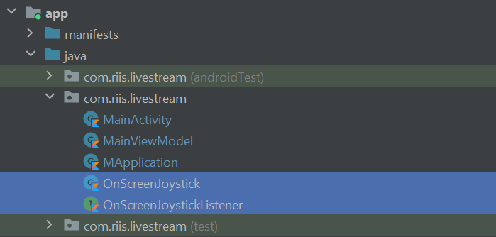
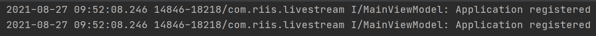
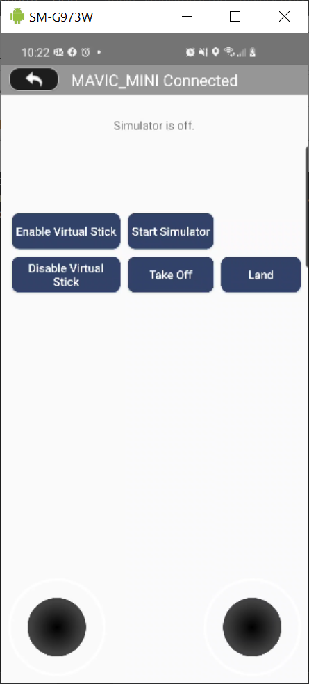

# DJI Simulator Tutorial


_If you come across any mistakes or bugs in this tutorial, please let us know by opening an issue in this Github repository. Please feel free to send us Github pull request and help us fix any issues._

* * *

In this tutorial, you will learn how to use the DJISimulator in your Android Studio project using DJI Mobile SDK. With the help of Virtual Stick control, you can input Virtual Stick flight control data and check the changes of simulator state in real time.

You can download the tutorial's final sample project from this [Github Page](https://github.com/josebgs/DJISimulator-Kotlin).

We use the Mavic Mini as an example to make this demo.

Let's get started!

## Introduction

DJISimulator is used to control the aircraft in a simulated environment based on the virtual stick input. The simulated aircraft state information will also be displayed on the screen.

You can use the `Simulator` class in `FlightController` to control the simulation. It allows both manual and automated flights to be simulated without actually flying the aircraft.

Additionally, simulator initialization, monitoring and termination can be controlled directly through the SDK allowing for application development in continuous integration environments.

## Application Activation and Aircraft Binding in China

For DJI SDK mobile application used in China, it's required to activate the application and bind the aircraft to the user's DJI account.

If an application is not activated, the aircraft not bound (if required), or a legacy version of the SDK (< 4.1) is being used, all **camera live streams** will be disabled, and flight will be limited to a zone of 100m diameter and 30m height to ensure the aircraft stays within line of sight.

To learn how to implement this feature, please check this tutorial [Application Activation and Aircraft Binding](https://developer.dji.com/mobile-sdk/documentation/android-tutorials/ActivationAndBinding.html).

## Setting Up Work Enviroment

### Importing Maven Dependency

Now, open Android Studio and select **File -> New -> New Project** to create a new project, and select "Empty Activity" under the "Phone and Tablet" section.

Next, enter the name of the project ("Kotlin-SimulatorDemo"), company domain and package name (Here we use "com.riis.livestream") you want, set the minimum SDK version 
as `API 22: Android 5.1 (Lollipop)`, make sure the language is Kotlin, and then press Finish to create the project. 

Lastly, leave the Activity Name as "MainActivity", and the Layout Name as "activity_main".

### Configure Gradle Script

Double click on the "build.gradle(Module: app)" in the project navigator to open it and add the following code:

```gradle
plugins {
    id 'com.android.application'
    id 'kotlin-android'
}

repositories {
    mavenLocal()
}

android {
    compileSdkVersion 30
    buildToolsVersion "30.0.2"
    useLibrary 'org.apache.http.legacy'

    defaultConfig {
        applicationId 'com.riis.livestream'
        minSdkVersion 22
        targetSdkVersion 30
        versionCode 1
        versionName "1.0"
        multiDexEnabled true
        ndk {
            // On x86 devices that run Android API 23 or above, if the application is targeted with API 23 or
            // above, FFmpeg lib might lead to runtime crashes or warnings.
            abiFilters 'armeabi-v7a', 'x86', 'arm64-v8a'
        }

        testInstrumentationRunner "androidx.test.runner.AndroidJUnitRunner"
    }

    buildTypes {
        release {
            minifyEnabled false
            proguardFiles getDefaultProguardFile('proguard-android-optimize.txt'), 'proguard-rules.pro'
        }

    }
    compileOptions {
        sourceCompatibility JavaVersion.VERSION_1_8
        targetCompatibility JavaVersion.VERSION_1_8
    }
    kotlinOptions {
        jvmTarget = '1.8'
    }

    dexOptions {
        javaMaxHeapSize "4g"
    }

    packagingOptions{
        doNotStrip "*/*/libdjivideo.so"
        doNotStrip "*/*/libSDKRelativeJNI.so"
        doNotStrip "*/*/libFlyForbid.so"
        doNotStrip "*/*/libduml_vision_bokeh.so"
        doNotStrip "*/*/libyuv2.so"
        doNotStrip "*/*/libGroudStation.so"
        doNotStrip "*/*/libFRCorkscrew.so"
        doNotStrip "*/*/libUpgradeVerify.so"
        doNotStrip "*/*/libFR.so"
        doNotStrip "*/*/libDJIFlySafeCore.so"
        doNotStrip "*/*/libdjifs_jni.so"
        doNotStrip "*/*/libsfjni.so"
        exclude 'META-INF/rxjava.properties'
    }
}

dependencies {
    implementation fileTree(dir: "libs", include: ["*.jar"])
    implementation "org.jetbrains.kotlin:kotlin-stdlib:$kotlin_version"
    implementation 'androidx.core:core-ktx:1.3.2'
    implementation 'androidx.appcompat:appcompat:1.2.0'
    implementation 'androidx.constraintlayout:constraintlayout:2.0.4'
    testImplementation 'junit:junit:4.12'
    androidTestImplementation 'androidx.test.ext:junit:1.1.2'
    androidTestImplementation 'androidx.test.espresso:espresso-core:3.3.0'

    // Viewmodel
    implementation 'androidx.fragment:fragment-ktx:1.2.5'
    implementation 'androidx.lifecycle:lifecycle-extensions:2.2.0'
    implementation 'androidx.lifecycle:lifecycle-livedata-ktx:2.2.0'
    implementation 'androidx.lifecycle:lifecycle-viewmodel-ktx:2.2.0'

    // DJI
    implementation('com.dji:dji-sdk:4.14.1')
    compileOnly('com.dji:dji-sdk-provided:4.14.1')
    implementation 'androidx.multidex:multidex:2.0.1'
}
```

Next, double click on the "build.gradle(Project: app)" in the project navigator to open it and add the following code:

```gradle
// Top-level build file where you can add configuration options common to all sub-projects/modules.
buildscript {
    ext.kotlin_version = "1.3.50"
    repositories {
        google()
        jcenter()
    }
    dependencies {
        classpath "com.android.tools.build:gradle:4.0.1"
        classpath "org.jetbrains.kotlin:kotlin-gradle-plugin:$kotlin_version"

        // NOTE: Do not place your application dependencies here; they belong
        // in the individual module build.gradle files
    }
}

allprojects {
    repositories {
        google()
        jcenter()
    }
}

task clean(type: Delete) {
    delete rootProject.buildDir
}
```

Then, finally make sure in your settings.gradle you only have 

```gradle
include ':app'
rootProject.name = "Kotlin-SimulatorDemo"
```

Once you finished the steps above, click the "Sync Now" option that pops up. Alternatively, select **File -> Sync Project with Gradle Files** and wait for Gradle project sync to finish.

### Implementing Registration in DJISimulatorApplication and MainActivity

Once you finish the above steps, let's register the application on DJI Developer Website and get the **App Key**. If you are not familiar with the App Key, please check [Generate an App Key](../quick-start/index.html#generate-an-app-key) for details.


### Implementing DJIApplication

Right click on the 'com.riis.livestream' module in the project navigator and select "New -> Kotlin Class/File" to create a new file, enter "DJIApplication" as the **Name** and then double click **Class**. Then replace the code with the following:

```kotlin
package com.riis.livestream

import android.app.Application
import android.content.Context
import com.secneo.sdk.Helper

class DJIApplication: Application() {

    override fun attachBaseContext(base: Context?) {
        super.attachBaseContext(base)
        Helper.install(this)
    }
}
```

Here, we override the `attachBaseContext()` method to add the `Helper.install(MApplication.this);` line of code.

> Note: Since some of SDK classes now need to be loaded before using, the loading process is done by `Helper.install()`. Developer needs to invoke this method before using any SDK functionality. Failing to do so will result in unexpected crashes.

### Working on the MainActivity

Once we finished the steps above, let's open the "MainActivity.kt" file, and replace the code with the following:

```kotlin
package com.riis.livestream

import android.Manifest
import android.os.Bundle
import androidx.activity.viewModels
import androidx.appcompat.app.AppCompatActivity
import androidx.core.app.ActivityCompat

class MainActivity : AppCompatActivity(){

    private val viewModel by viewModels<MainViewModel>()

    companion object {
        const val TAG = "UserAppMainAct"
    }

    override fun onCreate(savedInstanceState: Bundle?) {
        super.onCreate(savedInstanceState)
        setContentView(R.layout.activity_main)

        ActivityCompat.requestPermissions(
            this,
            arrayOf(
                Manifest.permission.WRITE_EXTERNAL_STORAGE,
                Manifest.permission.VIBRATE,
                Manifest.permission.INTERNET,
                Manifest.permission.ACCESS_WIFI_STATE,
                Manifest.permission.WAKE_LOCK,
                Manifest.permission.ACCESS_COARSE_LOCATION,
                Manifest.permission.ACCESS_NETWORK_STATE,
                Manifest.permission.ACCESS_FINE_LOCATION,
                Manifest.permission.CHANGE_WIFI_STATE,
                Manifest.permission.MOUNT_UNMOUNT_FILESYSTEMS,
                Manifest.permission.READ_EXTERNAL_STORAGE,
                Manifest.permission.SYSTEM_ALERT_WINDOW,
                Manifest.permission.READ_PHONE_STATE,
                Manifest.permission.RECORD_AUDIO
            ), 1
        )
        viewModel.startSdkRegistration(this)
    }

}
```

Here, we implement the following:

1.  In the `onCreate()` method, we request several permissions at runtime to ensure the SDK works well when the compile and target SDK version is higher than 22(Like Android Marshmallow 6.0 device and API 23). Then, we invoke the `startSdkRegistration(context: Context)` method of class `MainViewModel` to register the application. This is because `startSdkRegistration(context: Context)` will invoke `registerApp()` method of `DJISDKManager` to register the application. Here we will use a viewmodel to help register the app rather than have all the registration code in MainActivity.kt because it makes for cleaner code.

Next, you can just copy the MainViewModel.kt class into your com.riis.livestream package. This file just contains the code to register your app—all of which you have seen before. This file can be found in this repository [here.](https://github.com/josebgs/DJISimulator-Kotlin/blob/master/app/src/main/java/com/riis/kotlin_simulatordemo/MainViewModel.kt)

### Modifying AndroidManifest file

Once you finished the steps above, let's open the "AndroidManifest.xml" file and add the following elements on top of the **application** element:

```xml    
<uses-permission android:name="android.permission.BLUETOOTH" />
<uses-permission android:name="android.permission.BLUETOOTH_ADMIN" />
<uses-permission android:name="android.permission.VIBRATE" />
<uses-permission android:name="android.permission.INTERNET" />
<uses-permission android:name="android.permission.ACCESS_WIFI_STATE" />
<uses-permission android:name="android.permission.ACCESS_COARSE_LOCATION" />
<uses-permission android:name="android.permission.ACCESS_NETWORK_STATE" />
<uses-permission android:name="android.permission.ACCESS_FINE_LOCATION" />
<uses-permission android:name="android.permission.CHANGE_WIFI_STATE" />
<uses-permission android:name="android.permission.WRITE_EXTERNAL_STORAGE" />
<uses-permission android:name="android.permission.READ_EXTERNAL_STORAGE" />
<uses-permission android:name="android.permission.READ_PHONE_STATE" />
<uses-permission android:name="android.permission.RECORD_AUDIO" />

<uses-feature android:name="android.hardware.camera" />
<uses-feature android:name="android.hardware.camera.autofocus" />
<uses-feature
    android:name="android.hardware.usb.host"
    android:required="false" />
<uses-feature
    android:name="android.hardware.usb.accessory"
    android:required="true" />

```
Here, we request permissions that the application must be granted in order for it to register DJI SDK correctly. Also, we declare the camera and USB hardware which are used by the application.

Moreover, add the `android:name=".DJIApplication"` at the beginning of the `application` element:

```xml
<application
        android:name=".DJIApplication"
        android:allowBackup="true"
        android:icon="@mipmap/ic_launcher"
        android:label="@string/app_name"
        android:roundIcon="@mipmap/ic_launcher_round"
        android:supportsRtl="true"
        android:theme="@style/Theme.KotlinSimulatorDemo">
```

Furthermore, let's add the following elements as childs of the element on top of the "MainActivity" activity element as shown below:

```xml
 <meta-data
            android:name="com.dji.sdk.API_KEY"
            android:value="Please enter your App Key here." />

<service android:name="dji.sdk.sdkmanager.DJIGlobalService"></service>
<!-- DJI SDK -->
<uses-library android:name="org.apache.http.legacy" android:required="false" />
```

In the code above, you can substitute your **App Key** of the application for "Please enter your App Key here." in the **value** attribute under the `android:name="com.dji.sdk.API_KEY"` attribute. For the "accessory_filter.xml" file, right click on "res", select "New->Directory", and name it xml. Then, you can copy the "accessory_filter.xml" from this repository into this newly created folder. 

>Note it is suggested that you create a variable in your local.properties for your DJI API Key and place the variable name in the manifest. This ensures that your API key will not be tracked by version control systems. To do this copy `DJI_API_KEY=your_dji_key` into local.properties. Then, copy the following into your build.gradle(:app) above the `android` section:
```gradle
Properties properties = new Properties()
properties.load(project.rootProject.file('local.properties').newDataInputStream())
def djiKey = properties.getProperty('DJI_API_KEY')
```
> Next, copy `manifestPlaceholders = [DJI_API_KEY: djiKey]` into the build.gradle(:app) in the `defaultConfig` section. Finally, you can access your local.properties variable in your Android Manifest as such:

```xml
<meta-data
    android:name="com.dji.sdk.API_KEY"
    android:value="${DJI_API_KEY}" />
```

Finally, replace the "MainActivity" activity element with the following:

```xml
 <activity android:name=".MainActivity"
    android:theme="@style/Theme.AppCompat.Light.NoActionBar">
    <intent-filter>
        <action android:name="android.intent.action.MAIN" />

        <category android:name="android.intent.category.LAUNCHER" />
    </intent-filter>
    <intent-filter>
        <action android:name="android.hardware.usb.action.USB_ACCESSORY_ATTACHED" />
    </intent-filter>

    <meta-data
        android:name="android.hardware.usb.action.USB_ACCESSORY_ATTACHED"
        android:resource="@xml/accessory_filter" />
</activity>
```

## Working on MainActivity class

#### 1\. Implementing the Joystick Control

In order to input some simulated data, like `pitch`, `roll`, `yaw` and `verticalThrottle`, you may need a joystick control. Let's work on the implementation of it.

We implement the joystick control base on an open source Github project [OnScreenJoystick](https://github.com/Ville-/OnScreenJoystick/tree/master/OnScreenJoystick/src/com/salamientertainment/view/onscreenjoystick). You can download the Github project to get the **OnScreenJoystick.java** and **OnScreenJoystickListener.java** files and convert them to Kotlin. Alternatively, you can get them from this tutorial's Github Sample project. Now, copy and paste these two Kotlin files to the folder of "com.riis.livestream" on the left navigator as shown below:

<p align="center">
  
</p>

When you touch on the **OnScreenJoystick** view, the `onTouch` method in OnScreenJoystickListener will be called and you can get the "OnScreenJoystick" joystick object, and the x and y coordinate of the knob parameters from this method as shown below:

```kotlin
    /** Called when the joystick is touched.
     * @param joystick The joystick which has been touched.
     * @param pX The x coordinate of the knob. Values are between -1 (left) and 1 (right).
     * @param pY The y coordinate of the knob. Values are between -1 (down) and 1 (up).
     */
    fun onTouch(joystick: OnScreenJoystick?, pX: Float, pY: Float)
 ```

> Note: The values for x coordinate of the knob are between -1 (left) and 1 (right), the values for y coordinate of the knob are between -1 (down) and 1 (up).

Next, copy and paste the **joystick.png** and **joystick_bg.png** files from this tutorial's Github sample project to the **mipmap** folder on the left navigator as shown below:

<p align="center">
  
</p>

#### 2\. Implementing the MainActivity Layout

Now, let's continue to open the "activity_main.xml" file, and replace the code with the following:

```xml
<?xml version="1.0" encoding="utf-8"?>
<RelativeLayout xmlns:android="http://schemas.android.com/apk/res/android"
    xmlns:tools="http://schemas.android.com/tools"
    android:layout_width="match_parent"
    android:layout_height="match_parent"
    android:orientation="vertical">

    <RelativeLayout
        android:id="@+id/main_title_rl"
        android:layout_width="fill_parent"
        android:layout_height="40dp"
        android:background="@color/black_overlay" >

        <ImageButton
            android:id="@+id/ReturnBtn"
            android:layout_width="wrap_content"
            android:layout_height="35dp"
            android:layout_alignParentLeft="true"
            android:layout_centerVertical="true"
            android:layout_marginLeft="5dp"
            android:adjustViewBounds="true"
            android:background="@android:color/transparent"
            android:onClick="onReturn"
            android:scaleType="centerInside"
            android:src="@drawable/selector_back_button" />

        <TextView
            android:id="@+id/ConnectStatusTextView"
            android:layout_width="wrap_content"
            android:layout_height="wrap_content"
            android:layout_centerInParent="true"
            android:text="SimulatorDemo"
            android:textColor="@android:color/white"
            android:textSize="19sp" />
    </RelativeLayout>

    <TextView
        android:layout_marginTop="70dp"
        android:layout_width="wrap_content"
        android:layout_height="wrap_content"
        android:layout_centerHorizontal="true"
        android:text="Simulator is off."
        android:id="@+id/textview_simulator"/>

    <Button
        android:layout_width="wrap_content"
        android:layout_height="wrap_content"
        android:text="Enable Virtual Stick"
        style="@style/common_button"
        android:id="@+id/btn_enable_virtual_stick"
        android:layout_marginLeft="5dp"
        android:layout_alignTop="@+id/btn_start_simulator"
        android:layout_alignStart="@+id/directionJoystickLeft"
        android:layout_marginTop="0dp" />

    <Button
        android:layout_width="wrap_content"
        android:layout_height="wrap_content"
        android:text="Disable Virtual Stick"
        style="@style/common_button"
        android:id="@+id/btn_disable_virtual_stick"
        android:layout_below="@+id/btn_enable_virtual_stick"
        android:layout_alignStart="@+id/btn_enable_virtual_stick"
        android:layout_marginLeft="0dp"
        android:layout_alignEnd="@+id/btn_enable_virtual_stick" />

    <Button
        android:layout_width="wrap_content"
        android:layout_height="wrap_content"
        android:text="Take Off"
        style="@style/common_button"
        android:id="@+id/btn_take_off"
        android:layout_alignTop="@+id/btn_disable_virtual_stick"
        android:layout_alignStart="@+id/btn_start_simulator"
        android:layout_marginTop="0dp"
        android:layout_alignEnd="@+id/btn_start_simulator" />

    <ToggleButton
        android:id="@+id/btn_start_simulator"
        android:layout_width="wrap_content"
        android:layout_height="wrap_content"
        android:text="Start Simulator"
        android:textOff="Start Simulator"
        android:textOn="Stop Simulator"
        style="@style/common_button"
        android:layout_below="@+id/textview_simulator"
        android:layout_toEndOf="@+id/btn_enable_virtual_stick"
        android:layout_marginTop="107dp"
        android:layout_marginLeft="10dp" />

    <Button
        android:layout_width="wrap_content"
        android:layout_height="wrap_content"
        android:text="Land"
        style="@style/common_button"
        android:id="@+id/btn_land"
        android:layout_alignTop="@+id/btn_take_off"
        android:layout_marginTop="0dp"
        android:layout_alignEnd="@+id/directionJoystickRight"
        android:layout_toEndOf="@+id/btn_take_off"
        android:layout_marginLeft="10dp" />

    <com.riis.livestream.OnScreenJoystick
        android:id="@+id/directionJoystickLeft"
        android:layout_width="130dp"
        android:layout_height="130dp"
        android:layout_alignParentLeft="true"
        android:layout_alignParentBottom="true"
        android:layout_marginBottom="10dp"
        android:layout_marginLeft="10dp"
        android:background="@mipmap/joystick_bg"/>

    <com.riis.livestream.OnScreenJoystick
        android:id="@+id/directionJoystickRight"
        android:layout_width="130dp"
        android:layout_height="130dp"
        android:layout_alignParentRight="true"
        android:layout_alignParentBottom="true"
        android:layout_marginBottom="10dp"
        android:layout_marginRight="10dp"
        android:background="@mipmap/joystick_bg"/>


</RelativeLayout>
```
In the xml file, first, we implement the RelativeLayout element. We declare an ImageButton(id: ReturnBtnCamera) element to exit the application, and a TextView(id: ConnectStatusTextView) element to show the connection status text.

Next, create a TextureView(id: textview_simulator) element to show the simulator state infos. Moreover, create the "Enable Virtual Stick" button(id: btn_enable_virtual_stick), "Disable Virtual Stick" button(id: btn_disable_virtual_stick), "Take Off" button(id: btn_take_off), "Land" button(id: btn_land). Moreover, create the "Start Simulator" toggle button(id: btn_start_simulator) and set its **textOn** and **textOff** params to "Start Simulator" and "Stop Simulator".

Lastly, we create two OnScreenJoystick elements (id: directionJoystickRight) and (id:directionJoystickLeft) for joystick control.


#### 3\. Implementing the UI Elements in MainActivity Class

Now, let's open the MainActivity.java file, make the class extend View.OnClickListener, intialize the UI variable, and invoke a call to `initUi()` at the end of `onCreate(savedInstanceState: Bundle?)` as shown below:

```kotlin
class MainActivity : AppCompatActivity(), View.OnClickListener {
  
  private lateinit var mConnectStatusTextView: TextView
  private lateinit var mBtnEnableVirtualStick: Button
  private lateinit var mBtnDisableVirtualStick: Button
  private lateinit var mBtnSimulator: ToggleButton
  private lateinit var mBtnTakeOff: Button
  private lateinit var mBtnLand: Button
  private lateinit var mTextView: TextView
  private lateinit var mScreenJoystickLeft: OnScreenJoystick
  private lateinit var mScreenJoystickRight: OnScreenJoystick
  
  ...
  
  override fun onCreate(savedInstanceState: Bundle?) {
    ...
    initUi()
  }
  
}
```

Next, implement the following three methods `initUI()`, `onClick(v: View?)`, and `showToast(msg: String)`:

```kotlin
    private fun initUi() {
        mBtnEnableVirtualStick = findViewById(R.id.btn_enable_virtual_stick)
        mBtnDisableVirtualStick = findViewById(R.id.btn_disable_virtual_stick)
        mBtnTakeOff = findViewById(R.id.btn_take_off)
        mBtnLand = findViewById(R.id.btn_land)
        mBtnSimulator = findViewById(R.id.btn_start_simulator)
        mTextView = findViewById(R.id.textview_simulator)
        mConnectStatusTextView = findViewById(R.id.ConnectStatusTextView)
        mScreenJoystickRight = findViewById(R.id.directionJoystickRight)
        mScreenJoystickLeft = findViewById(R.id.directionJoystickLeft)

        mBtnEnableVirtualStick.setOnClickListener(this)
        mBtnDisableVirtualStick.setOnClickListener(this)
        mBtnTakeOff.setOnClickListener(this)
        mBtnLand.setOnClickListener(this)

        mBtnSimulator.setOnCheckedChangeListener { buttonView, isChecked ->
            //TODO
        }

        mScreenJoystickRight.setJoystickListener(object : OnScreenJoystickListener {
            override fun onTouch(joystick: OnScreenJoystick?, pX: Float, pY: Float) {
                TODO("Not yet implemented")
            }
        })

        mScreenJoystickLeft.setJoystickListener(object : OnScreenJoystickListener {
            override fun onTouch(joystick: OnScreenJoystick?, pX: Float, pY: Float) {
                TODO("Not yet implemented")
            }
        })
    }

    override fun onClick(v: View?) {
        when(v?.id) {
            R.id.btn_enable_virtual_stick -> {
                // TODO
            }
            R.id.btn_disable_virtual_stick -> {
                // TODO
            }
            R.id.btn_take_off -> {
                // TODO
            }
            R.id.btn_land -> {
                // TODO
            }
            else -> {

            }
        }
    }
    
    private fun showToast(msg: String) {
        Toast.makeText(this, msg, Toast.LENGTH_SHORT).show()
    }
```

In the code above, we implemented the following features:

**1.** Create the layout UI elements variables, including two TextView `mConnectStatusTextView`, `mTextView`, four buttons `mBtnEnableVirtualStick`, `mBtnDisableVirtualStick`, `mBtnTakeOff`, `mBtnLand`, one Toggle Button `mBtnSimulator` and two OnScreenJoystick control `mScreenJoystickRight` and `mScreenJoystickLeft`.

**2.** In the `initUI()` method, we first initialize the UI elements variables, then set the click listener of the four buttons to "this". Moreover, implement the `onCheckedChanged()` method of toggle button `mBtnSimulator`'s "setOnCheckedChangeListener". Finally, implement the `onTouch()` method of the two `OnScreenJoystick` objects' "setJoystickListener".

**3.** Override the `onClick()` method to implement the four buttons' click actions.

**4.** In the `showToast(msg: String)`, we create a helper method to display a toast to the user.


#### 4\. Configuring the Resources

Once you finish the above steps, let's add some resources files to the **res** folder on the left navigator of Android Studio.

Copy the following image and xml files from this tutorial Github Sample project's **drawable** folder to your project, they are used for the button's UI:

<p align="center">
  
</p>

Next, open the "colors.xml" file and add the following code at the bottom to declare the black overlay color:

```xml
<color name="colorPrimary">#3F51B5</color>
<color name="colorPrimaryDark">#303F9F</color>
<color name="colorAccent">#FF4081</color>
<color name="black_overlay">#66000000</color>
```

Next, open the "values/themes.xml" file and add the following code at the bottom to declare the black overlay color:

```xml
<resources xmlns:tools="http://schemas.android.com/tools">
    <!-- Base application theme. -->
    <style name="Theme.KotlinSimulatorDemo" parent="Theme.AppCompat.Light.NoActionBar">
        <!-- Primary brand color. -->
        <item name="colorPrimary">@color/purple_500</item>

    </style>
</resources>
```

Next, open the "values-night/theme.xml" file and add the following code at the bottom to declare the black overlay color:


```xml
<resources xmlns:tools="http://schemas.android.com/tools">
    <!-- Base application theme. -->
    <style name="Theme.KotlinSimulatorDemo" parent="Theme.AppCompat.Light.NoActionBar">
        <!-- Primary brand color. -->
        <item name="colorPrimary">@color/purple_200</item>
        <!-- Customize your theme here. -->
    </style>
</resources>
```

Moreover, open the "strings.xml" file and add the following strings:

```xml
<string name="view_virtual_stick">VirtualStickView</string>
<string name="sdk_registration_message">SDK Registration Failed. Please check the bundle ID and your network connectivity</string>
<string name="success">Success</string>
```

Lastly, right click on the "values" directory in "res" and select "New->Value Resource File". Write "styles" as the file name and leave all the other options as-is. Then, press "Ok" to create the file. Now, replace the code in your newly created file with the following to declare the "common_button" style:

```xml
<?xml version="1.0" encoding="utf-8"?>
<resources>
    <style name="common_button">
        <item name="android:layout_width">100dp</item>
        <item name="android:layout_height">45dp</item>
        <item name="android:layout_marginTop">10dp</item>
        <item name="android:background">@drawable/round_btn</item>
        <item name="android:paddingLeft">5dp</item>
        <item name="android:paddingRight">5dp</item>
        <item name="android:textAllCaps">false</item>
        <item name="android:textColor">@android:color/white</item>
        <item name="android:textSize">14sp</item>
    </style>
</resources>
```

Now let's build and run the project and install it to your Android device. If everything goes well, you should see the `MainViewModel: Application Registered` in your logcat under the debug section as shown in the screenshot below.

<p align="center">
  
</p>

## Working on MainActivity Class
### Update Product Connection Status

Add the `initObservers()` method, shown below, to the MainActivity class and invoke the function at the end of the `onCreate()` function.

```kotlin
private fun initObservers() {
        viewModel.connectionStatus.observe(this, androidx.lifecycle.Observer<Boolean> {
            var ret = false
            viewModel.product?.let {
                if (it.isConnected) {
                    mConnectStatusTextView.text = it.model.toString() + " Connected"
                    ret = true
                } else {
                    if ((it as Aircraft?)?.remoteController != null && it.remoteController.isConnected
                    ) {
                        mConnectStatusTextView.text = "only RC Connected"
                        ret = true
                    }

                }
            }
            if (!ret) {
                mConnectStatusTextView.text = "Disconnected"
            }
        })
    }
```

Now let's build and run the project and install it to your Android device. Then connect the demo application to your Mavic Mini (Please check [Run Application](https://developer.dji.com/mobile-sdk/documentation/application-development-workflow/workflow-run.html) for more details), if everything goes well, you should see the title textView content updates to "MAVIC_MINI Connected" as shown below:

<p align="center">
  
</p>

### Implementing Virtual Stick Control

Since we have implemented the Joystick control, now let's continue to work on sending virtual stick flight control data to the aircraft. First,  a Timer variable `mSendVirtualStickDataTimer`, a SendVirtualStickDataTask(extends from TimerTask class) variable `mSendVirtualStickDataTask` and four float variables on top of `onCreate()` method as shown below:

```kotlin
private var mSendVirtualStickDataTimer: Timer? = null
private var mSendVirtualStickDataTask: SendVirtualStickDataTask? = null

private var mPitch: Float = 0f
private var mRoll: Float = 0f
private var mYaw: Float = 0f
private var mThrottle: Float = 0f
```

We may use the `mPitch`, `mRoll`, `mYaw` and `mThrottle` variables to store the **pitch**, **roll**, **yaw** and **vertical throttle** virtual stick flight control data.

Next, create the `initFlightController()` method, invoke it in the `initObservers()` method above the `var ret = false` line, and implement the SendVirtualStickDataTask class as shown below. Also, implement the `onReturn(v: View)` and override the `onDestroy()` methods with the following:

```kotlin
private fun initObservers() {
    viewModel.connectionStatus.observe(this, androidx.lifecycle.Observer<Boolean> {
        initFlightController()
        var ret = false

        ...
    }
}

...

private fun initFlightController() {

    viewModel.getFlightController()?.let {
        //TODO
    }
}

fun onReturn(view: View) {
    this.finish()
}

override fun onDestroy() {
    mSendVirtualStickDataTask?.let {
        it.cancel()
        mSendVirtualStickDataTask = null
    }

    mSendVirtualStickDataTimer?.let {
        it.cancel()
        it.purge()
        mSendVirtualStickDataTimer = null
    }
    super.onDestroy()
}

inner class SendVirtualStickDataTask: TimerTask() {
    override fun run() {
        viewModel.getFlightController()?.sendVirtualStickFlightControlData(
            FlightControlData(mPitch, mRoll, mYaw, mThrottle)
        ) {

        }
    }
}
```

In the code above, we implement the following features:

**1.** In the `initFlightController()` method, we check if the aircraft is not null and is connected via the MainViewModel method `getFlightController()` which calls the `getFlightController()` method of the Aircraft class.

**2.** Next, extends from TimerTask class to create the **SendVirtualStickDataTask** class. Inside the class, override the `run()` method to invoke the `sendVirtualStickFlightControlData()` method of FlightController to send virtual stick flight control data. Here, we create the **FlightControlData** object from the four float variables declared before: `mPitch`, `mRoll`, `mYaw` and `mThrottle`.

**3.** Override the `onDestroy()` method in order to prevent memory leaks in the case where the app is destroyed before the task is completed. We also implement the functionality of the return button which exits the app.

Once you finish the above steps, let's implement the `setJoystickListener()` methods of `mScreenJoystickLeft` and `mScreenJoystickRight` variables at the bottom of `initUI()` method as shown below:

```kotlin
mScreenJoystickRight.setJoystickListener(object : OnScreenJoystickListener {
    override fun onTouch(joystick: OnScreenJoystick?, pXP: Float, pYP: Float) {
        var pX = pXP
        var pY = pYP
        if (abs(pX) < 0.02) {
            pX = 0f
        }
        if (abs(pY) < 0.02) {
            pY = 0f
        }
        val pitchJoyControlMaxSpeed = 10f
        val rollJoyControlMaxSpeed = 10f
        mPitch = (pitchJoyControlMaxSpeed * pX)
        mRoll = (rollJoyControlMaxSpeed * pY)
        if (null == mSendVirtualStickDataTimer) {
            mSendVirtualStickDataTask = SendVirtualStickDataTask()
            mSendVirtualStickDataTimer = Timer()
            mSendVirtualStickDataTimer?.schedule(mSendVirtualStickDataTask, 100, 200)
        }
    }
})

mScreenJoystickLeft.setJoystickListener(object : OnScreenJoystickListener {
    override fun onTouch(joystick: OnScreenJoystick?, pX: Float, pY: Float) {
        var pX = pX
        var pY = pY
        if (abs(pX) < 0.02) {
            pX = 0f
        }
        if (abs(pY) < 0.02) {
            pY = 0f
        }
        val verticalJoyControlMaxSpeed = 2f
        val yawJoyControlMaxSpeed = 30f
        mYaw = (yawJoyControlMaxSpeed * pX)
        mThrottle = (verticalJoyControlMaxSpeed * pY)
        if (null == mSendVirtualStickDataTimer) {
            mSendVirtualStickDataTask = SendVirtualStickDataTask()
            mSendVirtualStickDataTimer = Timer()
            mSendVirtualStickDataTimer?.schedule(mSendVirtualStickDataTask, 0, 200)
        }
    }
})
```

Here, we implement the following features:

**1.** Override the `onTouch()` method of **setJoystickListener** and filter the `pX` and `pY` variables' value by checking if they are less than 0.02\. We should not send the virtual stick data to flight controller too frequently if the value is too small.

**2.** Get the maximum velocity of pitch and roll control, then store them to `pitchJoyControlMaxSpeed` and `rollJoyControlMaxSpeed` variables. Since the value of `pX` is between -1 (left) and 1 (right), the value of `pY` is between -1 (down) and 1 (up), we multiply by using the `pitchJoyControlMaxSpeed` and `rollJoyControlMaxSpeed` values to update the `mPitch` and `mRoll` data. Here we take Mode 2(American mode) of remote controller as example.

**3.** Lastly, we check if `mSendVirtualStickDataTimer` is null, and create it by invoking the `SendVirtualStickDataTask()` method. Then, create the `mSendVirtualStickDataTimer` and invoke its `schedule()` method to trigger the timer by passing `mSendVirtualStickDataTask` variable, 0 milliseconds of delay and 200 milliseconds between subsequent executions.

**4.** Similarly, implement the `setJoystickListener()` method of `mScreenJoystickRight` variable to update the `mYaw` and `mThrottle` values and trigger the timer to send virtual stick data to the aircraft's flight controller.

Now, when you control the left and right joysticks, they will send the simulated virtual stick data (Including **Yaw**, **Pitch**, **Roll** and **Vertical Throttle**) to the flight controller of aircraft.

Lastly, override the `onClick()` method to implement the enable and disable virtual stick control buttons click actions as shown below:

```kotlin
override fun onClick(v: View?) {
        when(v?.id) {
            R.id.btn_enable_virtual_stick -> {
                viewModel.getFlightController()?.let { controller ->
                    controller.setVirtualStickModeEnabled(true) { djiError ->
                        if (djiError != null) {
                            Log.i(TAG, djiError.description)
                            showToast("Virtual Stick: Could not enable virtual stick")
                        } else {
                            Log.i(TAG,"Enable Virtual Stick Success")
                            showToast("Virtual Sticks Enabled")
                        }
                    }
                }

            }
            R.id.btn_disable_virtual_stick -> {
                viewModel.getFlightController()?.let { controller ->
                    controller.setVirtualStickModeEnabled(false) { djiError ->
                        if (djiError != null) {
                            Log.i(TAG, djiError.description)
                            showToast("Virtual Stick: Could not disable virtual stick")
                        } else {
                            Log.i(TAG,"Disable Virtual Stick Success")
                            showToast("Virtual Sticks Disabled")
                        }
                    }
                }
            }

            R.id.btn_take_off -> {
                // TODO
            }
            R.id.btn_land -> {
                // TODO
            }
            else -> {

            }
        }
    }
```
This invokes the `enableVirtualStickControlMode()` and `disableVirtualStickControlMode()` methods of FlightController to enable and disable the virtual stick control mode.

### Implementing DJISimulator

Let's implement the DJISimulator feature now. In order to update the simulator state data in `mTextView`, we may need to implement the `setStateCallback()` method of DJISimulator in the `initFlightController()` method as shown below:

```kotlin
private fun initFlightController() {

    viewModel.getFlightController()?.let {
        it.rollPitchControlMode = RollPitchControlMode.VELOCITY
        it.yawControlMode = YawControlMode.ANGULAR_VELOCITY
        it.verticalControlMode = VerticalControlMode.VELOCITY
        it.rollPitchCoordinateSystem = FlightCoordinateSystem.BODY
        it.simulator.setStateCallback { stateData ->
            val yaw = String.format("%.2f", stateData.yaw)
            val pitch = String.format("%.2f", stateData.pitch)
            val roll = String.format("%.2f", stateData.roll)
            val positionX = String.format("%.2f", stateData.positionX)
            val positionY = String.format("%.2f", stateData.positionY)
            val positionZ = String.format("%.2f", stateData.positionZ)

            lifecycleScope.launch(Dispatchers.Main) {
                mTextView.text = "Yaw: $yaw, Pitch $pitch, Roll: $roll, \n, PosX: $positionX, PosY: $positionY, PosZ: $positionZ"
            }

        }
    }
}
```

In the code above, we override the `onUpdate()` method to get the lastest simulator state data, then invoke the `getYaw()`, `getPitch()`, `getRoll()`, `getPositionX()`, `getPositionY()` and `getPositionZ()` methods of `SimulatorState` to get the updated yaw, pitch, roll, positionX, positionY and positionZ values and show them in `mTextView`.

Next, override the `onCheckedChanged()` method of `mBtnSimulator` toggleButton's `setOnCheckedChangeListener()` method as shown below:

```kotlin
mBtnSimulator.setOnCheckedChangeListener { buttonView, isChecked ->
    if (isChecked) {
        mTextView.visibility = View.VISIBLE
        viewModel.getFlightController()?.simulator?.start(
            InitializationData.createInstance(
                LocationCoordinate2D(23.0, 113.0), 10, 10
            )
        ) { djiError ->
            if (djiError != null) {
                Log.i(TAG, djiError.description)
                showToast("Simulator Error: ${djiError.description}")
            } else {
                Log.i(TAG,"Start Simulator Success")
                showToast("Start Simulator Success")
            }
        }
    } else {
        mTextView.visibility = View.INVISIBLE
        if(viewModel.getFlightController() == null) {
            Log.i(TAG, "isFlightController Null ")
        }
        viewModel.getFlightController()?.simulator?.stop { djiError ->
            if (djiError != null) {
                Log.i(TAG, djiError.description)
                showToast("Simulator Error: ${djiError.description}")
            } else {
                Log.i(TAG,"Stop Simulator Success")
                showToast("Stop Simulator Success")
            }
        }
    }
}
```

In the code above, we implement the following features:

**1.** If the `mBtnSimulator` toggle button is checked, then show the `mTextView`. Next, if the `mFlightController` is not null, we invoke the `start()` method of DJISimulator by passing a `InitializationData` with LocationCoordinate2D struct (lattitude 23 and longitude 113), updateFrequency 10 and satelliteCount 10 parameters to it. For more details of DJISimulatorInitializationData, please check the [Android API Reference](https://developer.dji.com/iframe/mobile-sdk-doc/android/reference/dji/sdk/FlightController/DJISimulatorInitializationData.html).

**2.** Next, overide the `onResult()` method of `start()`, invoke `showToast()` method to show the start simulator result to the user.

**3.** Similarly, if the `mBtnSimulator` toggle button is not checked, then invoke the `stop()` method of DJISimulator to stop the simulator. Furthermore, override the `onResult()` method and invoke the `showToast()` method to show the stop simulator result to the user.

### Working on Takeoff and AutoLanding features

Finally, let's add the following code at the bottom of `onClick()` method to implement the **Take off** and **Land** buttons' click actions as shown below:

```kotlin
R.id.btn_take_off -> {
    viewModel.getFlightController()?.let { controller ->
        controller.startTakeoff { djiError ->
            if (djiError != null) {
                Log.i(TAG, djiError.description)
                showToast("Takeoff Error: ${djiError.description}")
            } else {
                Log.i(TAG,"Takeoff Success")
                showToast("Takeoff Success")
            }
        }
    }
}
R.id.btn_land -> {
    viewModel.getFlightController()?.let { controller ->
        controller.startLanding { djiError ->
            if (djiError != null) {
                Log.i(TAG, djiError.description)
                showToast("Landing Error: ${djiError.description}")
            } else {
                Log.i(TAG,"Start Landing Success")
                showToast("Start Landing Success")
            }
        }
    }
}
else -> {

}
```

For the case of "R.id.btn_take_off", we invoke the `startTakeoff()` method of FlightController to send the take off command to the aircraft. Similiarly, for the case of "R.id.btn_land", we invoke the `startLanding()` method to send the auto landing command. It's just that simple and easy.

We have gone through a long way in this tutorial, now let's build and run the project, connect the demo application to your Mavic Pro (Please check [Run Application](https://developer.dji.com/mobile-sdk/documentation/application-development-workflow/workflow-run.html) for more details) and check all the features we have implemented so far.

If everything goes well, you should see something similiar to the following gif animations like this:

<p align=center>
    
</p>

*   If the demo application is connected with Mavic Mini successfully, you should see the title textView content updates to "MAVIC_MINI Connected".

*   Press **Enable Virtual Stick** button to enable virtual stick control, then press **Start Simulator** to start the simulator.

*   Moreover, press the **Take Off** button to send take off command to the aircraft, if the command executes successfully, you should see the **PosZ** value start to change, means that the aircraft is rising.

*   Now you can drag the left and right virtual stick controls to simulate the flight behavious.

*   Lastly, press the **Land** button to make the aircraft start auto landing, once it finish, you may notice the **PosZ** value becomes "0.00". Press the **Stop Simulator** button to stop the simulator and then press **Disable Virtual Stick** to disable the virtual stick control.

### Summary

In this tutorial, you've learned how to use the DJISimulator feature to simulate aircraft's flight behaviour in a simulated environment based on the virtual stick control input and show the changes of simulator state(Yaw,Pitch,Roll,PosX,PosY and PosZ) in real time. Also you've learned how to use Virtual Stick control to send virtual stick flight control data to the aircraft.

This demo is a simple demonstration of using DJISimulator, to have a better user experience, you can create a 3D simulated environment using 3D game engine like [Unity3D](https://unity3d.com) to show the simulated data and aircraft flight behavious inside your mobile application (Like the Flight Simulator in DJI Go app)!

Furthermore, the DJISimulator allows for automated testing in continous integration environment(Like [Jenkins](https://jenkins.io)), it would help your DJI-SDK based application testing process. Good luck, and hope you enjoyed this tutorial!
