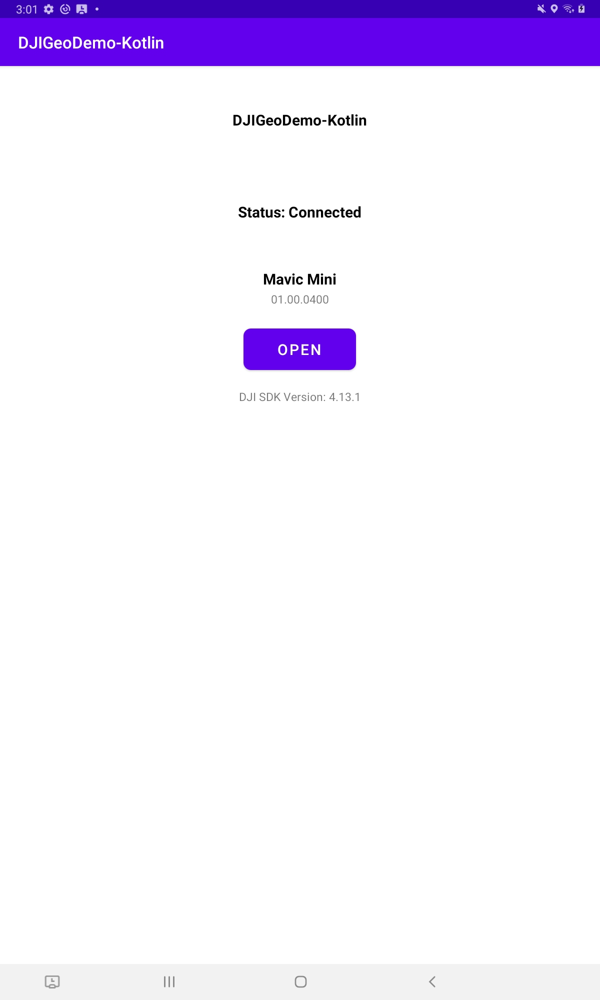
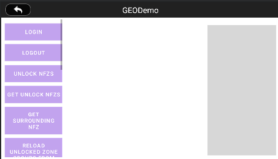
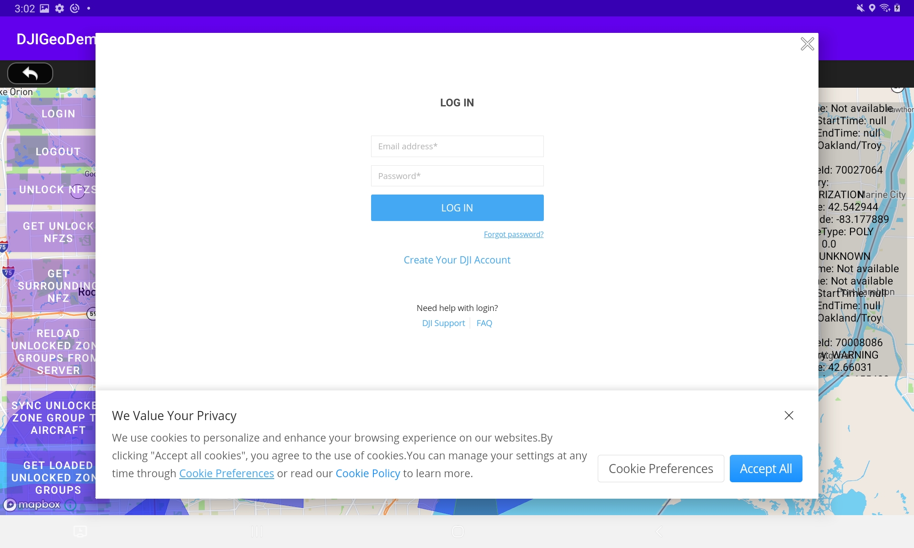

# DJI GEO System Tutorial

## DJI LAB 8 TUTORIAL KOTLIN

***`WARNING: THIS TUTORIAL ASSUMES YOU'VE COMPLETED THE PREVIOUS TUTORIALS`***

In this tutorial, you will learn how to use the `FlyZoneManager` and `FlyZoneInformation` of DJI Mobile SDK to get the fly zone information, and unlock authorization fly zones.

You can download the tutorial's final sample project from this [Github Page](https://github.com/riisinterns/drone-lab-eight-geo-system).

> Note: In this tutorial, we will use Mavic Pro for testing, use Android Studio 3.0 for developing the demo application, and use the Mapbox API for navigating.

---

### Introduction

The [Geospatial Environment Online (GEO)](https://www.dji.com/ca/flysafe) system is a best-in-class geospatial information system that provides drone operators with information that will help them make smart decisions about where and when to fly. It combines up-to-date airspace information, a warning and flight-restriction system, a mechanism for unlocking (self-authorizing) drone flights in locations where flight is permitted under certain conditions, and a minimally-invasive accountability mechanism for these decisions.

---

### Preparation

#### 1. Setup Android Development Environment

Throughout this tutorial we will be using the latest version of android studio, which you can download from here: <http://developer.android.com/sdk/index.html>.

---

### Initial Gradle and Manifest Setup

We can use the map view to display waypoints and show the flight route of the aircraft when waypoint mission is being executed. In this tutorial, we will be using MapBox.

#### 1. Create the project

Open Android Studio and select **File -> New -> New Project** to create a new project, named `"DJIGEODemo-Kotlin"`. Enter the company domain and package name `(Here we use "com.riis.djigeodemo_kotlin")` you want and press Next. Set the mimimum SDK version as `API 22: Android 5.1 (Lollipop)` for "Phone and Tablet" and press Next. Then select "Empty Activity" and press Next. Lastly, leave the Activity Name as "MainActivity", and the Layout Name as "activity_main", Press "Finish" to create the project.

#### 2. Install the Mapbox SDK

To complete this, follow the steps in the following link: <https://docs.mapbox.com/android/maps/guides/install/>. In order to do this, you'll need to configure your credentials and add the Mapbox SDK as a dependency. Be sure to do everything in this page aside from the "Add a Map" step at the bottom.

Once this is complete, please add the api access token as a raw string to `strings.xml` as well as all the other strings below.

```xml
<resources>
    <string name="app_name">DJIGeoDemo-Kotlin</string>
    <string name="title_activity_GEODemo">GEODemo</string>

    <string name="action_settings">Settings</string>
    <string name="disconnected">Disconnected</string>
    <string name="product_information">Product Information</string>
    <string name="connection_loose">Status: No Product Connected</string>
    <string name="sdk_version">DJI SDK Version: %1$s</string>
    <string name="model_not_available">Model not Available</string>

    <!-- GEO with map testing activity-->
    <string name="title_activity_geo_with_map_testing">GeoWithMapTestingActivity</string>
    <string name="demo_desc_geo_with_map">Geo System With Map</string>

    <string name="item_top_left_title">Category</string>
    <string name="item_top_title">EventName</string>
    <string name="Message_WaitStatus">Upload Status</string>

    <string name="title_activity_geo_testing">GeoTestingActivity</string>
    <string name="demo_desc_geo">Geo System</string>
    <string name="geo_get_surrounding_nfz">Get Surrounding NFZ</string>
    <string name="geo_get_location_nfz">Get location NFZ</string>
    <string name="geo_get_unlock_nfz">Get Unlock NFZ</string>
    <string name="geo_refresh_nfz">Refresh Local Data</string>
    <string name="geo_unlock_nfzs">Unlock NFZs</string>
    <string name="geo_get_unlock_nfzs">Get Unlock NFZs</string>
    <string name="geo_reload_unlocked_zone_groups_from_server">Reload Unlocked Zone Groups from Server</string>
    <string name="geo_sync_unlocked_zone_group_to_aircraft">Sync Unlocked Zone Group to Aircraft</string>
    <string name="geo_get_loaded_unlocked_zone_groups">Get Loaded Unlocked Zone Groups</string>
    <string name="geo_login">Login</string>
    <string name="geo_logout">Logout</string>
    <string name="enabled_geo">Enabled GEO</string>
    <string name="start_simulator">Start Simulator</string>
    <string name="stop_simulator">Stop Simulator</string>
    <string name="geo_set_geo_enabled">Set GEO Enabled</string>
    <string name="geo_get_geo_enabled">Get GEO Enabled</string>
    <string name="flysafe_clear_text">Clear Text</string>
    <string name="geo_update_location">Update Location</string>
    <string name="geo_load_custom_unlock_zones">Load Custom Unlock Zones from server</string>
    <string name="geo_get_custom_unlock_zones">Get Custom Unlock Zones</string>
    <string name="geo_enable_custom_unlock_zone">Enable Custom Unlock Zone</string>
    <string name="geo_disable_custom_unlock_zone">Disable Custom Unlock Zone</string>
    <string name="geo_get_enabled_custom_unlock_zone">Get Enabled Custom Unlock Zone</string>
    <string name="mapbox_access_token">enter your token here</string>
</resources>
```

#### 3. Android Manifest Permissions

Specify the permissions of your application needs, by adding `<uses-permission>` elements as children of the `<manifest>` element in the `AndroidManifest.xml` file.

```xml
<uses-permission android:name="android.permission.BLUETOOTH" />
<uses-permission android:name="android.permission.BLUETOOTH_ADMIN" />
<uses-permission android:name="android.permission.VIBRATE" />
<uses-permission android:name="android.permission.INTERNET" />
<uses-permission android:name="android.permission.ACCESS_WIFI_STATE" />
<uses-permission android:name="android.permission.WAKE_LOCK" />
<uses-permission android:name="android.permission.ACCESS_COARSE_LOCATION" />
<uses-permission android:name="android.permission.ACCESS_NETWORK_STATE" />
<uses-permission android:name="android.permission.ACCESS_FINE_LOCATION" />
<uses-permission android:name="android.permission.CHANGE_WIFI_STATE" />
<uses-permission android:name="android.permission.MOUNT_UNMOUNT_FILESYSTEMS"
    tools:ignore="ProtectedPermissions" />
<uses-permission android:name="android.permission.WRITE_EXTERNAL_STORAGE" />
<uses-permission android:name="android.permission.READ_EXTERNAL_STORAGE" />
<uses-permission android:name="android.permission.SYSTEM_ALERT_WINDOW" />
<uses-permission android:name="android.permission.READ_PHONE_STATE" />

<uses-feature android:name="android.hardware.camera" />
<uses-feature android:name="android.hardware.camera.autofocus" />
<uses-feature
    android:name="android.hardware.usb.host"
    android:required="false" />
<uses-feature
    android:name="android.hardware.usb.accessory"
    android:required="true" />
```

In the code above, we specify the permissions of your application needs by adding `<uses-permission>` elements as children of the `<manifest>` element.

Moreover, because not all Android-powered devices are guaranteed to support the USB accessory and host APIs, include two elements that declare that your application uses the "android.hardware.usb.accessory" and "android.hardware.usb.host" feature.

Finally, we need to specify the requirement for OpenGL ES version 2.

For more details of description on the permissions, refer to https://developers.google.com/maps/documentation/android/config.

Furthermore, let's replace the `<application>` element with the followings:

```xml
<application
    android:name=".MApplication"
    android:allowBackup="true"
    android:icon="@mipmap/ic_launcher"
    android:label="@string/app_name"
    android:roundIcon="@mipmap/ic_launcher_round"
    android:supportsRtl="true"
    android:theme="@style/Theme.DJIGeoDemoKotlin">
    <activity android:name=".ConnectionActivity"
        android:configChanges="orientation"
        android:launchMode="singleTop"
        android:screenOrientation="portrait">

        <intent-filter>
            <action android:name="android.intent.action.MAIN" />

            <category android:name="android.intent.category.LAUNCHER" />
        </intent-filter>
        <intent-filter>
            <action android:name="android.hardware.usb.action.USB_ACCESSORY_ATTACHED" />
        </intent-filter>

    </activity>
    <activity android:name=".MainActivity"
        android:screenOrientation="userLandscape"/>

    <uses-library android:name="com.android.future.usb.accessory" />
    <uses-library
        android:name="org.apache.http.legacy"
        android:required="false" />

    <meta-data
        android:name="com.dji.sdk.API_KEY"
        android:value="enter your dji api key here" />
</application>
```

Please enter the **App Key** of the application in the value part of `android:name="com.dji.sdk.API_KEY"` attribute. For more details of the `AndroidManifest.xml` file, please check this tutorial's Github source code of the demo project.

#### 4. Adding Multidex Support with Gradle

In order to use Mapbox Service in our project, we need to add Multidex support to avoid the 64K limit with Gradle.

Modify the module-level `build.gradle` file configuration to include the support library and enable multidex output in both **defaultConfig** and **dependencies** parts, as shown in the following code snippet:

```gradle
android {
    compileSdkVersion 30
    buildToolsVersion "30.0.3"

    defaultConfig {
        ...
        minSdkVersion 22
        targetSdkVersion 30
        ...
        
        // Enabling multidex support.
        multiDexEnabled true
    }
    ...
}

dependencies {
  ...
  implementation 'androidx.multidex:multidex:2.0.0'
  implementation 'com.mapbox.mapboxsdk:mapbox-android-sdk:9.6.1'
}
```

In the code above, we declare the "compileSdkVersion", "buildToolsVersion", "minSdkVersion" and "targetSdkVersion". Furthermore, we add the compile `implementation 'com.mapbox.mapboxsdk:mapbox-android-sdk:9.6.1'` to the "dependencies" to support the mapbox service.

Then select **Tools->Android->Sync Project** with Gradle Files to sync the gradle files.

For more details about configuring your App for Multidex with Gradle, please check this link: <http://developer.android.com/tools/building/multidex.html>.

---

### Importing the DJI Dependencies

Please follow [Lab Two: Import and Activate SDK into Application](https://github.com/riisinterns/drone-lab-two-import-and-activate-sdk-in-android-studio) tutorial to learn how to import the Android SDK Maven Dependency for DJI.

---

### Creating App Layouts and Classes

#### 1. Implementing MApplication, ConnectionActivity, and DJIDemoApplication

Please check the [Creating an Camera Application](https://github.com/riisinterns/drone-lab-three-camera-demo) tutorial and its associated sample project for the detailed implementations of `MApplication`.

To improve the user experience, we had better create an activity to show the connection status between the DJI Product and the SDK, once it's connected, the user can press the **OPEN** button to enter the **MainActivity**. You can also check the [Creating an Camera Application](https://github.com/riisinterns/drone-lab-three-camera-demo) tutorial to learn how to implement the `ConnectionActivity` Class and Layout in this project (along with its viewmodel). If you open the `activity_connection.xml` file, and click on the Design tab on the top right, you should see the preview screenshot of `ConnectionActivity` as shown below:



In order to create the `DJIDemoApplication.kt` singleton class, please add the following code to that file inside the com.riis.djigeodemo_kotlin package:

```kotlin
package com.riis.djigeodemo_kotlin

import dji.sdk.base.BaseProduct
import dji.sdk.camera.Camera
import dji.sdk.flightcontroller.FlightController
import dji.sdk.products.Aircraft
import dji.sdk.products.HandHeld
import dji.sdk.sdkmanager.DJISDKManager

object DJIDemoApplication {

    fun getProductInstance(): BaseProduct? {
        return DJISDKManager.getInstance().product
    }

    fun getCameraInstance(): Camera? {
        if (getProductInstance() == null) return null

        if (getProductInstance() is Aircraft) {
            return (getProductInstance() as Aircraft).camera
        } else if (getProductInstance() is HandHeld) {
            return (getProductInstance() as HandHeld).camera
        } else
            return null
    }

    fun getFlightController(): FlightController? {
        val product = getProductInstance()?: return null
        if (product.isConnected) {
            if (product is Aircraft) {
                return product.flightController
            }
        }
        return null
    }

    fun isAircraftConnected(): Boolean {
        return getProductInstance() != null && getProductInstance() is Aircraft
    }

    fun isProductModuleAvailable(): Boolean {
        return (getProductInstance() != null)
    }

    fun isCameraModuleAvailable(): Boolean {
        return isProductModuleAvailable() && (getProductInstance()?.camera != null)
    }

    fun isPlaybackAvailable(): Boolean {
        return isCameraModuleAvailable() && (getProductInstance()?.camera?.playbackManager != null)
    }

}
```

This is a singleton class that is used to store the DJI SDK related objects.

* The `getProductInstance()` method is used to get the DJI Product instance.

* The `getCameraInstance()` method is used to get the DJI Camera instance.

* The `getFlightController()` method is used to get the DJI Flight Controller instance which is later used to tell the drone how to move.

* The `isAircraftConnected()` method is used to check if the DJI Product is connected.

* The `isProductModuleAvailable()` method is used to check if the DJI Product's modules can be accessed (ex. the camera).

* The `isCameraModuleAvailable()` method is used to check if the DJI Product's camera module can be accessed and then it returns it.

* The `isPlaybackAvailable()` method is used to check if the DJI Product's camera module has the playback manager and then it returns it.

#### 2. Implementing MainActivity

Open the `activity_main.xml` layout file and replace the code with the following:

```xml
<?xml version="1.0" encoding="utf-8"?>
<LinearLayout xmlns:android="http://schemas.android.com/apk/res/android"
    xmlns:tools="http://schemas.android.com/tools"
    android:layout_width="match_parent"
    android:layout_height="match_parent"
    android:orientation="vertical"
    tools:context=".MainActivity">

    <RelativeLayout
        android:id="@+id/main_title_rl"
        android:layout_width="fill_parent"
        android:layout_height="40dp"
        android:background="@color/title_dark">

        <ImageButton
            android:id="@+id/ReturnBtnCamera"
            android:layout_width="wrap_content"
            android:layout_height="35dp"
            android:layout_alignParentLeft="true"
            android:layout_centerVertical="true"
            android:layout_marginLeft="5dp"
            android:adjustViewBounds="true"
            android:background="@android:color/transparent"
            android:onClick="onReturn"
            android:scaleType="centerInside"
            android:src="@drawable/selector_back_button" />

        <TextView
            android:id="@+id/ConnectStatusTextView"
            android:layout_width="wrap_content"
            android:layout_height="wrap_content"
            android:layout_centerInParent="true"
            android:text="GEODemo"
            android:textColor="@android:color/white"
            android:textSize="21sp" />
    </RelativeLayout>

    <RelativeLayout
        android:layout_width="match_parent"
        android:layout_height="match_parent">

        <com.mapbox.mapboxsdk.maps.MapView
            android:layout_width="match_parent"
            android:layout_height="match_parent"
            android:id="@+id/map" />

        <ScrollView
            android:layout_width="wrap_content"
            android:layout_height="wrap_content"
            android:layout_alignParentLeft="true"
            android:layout_alignParentStart="true"
            android:layout_centerVertical="true"
            android:layout_marginBottom="10dp"
            android:scrollbars="vertical">

            <LinearLayout
                android:layout_width="wrap_content"
                android:layout_height="wrap_content"
                android:orientation="vertical">

                <Button
                    android:id="@+id/geo_login_btn"
                    style="@style/left_button_list_button"
                    android:text="@string/geo_login"/>

                <Button
                    android:id="@+id/geo_logout_btn"
                    style="@style/left_button_list_button"
                    android:text="@string/geo_logout"/>

                <Button
                    android:id="@+id/geo_unlock_nfzs_btn"
                    style="@style/left_button_list_button"
                    android:text="@string/geo_unlock_nfzs"/>

                <Button
                    style="@style/left_button_list_button"
                    android:id="@+id/geo_get_unlock_nfzs_btn"
                    android:text="@string/geo_get_unlock_nfzs" />

                <Button
                    style="@style/left_button_list_button"
                    android:id="@+id/geo_get_surrounding_nfz_btn"
                    android:text="@string/geo_get_surrounding_nfz" />

                <Button
                    android:id="@+id/geo_reload_unlocked_zone_groups_from_server"
                    style="@style/left_button_list_button"
                    android:text="@string/geo_reload_unlocked_zone_groups_from_server"/>

                <Button
                    android:id="@+id/geo_sync_unlocked_zone_group_to_aircraft"
                    style="@style/left_button_list_button"
                    android:text="@string/geo_sync_unlocked_zone_group_to_aircraft"/>

                <Button
                    android:id="@+id/geo_get_loaded_unlocked_zone_groups"
                    style="@style/left_button_list_button"
                    android:text="@string/geo_get_loaded_unlocked_zone_groups"/>

                <Button
                    android:id="@+id/geo_update_location_btn"
                    style="@style/left_button_list_button"
                    android:text="@string/geo_update_location" />

                <Button
                    android:id="@+id/geo_load_custom_unlock_zones"
                    style="@style/left_button_list_button"
                    android:text="@string/geo_load_custom_unlock_zones"/>

                <Button
                    android:id="@+id/geo_get_custom_unlock_zones"
                    style="@style/left_button_list_button"
                    android:text="@string/geo_get_custom_unlock_zones"/>

                <Button
                    android:id="@+id/geo_enable_custom_unlock_zone"
                    style="@style/left_button_list_button"
                    android:text="@string/geo_enable_custom_unlock_zone"/>

                <Button
                    android:id="@+id/geo_disable_custom_unlock_zone"
                    style="@style/left_button_list_button"
                    android:text="@string/geo_disable_custom_unlock_zone"/>

                <Button
                    android:id="@+id/geo_get_enabled_custom_unlock_zone"
                    style="@style/left_button_list_button"
                    android:text="@string/geo_get_enabled_custom_unlock_zone"/>

            </LinearLayout>

        </ScrollView>

        <TextView
            android:layout_width="180dp"
            android:layout_height="wrap_content"
            android:id="@+id/login_status"
            android:textSize="14sp"
            android:textColor="@android:color/black"
            android:layout_alignParentRight="true"
            android:layout_marginRight="10dp"
            android:textAlignment="center" />

        <ScrollView
            android:layout_width="180dp"
            android:layout_height="400dp"
            android:layout_alignParentRight="true"
            android:layout_marginRight="10dp"
            android:layout_marginBottom="10dp"
            android:scrollbars="vertical"
            android:background="@color/button_normal"
            android:layout_below="@+id/login_status">

            <TextView
                android:layout_width="wrap_content"
                android:layout_height="wrap_content"
                android:textColor="@android:color/black"
                android:id="@+id/fly_zone_tv" />

        </ScrollView>

    </RelativeLayout>

</LinearLayout>
```

In the xml file, we implement the following UIs:

* Create a RelativeLayout to add a back button and a TextView to show the SDK connection status on the top.

* Then create a RelativeLayout and add a scrollView on the left side with eight Buttons from top to bottom: "Login", "Logout", "Unlock NFZs", "Get Unlock NFZs", "Get Surrounding NFZ" and "Update Location", place them vertically.

* Lastly, on the right side, we add a TextView to show the login status and a scrollView with a textView inside to show the fly zone infos.

Next, open the `styles.xml` file in the "values" folder and add the following code below the "AppTheme" style:

```xml
<?xml version="1.0" encoding="utf-8"?>
<resources>
    <style name="left_button_list_button">
        <item name="android:minHeight">@dimen/left_button_list_button_height</item>
        <item name="android:layout_width">@dimen/left_button_list_button_width</item>
        <item name="android:layout_height">wrap_content</item>
        <item name="android:paddingLeft">@dimen/left_button_list_button_padding_left</item>
        <item name="android:paddingRight">@dimen/left_button_list_button_padding_right</item>
        <item name="android:layout_marginLeft">@dimen/left_button_list_button_margin_left</item>
        <item name="android:layout_marginTop">@dimen/left_button_list_button_margin_top</item>
        <item name="android:background">@drawable/selector_button</item>
        <item name="android:textSize">@dimen/left_button_list_button_text_size</item>
        <item name="android:textColor">@color/white</item>
    </style>
</resources>
```

Furthermore, create an xml file named `dimens.xml` inside the "values" folder and replace the code with the followings:

```xml
<?xml version="1.0" encoding="utf-8"?>
<resources>
    <!-- Default screen margins, per the Android Design guidelines. -->
    <dimen name="activity_horizontal_margin">16dp</dimen>
    <dimen name="activity_vertical_margin">16dp</dimen>

    <!-- left button list -->
    <dimen name="left_button_list_button_width">150dp</dimen>
    <dimen name="left_button_list_button_height">45dp</dimen>
    <dimen name="left_button_list_button_padding_left">5dp</dimen>
    <dimen name="left_button_list_button_padding_right">5dp</dimen>
    <dimen name="left_button_list_button_margin_left">10dp</dimen>
    <dimen name="left_button_list_button_margin_top">10dp</dimen>
    <dimen name="left_button_list_button_text_size">14sp</dimen>
</resources>
```

Now, if you open the `activity_maps.xml` file, and click on the Design tab on the top right, you should see the preview screenshot of `MainActivity` as shown below:



---

### Implementing GEO Features in MainActivity

> NOTE: This section is a more in depth version of the previous section.

#### 1. Update the Connection Status TextView

Let's open `MainActivity.kt` file and add the following two methods to update the `mConnectStatusTextView` content when product's connection changes:

```kotlin
override fun onResume() {
    super.onResume()
    updateTitleBar()
    initFlightController()
}

private fun updateTitleBar() {
    var ret = false
    val product: BaseProduct? = DJIDemoApplication.getProductInstance()
    if (product != null) {
        if (product.isConnected) {
            //The product is connected
            runOnUiThread {
                mConnectStatusTextView.text = DJIDemoApplication.getProductInstance()?.model.toString() + " Connected"

            }
            ret = true
        } else {
            if (product is Aircraft) {
                if (product.remoteController != null && product.remoteController.isConnected) {
                    // The product is not connected, but the remote controller is connected
                    runOnUiThread {
                        mConnectStatusTextView.text = "only RC Connected"
                    }
                    ret = true
                }
            }
        }
    }
    if (!ret) {
        // The product or the remote controller are not connected.
        runOnUiThread { mConnectStatusTextView.text = "Disconnected" }
    }
}
```

#### 2. Working on Login and Logout Features

Now, let's add the `loginAccount()` method in the `MainActivity.kt` file. We want the following code snippet there:

```kotlin
private fun loginAccount() {
    UserAccountManager.getInstance().logIntoDJIUserAccount(this,
        object : CompletionCallbackWith<UserAccountState> {
            override fun onSuccess(userAccountState: UserAccountState) {
                showToast("Login Success: " + userAccountState.name)
                runOnUiThread { loginStatusTv.text = userAccountState.name }
            }

            override fun onFailure(error: DJIError) {
                showToast("Login Error: " + error.description)
            }
        })
}
```

In the code above, we invoke the `getUserAccountState()` method of the `UserAccountManager` instance to fetch the current user account status and update the textView `loginStatusTv`'s text content.

Next, let's implement the `override onClick()` method for `btnLogin` and `btnLogout` buttons as shown below:

```kotlin
override fun onClick(v: View?) {
    when (v?.id) {
        R.id.geo_unlock_nfzs_btn -> {...}
        R.id.geo_get_unlock_nfzs_btn -> {...}
        R.id.geo_get_surrounding_nfz_btn -> {...}
        R.id.geo_update_location_btn -> {...}
        R.id.geo_load_custom_unlock_zones ->{...}
        R.id.geo_reload_unlocked_zone_groups_from_server -> {...}
        R.id.geo_sync_unlocked_zone_group_to_aircraft -> {...}
        R.id.geo_get_loaded_unlocked_zone_groups -> {...}
        R.id.geo_get_custom_unlock_zones -> {...}
        R.id.geo_enable_custom_unlock_zone -> {...}
        R.id.geo_disable_custom_unlock_zone -> {...}
        R.id.geo_get_enabled_custom_unlock_zone ->{...}
        
        R.id.geo_login_btn -> {
            loginAccount()
        }
        R.id.geo_logout_btn -> {
            UserAccountManager.getInstance().logoutOfDJIUserAccount { error ->
                if (null == error) {
                    showToast("Logout Success")
                    runOnUiThread { loginStatusTv.text = "NotLoggedIn" }
                } else {
                    showToast("Logout Error: " + error.description)
                }
            }
        }
    }
}
```

In the code above, we invoke the `logIntoDJIUserAccount()` method of `UserAccountManager` to present a login view for the user to login. When login success, we update the `loginStatusTv`'s text content with the user account status. Similarly, invoke the `logoutOfDJIUserAccount()` method of `UserAccountManager` to log out the user account.

Clicking the login button will open a login view for the user to login as shown in the screenshot below:



#### 3. Update Fly Zone Info and Aircraft Location

If you want to unlock a fly zone, you may need to get the fly zone's ID first. Now let's update the fly zone info in the `flyZonesTv` and update the aircraft's location when simulated coordinate data changes.

Create the following variables above the `override onCreate()` method as shown below:

```kotlin
private var marker: Marker? = null
private val markerOptions = MarkerOptions()
private var latLng: LatLng? = null
private var droneLocationLat = 181.0
private var droneLocationLng = 181.0
```

Then add the following two methods above the `override onMapReady()` method as shown below:

```kotlin
private fun initFlightController() {
    DJIDemoApplication.getFlightController()?.setStateCallback {
        droneLocationLat = it.aircraftLocation.latitude
        droneLocationLng = it.aircraftLocation.longitude
        updateDroneLocation()
    }
}

private fun updateDroneLocation() {
    runOnUiThread {

        marker?.remove()

        if (checkGpsCoordinates(droneLocationLat, droneLocationLng)) {
            val pos = LatLng(droneLocationLat, droneLocationLng)
            marker = mapboxMap?.addMarker(markerOptions.position(pos))
        }
    }
}

private fun checkGpsCoordinates(
    latitude: Double,
    longitude: Double
): Boolean {
    return latitude > -90 && latitude < 90 && longitude > -180 && longitude < 180 && latitude != 0.0 && longitude != 0.0
}
```

In the code above, we mainly implement the `setStateCallback()` method of FlightController to invoke the `updateDroneLocation()` method to update the aircraft location on the map view when it's moving.

Moreover, let's update the `override onMapReady()` method with the following code:

```kotlin
override fun onMapReady(mapboxMap: MapboxMap) {
    this.mapboxMap = mapboxMap
    isMapReady = true
    latLng?.let {
        mapboxMap.moveCamera(CameraUpdateFactory.newLatLng(it))
    }
    mapboxMap.addOnMapClickListener(this)
    mapboxMap.animateCamera(CameraUpdateFactory.zoomTo(17.0))
    mapboxMap.setStyle(Style.MAPBOX_STREETS) {
        enableLocationComponent(it)
        circleManager = CircleManager(mapView, mapboxMap, it)
        fillManager = FillManager(mapView, mapboxMap, it)

    }
    runOnUiThread {
        val camPos = CameraPosition.Builder()
            .target(LatLng(droneLocationLat, droneLocationLng))
            .zoom(15.0)
            .build()
        mapboxMap.animateCamera(CameraUpdateFactory.newCameraPosition(camPos))
    }
    printSurroundFlyZones()
}
```

In the code above, we initialize the `mapboxMap` variable and invoke the `moveCamera()` and `animateCamera()` methods of Mapbox class to move the camera and zoom in on the map. Then, invoke the `printSurroundFlyZones()` method to update the fly zone info.

Lastly, add the following two methods below the `override onMapReady()` method as shown below:

```kotlin
private fun printSurroundFlyZones() {
    DJISDKManager.getInstance().flyZoneManager.getFlyZonesInSurroundingArea(object :
        CompletionCallbackWith<ArrayList<FlyZoneInformation?>?> {
        override fun onSuccess(flyZones: ArrayList<FlyZoneInformation?>?) {
            showToast("get surrounding Fly Zone Success!")
            updateFlyZonesOnTheMap(flyZones)
            showSurroundFlyZonesInTv(flyZones)
        }

        override fun onFailure(error: DJIError) {
            showToast(error.description)
        }
    })
}

private fun showSurroundFlyZonesInTv(flyZones: List<FlyZoneInformation?>?) {
    val sb = StringBuffer()
    if (flyZones != null) {
        for (flyZone in flyZones) {
            if (flyZone != null && flyZone.category != null) {
                sb.append("FlyZoneId: ").append(flyZone.flyZoneID).append("\n")
                sb.append("Category: ").append(flyZone.category.name).append("\n")
                sb.append("Latitude: ").append(flyZone.coordinate.latitude).append("\n")
                sb.append("Longitude: ").append(flyZone.coordinate.longitude).append("\n")
                sb.append("FlyZoneType: ").append(flyZone.flyZoneType.name).append("\n")
                sb.append("Radius: ").append(flyZone.radius).append("\n")
                if (flyZone.shape != null) {
                    sb.append("Shape: ").append(flyZone.shape.name).append("\n")
                }
                sb.append("StartTime: ").append(flyZone.startTime).append("\n")
                sb.append("EndTime: ").append(flyZone.endTime).append("\n")
                sb.append("UnlockStartTime: ").append(flyZone.unlockStartTime).append("\n")
                sb.append("UnlockEndTime: ").append(flyZone.unlockEndTime).append("\n")
                sb.append("Name: ").append(flyZone.name).append("\n")
                sb.append("\n")
            }
        }
    }
    runOnUiThread { flyZonesTv.text = sb.toString() }
}
```

In the code above, we invoke the `getFlyZonesInSurroundingArea()` method of **FlyZoneManager** to fetch the fly zone informations list, then in the `onSuccess()` method, invoke the `showSurroundFlyZonesInTv()` method to update the fly zone infos on `flyZonesTv` textView.

Lastly, let's implement the `OnClick()` method of `btnGetSurroundNFZ` and `btnUpdateLocation` buttons as shown below:

```kotlin
override fun onClick(v: View?) {
    when (v?.id) {
        R.id.geo_get_surrounding_nfz_btn -> printSurroundFlyZones()
        R.id.geo_update_location_btn -> {
            latLng = LatLng(droneLocationLat, droneLocationLng)
            marker = mapboxMap?.addMarker(markerOptions.position(latLng))
            latLng?.let {
                mapboxMap?.moveCamera(CameraUpdateFactory.newLatLng(it))
            }
            mapboxMap?.animateCamera(CameraUpdateFactory.zoomTo(15.0))
        }
        ...
    }
}
```

When you press the `btnGetSurroundNFZ` button, it will invoke the `printSurroundFlyZones()` method to update the fly zone infos on the `flyZonesTv` textView. When you press the `btnUpdateLocation` method, it will get the updated latitude and longitude data of the aircraft from `DataOsdGetPushCommon` and update the aircraft location on the map view. Then invoke the `moveCamera()` and `animateCamera()` method of Mapbox to move and zoom in the camera to the aircraft's updated location on the map.

#### 4. Unlock Fly Zones

Once you finished the above steps, let's create more variables on top of `override onCreate()` method as shown below:

```kotlin
private val markerOptions = MarkerOptions()
private val flyZoneIdsToUnlock = mutableListOf<Int>()
```

Next, update the `override onResume()` method and add the following methods under the `override onCreate()` method:

```kotlin
override fun onResume() {
    super.onResume()
    updateTitleBar()
    initFlightController()
}

fun onReturn(view: View?) {
    Log.e(TAG, "onReturn")
    finish()
}
```

In the code above, we mainly override methods of android.app.Activity. In the `override onResume()` method, we invoke the `initFlightController()` methods to initialize the `mFlightController` variable.

Next, add the following code at the bottom of `onCreate()` method:

```kotlin
DJISDKManager.getInstance().flyZoneManager
    .setFlyZoneStateCallback {
        showToast(it.name)
    }
```

The code above will show the fly forbid status to the user. For example, if the aircraft is approaching a restricted fly area, it will pop up a message to warn the user.

Before we unlock the fly zones, we should show the fly zone on the map by drawing polygons or circles with different colors. Let's define a `unlockableIds` arrayList, two int values and a `FlyfrbBasePainter` object above the `override onCreate()` method first:

```kotlin
private val unlockableIds = mutableListOf<Int>()
private val painter: FlyfrBasePainter = FlyfrBasePainter()
```

`FlyfrBasePainter.kt` is a utility class which defines the painter's colors. The code below is what it should contain:

```kotlin
package com.riis.djigeodemo_kotlin

import android.graphics.Color

class FlyfrBasePainter {

    var heightToColor: MutableMap<Int, Float> = HashMap()
    val colorTransparent = Color.argb(0, 0, 0, 0)

    init {
        /*heightToColor[65] = Color.argb(50, 0, 0, 0)
        heightToColor[125] = Color.argb(25, 0, 0, 0)*/
        heightToColor[65] = .2f
        heightToColor[125] = .1f
    }
}
```

Then create the `updateFlyZonesOnTheMap()` method and invoke it in `printSurroundFlyZones()` method as shown below:

```kotlin
private fun updateFlyZonesOnTheMap(flyZones: ArrayList<FlyZoneInformation?>?) {
    mapboxMap?.let { map ->
        runOnUiThread {
            map.clear()
            fillManager.deleteAll()
            if (latLng != null) {
                marker = map.addMarker(markerOptions.position(latLng))
            }
            flyZones?.let { zones ->
                for (flyZone in zones) {
                    //print polygon
                    if (flyZone?.subFlyZones != null) {
                        val polygonItems = flyZone.subFlyZones
                        val itemSize = polygonItems.size
                        for (i in 0 until itemSize) {
                            if (polygonItems[i].shape == SubFlyZoneShape.POLYGON) {
                                DJILog.d(
                                    "updateFlyZonesOnTheMap",
                                    "sub polygon points " + i + " size: " + polygonItems[i].vertices.size
                                )
                                DJILog.d(
                                    "updateFlyZonesOnTheMap",
                                    "sub polygon points " + i + " category: " + flyZone.category.value()
                                )
                                DJILog.d(
                                    "updateFlyZonesOnTheMap",
                                    "sub polygon points " + i + " limit height: " + polygonItems[i].maxFlightHeight
                                )
                                addPolygonMarker(
                                    polygonItems[i].vertices,
                                    flyZone.category,
                                    polygonItems[i].maxFlightHeight
                                )
                            } else if (polygonItems[i].shape == SubFlyZoneShape.CYLINDER) {
                                val tmpPos = polygonItems[i].center
                                val subRadius = polygonItems[i].radius
                                DJILog.d(
                                    "updateFlyZonesOnTheMap",
                                    "sub circle points " + i + " coordinate: " + tmpPos.latitude + "," + tmpPos.longitude
                                )
                                DJILog.d(
                                    "updateFlyZonesOnTheMap",
                                    "sub circle points $i radius: $subRadius"
                                )

                                val polygonOptions = PolygonOptions()
                                    .addAll(polygonCircleForCoordinate(LatLng(tmpPos.latitude, tmpPos.longitude), subRadius))

                                when (flyZone.category) {
                                    FlyZoneCategory.WARNING -> polygonOptions.fillColor(Color.parseColor("#00FF007D"))
                                    FlyZoneCategory.ENHANCED_WARNING -> polygonOptions.fillColor(Color.parseColor("#0000FF7D"))
                                    FlyZoneCategory.AUTHORIZATION -> {
                                        polygonOptions.fillColor(Color.parseColor("#ff00007D"))
                                        unlockableIds.add(flyZone.flyZoneID)
                                    }
                                    FlyZoneCategory.RESTRICTED -> polygonOptions.fillColor(Color.parseColor("#ff00007D"))
                                    else -> {
                                    }
                                }

                                mapboxMap?.addPolygon(polygonOptions)

                                /*val circle = CircleOptions()
                                    .withCircleRadius(subRadius.toFloat())
                                    .withLatLng(LatLng(tmpPos.latitude, tmpPos.longitude))
                                    .withCircleOpacity(0.5f)


                                when (flyZone.category) {
                                    FlyZoneCategory.WARNING -> circle.withCircleColor(colorToRgbaString(Color.GREEN))
                                    FlyZoneCategory.ENHANCED_WARNING -> circle.withCircleColor(colorToRgbaString(Color.BLUE))
                                    FlyZoneCategory.AUTHORIZATION -> {
                                        circle.withCircleColor(colorToRgbaString(Color.YELLOW))
                                        unlockableIds.add(flyZone.flyZoneID)
                                    }
                                    FlyZoneCategory.RESTRICTED -> circle.withCircleColor(colorToRgbaString(Color.RED))
                                    else -> {
                                    }
                                }

                                circleManager.create(circle)*/

                            }
                        }
                    } else {
                        flyZone?.let { zone ->

                            val polygonOptions = PolygonOptions()
                                .addAll(polygonCircleForCoordinate(LatLng(zone.coordinate.latitude, zone.coordinate.longitude), zone.radius))

                            when (flyZone.category) {
                                FlyZoneCategory.WARNING -> polygonOptions.fillColor(Color.parseColor("#00FF007D"))
                                FlyZoneCategory.ENHANCED_WARNING -> polygonOptions.fillColor(Color.parseColor("#0000FF7D"))
                                FlyZoneCategory.AUTHORIZATION -> {
                                    polygonOptions.fillColor(Color.parseColor("#ff00007D"))
                                    unlockableIds.add(flyZone.flyZoneID)
                                }
                                FlyZoneCategory.RESTRICTED -> polygonOptions.fillColor(Color.parseColor("#ff00007D"))
                                else -> {
                                }
                            }

                            mapboxMap?.addPolygon(polygonOptions)

                            /*val circle = CircleOptions()
                                .withCircleRadius(zone.radius.toFloat())
                                .withLatLng(LatLng(zone.coordinate.latitude, zone.coordinate.longitude))
                                .withCircleOpacity(0.5f)
                            when (zone.category) {
                                FlyZoneCategory.WARNING -> circle.withCircleColor(colorToRgbaString(Color.GREEN))
                                FlyZoneCategory.ENHANCED_WARNING -> circle.withCircleStrokeColor(colorToRgbaString(Color.BLUE))
                                FlyZoneCategory.AUTHORIZATION -> {
                                    circle.withCircleStrokeColor(colorToRgbaString(Color.YELLOW))
                                    unlockableIds.add(flyZone.flyZoneID)
                                }
                                FlyZoneCategory.RESTRICTED -> circle.withCircleStrokeColor(colorToRgbaString(Color.RED))
                                else -> {
                                }
                            }
                            circleManager.create(circle)*/
                        }
                    }
                }
            }
        }
    }
}

private fun addPolygonMarker(
    polygonPoints: List<LocationCoordinate2D>?,
    flyZoneCategory: FlyZoneCategory,
    height: Int
) {
    if (polygonPoints == null) {
        return
    }
    val shape = mutableListOf<MutableList<LatLng>>()
    val points = mutableListOf<LatLng>()
    for (point in polygonPoints) {
        points.add(LatLng(point.latitude, point.longitude))
    }
    shape.add(points)

    var fillColor = "#78FF00"
    var fillOpacity = .5f

    if (painter.heightToColor[height] != null) {
        painter.heightToColor[height]?.let {
            fillOpacity = it
        }
    } else if (flyZoneCategory == FlyZoneCategory.AUTHORIZATION) {
        fillColor = "#28FFFF"
    } else if (flyZoneCategory == FlyZoneCategory.ENHANCED_WARNING || flyZoneCategory == FlyZoneCategory.WARNING) {
        fillColor = "#0d1eff"
    }

    val fillOptions = FillOptions()
        .withLatLngs(shape)
        .withFillColor(fillColor)
        .withFillOpacity(fillOpacity)


    fillManager.create(fillOptions)
}

private fun printSurroundFlyZones() {
    DJISDKManager.getInstance().flyZoneManager.getFlyZonesInSurroundingArea(object :
        CompletionCallbackWith<ArrayList<FlyZoneInformation?>?> {
        override fun onSuccess(flyZones: ArrayList<FlyZoneInformation?>?) {
            showToast("get surrounding Fly Zone Success!")
            updateFlyZonesOnTheMap(flyZones)
            showSurroundFlyZonesInTv(flyZones)
        }

        override fun onFailure(error: DJIError) {
            showToast(error.description)
        }
    })
}
```

In the code above, we implement the following features:

* In the `updateFlyZonesOnTheMap()` method, we use a for loop to get each `flyZone` object in the flyZones arraylist and then check if the `flyZone` has polygon fly zone and add different shape of fly zones with different colors on the map.

* Next, in the `printSurroundFlyZones()` method, we invoke `getFlyZonesInSurroundingArea` method of `FlyZoneManager` to get the fly zone infos in the surrounding area. Then invoke the `updateFlyZonesOnTheMap()` method and pass the `flyZones` object to draw flyzone shapes on the map. Also, invoke the `showSurroundFlyZonesInTv()` method to show fly zone infos on the `flyZonesTv` textView.

Finally, let's implement the `override onClick()` method of `btnUnlock` and `btnGetUnlock` buttons as shown below:

```kotlin
override fun onClick(v: View?) {
    when (v?.id) {
        R.id.geo_unlock_nfzs_btn -> unlockNFZs()
        R.id.geo_get_unlock_nfzs_btn -> DJISDKManager.getInstance().flyZoneManager.getUnlockedFlyZonesForAircraft(
            object : CompletionCallbackWith<List<FlyZoneInformation?>?> {
                override fun onSuccess(flyZoneInformations: List<FlyZoneInformation?>?) {
                    showToast("Get Unlock NFZ success")
                    showSurroundFlyZonesInTv(flyZoneInformations)
                }

                override fun onFailure(djiError: DJIError) {
                    showToast("Get Unlock NFZ failed: " + djiError.description)
                }
            })
    }
}
```

The unlockNFZs() method is used to unlock the no fly zones in the surrounding area.

```kotlin
private fun unlockNFZs() {
    val builder = AlertDialog.Builder(this)
    val input = EditText(this)
    input.hint = "Enter Fly Zone ID"
    input.inputType = EditorInfo.TYPE_CLASS_NUMBER
    builder.setView(input)
    builder.setTitle("Unlock Fly Zones")
    builder.setItems(
        arrayOf<CharSequence>("Continue", "Unlock", "Cancel")
    ) { dialog, which -> // The 'which' argument contains the index position
        // of the selected item
        when (which) {
            0 -> if (TextUtils.isEmpty(input.text)) {
                dialog.dismiss()
            } else {
                val value1 = input.text.toString()
                flyZoneIdsToUnlock.add(value1.toInt())
            }
            1 -> if (TextUtils.isEmpty(input.text)) {
                dialog.dismiss()
            } else {
                val value2 = input.text.toString()
                flyZoneIdsToUnlock.add(value2.toInt())
                DJISDKManager.getInstance().flyZoneManager.unlockFlyZones(
                    flyZoneIdsToUnlock as ArrayList<Int>
                ) { error ->
                    flyZoneIdsToUnlock.clear()
                    if (error == null) {
                        showToast("unlock NFZ Success!")
                    } else {
                        showToast(error.description)
                    }
                }
            }
            2 -> dialog.dismiss()
        }
    }
    builder.show()
}
```

In the code above, we implement the following features:

1\. For the case of `btnUnlock` button, we create an "AlertDialog" with the title of "Unlock Fly Zone ID", and add a EditText with the hint of "Enter Fly Zone ID". Then create three items for **Continue**, **Unlock**, and **Cancel** actions:

* Continue Action
* It will add the current input fly zone ID to the `unlockFlyZoneIds` ArrayList and dismiss the "AlertDialog".
* Unlock Action
* It will add the current input fly zone ID to `unlockFlyZoneIds` ArrayList and invoke the `unlockFlyZones()` method of FlyZoneManager by passing the `unlockFlyZoneIds` array to unlock fly zones.
* Cancel Action

It will dismiss the "AlertDialog".

2\. For the case of `btnGetUnlock` button, we invoke the `getUnlockedFlyZones()` method of **FlyZoneManager** to fetch unlocked fly zone infos, then override the `onSuccess()` method and invoke the `showSurroundFlyZonesInTv()` method by passing the `flyZoneInformations` ArrayList to update the fly zone infos in the right `flyZonesTv` textView.

For more details of the implementation, please check this tutorial's [Github Sample Project](https://github.com/riisinterns/drone-lab-eight-geo-system).

---

### Running the Sample Code

We have gone through a long way so far, now, let's build and run the project, connect the demo application to your Phantom 4 (Please check the [Run Application](https://developer.dji.com/mobile-sdk/documentation/application-development-workflow/workflow-run.html) for more details) and check all the features we have implemented so far.

---

### Unlock Authorization Fly Zone Workflow

1. Login your verified DJI account, if it's a new account, you need to complete the verification process.

2. Open the Simulator of DJI Assistant 2 or DJI PC Simulator and enter the coordinate data (37.4613697, -122.1237315) (Near Palo Alto Airport) to start simulating the aircraft's coordinate to the authorization area.

3. Press **UPDATE LOCATION** and **GET SURROUNDING NFZ** buttons to update the aircraft location on the map and update the fly zone information around the aircraft on the right textView.

4. Get the authorization fly zone ID you want to unlock from the textView, the category of it should be **Authorization**.

5. Press **UNLOCK NFZS** button and enter the fly zone ID to unlock it.

6. If you unlock the fly zone successfully, you can press the **GET SURROUNDING NFZ** button to refresh the fly zone infos on the right textView, you may notice that one of the yellow circle will disappear in the map. And you can take off the aircraft in the simulator now.

> Note: Limited Simulation Area.
> Currently, you can only test the GEO feature within **50km** of (37.453671, -122.118101), which is the location of **Palo Alto Airport** in California, United States.

---

### Login and Logout DJI Account

#### 1. Login DJI Account

Press the **LOGIN** button and a login view will pop up as shown below:


If it's a new DJI account, it will show a verification view as shown below:


#### 2. Logout DJI Account

Press the **LOGOUT** button to logout your DJI account.

On the upper right corner of the screenshot, you can check the `loginStatusTv`'s info for the user account status as shown below:


#### 3. Use DJISimulator to Simulate Aircraft Location

We will use the DJISimulator to simulate the test environment to locate the aircraft to specific latitude and longitude coordinate.

If you are using Phantom 4 for testing, please check [DJI Assistant 2 Simulator](https://developer.dji.com/mobile-sdk/documentation/application-development-workflow/workflow-testing.html#dji-assistant-2-simulator) tutorial for details, otherwise, if you are using Phantom 3 Professional, Inspire 1, etc, please check [DJI PC Simulator](https://developer.dji.com/mobile-sdk/documentation/application-development-workflow/workflow-testing.html#dji-pc-simulator) tutorial for details.

Open the Simulator of DJI Assistant 2 or DJI PC Simulator and enter the coordinate data (37.4613697, -122.1237315) (Near Palo Alto Airport) to start simulating the aircraft's coordinate to the authorization area.

Press **UPDATE LOCATION** and **GET SURROUNDING NFZ** buttons to update the aircraft's location on the map and update the fly zone information around the aircraft on the right textView.

Wait for a while, you may see there a red aircraft placed inside the yellow circle, which is an authorization fly zone you can unlock as shown below:


Also the textView on the right side will show the FlyZoneInformation info, includes the fly zone name, fly zone id (required in the unlock process), fly zone category, type, etc.

Here are the explanation of the three fly zone circles:

* Green Circle
* It represents the warning fly zones, which do not restrict flight and are informational to alert the user. In a warning fly zone, users should be prompted with a warning message describing the zone.
* Yellow Circle
* It represents the authorization fly zone, which will restrict the flight by default, it can be unlocked by a GEO verified user.
* Red Circle
* It represents the restricted fly zone, it will restrict the flight by default and cannot be unlocked by a GEO verified user.

#### 4. Unlock Fly Zone

After you login with your DJI account and locate the aircraft to the coordinate of (37.4613697, -122.1237315), you can press the **UNLOCK NFZS** button and type in the fly zone ID to unlock it.

If you unlock the fly zone successfully, you can press the **GET SURROUNDING NFZ** button to refresh the fly zone infos on the right textView, and one of the yellow circle will disappear in the map as shown in the following gif animation:


#### 5. Get Unlock Fly Zone List

You can press the **GET SURROUNDING NFZ** button to get the fly zone you have unlocked before on the right textView as shown below:


Lastly, please restart the aircraft to make the settings become effective.

---

### Conclusion

In this tutorial, you've learned how to use the `FlyZoneManager` and `FlyZoneInformation` of DJI Mobile SDK to get the fly zone information, how to unlock authorization fly zones and how to add aircraft annotation and draw fly zone circle overlays on the map view to represent the fly zones. Moreover, you've learned how to use the DJISimulator to simulate the aircraft's coordinate and test the GEO System feature indoor without flying outside.

Hope this tutorial can help you integrate the GEO System feature in your DJI SDK based Application. Good luck, and hope you enjoyed this tutorial!

---

## License

MIT
