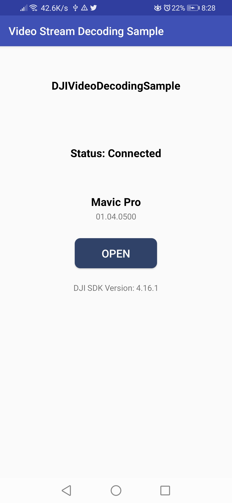
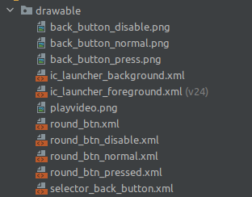
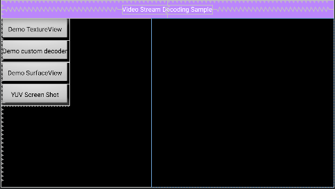
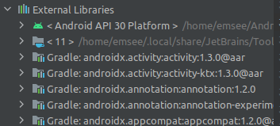
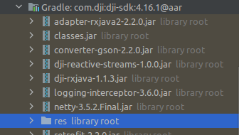
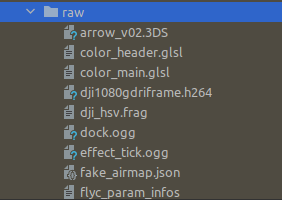
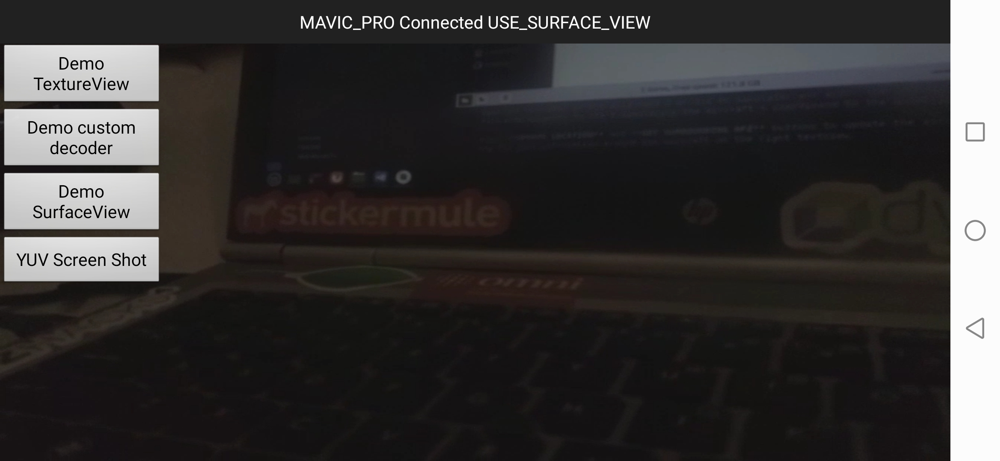
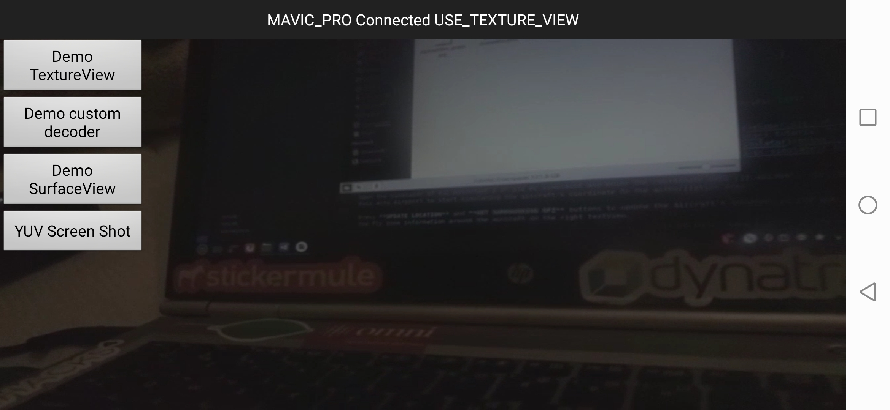
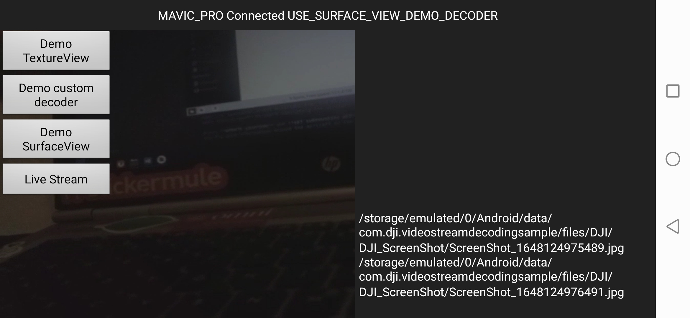

# DJI Video Decoder Tutorial

## DJI LAB 9 TUTORIAL KOTLIN

***`WARNING: THIS TUTORIAL ASSUMES YOU'VE COMPLETED THE PREVIOUS TUTORIALS`***

In this tutorial, you will learn how to use `FFmpeg` for video frame parsing and to use the `MediaCodec` for hardware decoding. It will help to parse video frames and decode the raw video stream data from DJI Camera and output the YUV data.

You can download the tutorial's final sample project from this [Github Page](https://github.com/godfreynolan/DJITutorialsKotlin/tree/main/9-VideoDecoder).

> Note: In this tutorial, we will use Mavic Pro for testing and use Android Studio 3.0 for developing the demo application.

---

### Introduction

In order to use DJI drones for computer vision projects, the first step is to parse the video stream obtained from the camera into image frames. DJI provides a Demo program on github that decodes the video into image frames. The official website documentation does not explain how to integrate this decoding Demo into your own project, but simply explains the main purpose of the DJIVideoStreamDecoder and NativeHelper classes.

---

### Preparation

#### 1. Setup Android Development Environment

Throughout this tutorial we will be using the latest version of android studio, which you can download from here: <http://developer.android.com/sdk/index.html>.

---

### Initial Gradle and Manifest Setup

This part is important as it will help us to setup the project with the latest libraries and dependencies. Some notable ones are ffmpeg and the libdjivideojni.so library which are referenced within the code.

#### 1. Create the project

Open Android Studio and select **File -> New -> New Project** to create a new project, named `"VideoStreamDecodingSample"`. Enter the company domain and package name `(com.dji.videostreamdecodingsample)` and press Next. Set the mimimum SDK version as `API 21: Android 5.1 (Lollipop)` for "Phone and Tablet" and press Next. Then select "Empty Activity" and press Next. Lastly, leave the Activity Name as "MainActivity", and the Layout Name as "activity_main", Press "Finish" to create the project.

#### 2. Add Some String Resources

Please edit `strings.xml` and add the following resources below.

```xml
<resources>
    <string name="app_name_decoding_sample">Video Stream Decoding Sample</string>
    <string name="title_main_activity">Video Stream Decoding Sample</string>
    <string name="product_information">Product Information</string>
    <string name="connection_loose">Status: No Product Connected</string>
    <string name="model_not_available">Model Not Available</string>
    <string name="sdk_version">DJI SDK Version: %1$s</string>
</resources>
```

#### 3. Android Manifest Permissions

Complete AndroidManifest.xml file for this project
```xml
<?xml version="1.0" encoding="utf-8"?>
<manifest xmlns:android="http://schemas.android.com/apk/res/android"
    xmlns:tools="http://schemas.android.com/tools"
    package="com.dji.videostreamdecodingsample">
    <uses-permission android:name="android.permission.VIBRATE"/>
    <uses-permission android:name="android.permission.INTERNET"/>
    <uses-permission android:name="android.permission.ACCESS_WIFI_STATE"/>
    <uses-permission android:name="android.permission.WAKE_LOCK"/>
    <uses-permission android:name="android.permission.ACCESS_COARSE_LOCATION"/>
    <uses-permission android:name="android.permission.ACCESS_NETWORK_STATE"/>
    <uses-permission android:name="android.permission.ACCESS_FINE_LOCATION"/>
    <uses-permission android:name="android.permission.CHANGE_WIFI_STATE"/>
    <uses-permission android:name="android.permission.MOUNT_UNMOUNT_FILESYSTEMS"
        tools:ignore="ProtectedPermissions" />
    <uses-permission android:name="android.permission.WRITE_EXTERNAL_STORAGE"
        tools:ignore="ScopedStorage" />
    <uses-permission android:name="android.permission.READ_EXTERNAL_STORAGE"/>
    <uses-permission android:name="android.permission.SYSTEM_ALERT_WINDOW"/>
    <uses-permission android:name="android.permission.READ_PHONE_STATE"/>
    <uses-permission android:name="android.permission.BLUETOOTH"/>
    <uses-permission android:name="android.permission.BLUETOOTH_ADMIN" />

    <uses-feature android:name="android.hardware.camera"/>
    <uses-feature android:name="android.hardware.camera.autofocus"/>
    <uses-feature
        android:name="android.hardware.usb.host"
        android:required="false"/>
    <uses-feature
        android:name="android.hardware.usb.accessory"
        android:required="true"/>
    <application
        android:name=".VideoDecodingApplication"
        android:allowBackup="true"
        android:label="@string/app_name_decoding_sample"
        android:supportsRtl="true"
        android:theme="@style/Theme.VideoStreamDecodingSample">

        <uses-library android:name="org.apache.http.legacy" android:required="false" />

        <meta-data
            android:name="com.dji.sdk.API_KEY"
            android:value="b434ac9f2ec4ea174d0ec5f5"/>

        <activity
            android:name=".ConnectionActivity"
            android:launchMode="singleTop"
            android:screenOrientation="portrait"
            android:exported="true">
            <intent-filter>
                <action android:name="android.intent.action.MAIN"/>
                <category android:name="android.intent.category.LAUNCHER"/>
                <action android:name="android.hardware.usb.action.USB_ACCESSORY_ATTACHED"/>
            </intent-filter>
            <meta-data
                android:name="android.hardware.usb.action.USB_ACCESSORY_ATTACHED"
                android:resource="@xml/accessory_filter"/>
        </activity>
        <activity
            android:name=".MainActivity"
            android:screenOrientation="landscape"
            android:configChanges="orientation|screenSize"
            android:theme="@android:style/Theme.NoTitleBar.Fullscreen" />
    </application>

</manifest>
```

In the code above, we specify the permissions of your application needs by adding `<uses-permission>` elements as children of the `<manifest>` element.

Moreover, because not all Android-powered devices are guaranteed to support the USB accessory and host APIs, include two elements that declare that your application uses the "android.hardware.usb.accessory" and "android.hardware.usb.host" feature.

Please enter the **App Key** of the application in the value part of `android:name="com.dji.sdk.API_KEY"` attribute. **One has already been provided for you**.

Finally, we need to specify the requirement for OpenGL ES version 2.

For more details of description on the permissions, refer to https://developers.google.com/maps/documentation/android/config.

Create the `accessory_filter.xml` file under `app/res/xml` (create the xml directory if needed). Add the following code to the file
```xml
<?xml version="1.0" encoding="utf-8"?>
<resources>
    <usb-accessory model="T600" manufacturer="DJI"/>
    <usb-accessory model="AG410" manufacturer="DJI"/>
</resources>
```

---

### Importing the DJI Dependencies

Please follow [Lab Three: Camera](https://github.com/godfreynolan/DJITutorialsKotlin/tree/main/3-Camera) tutorial to learn how to import the Android SDK Maven Dependency for DJI. **Use the following gradle files for this tutorial**

### Build.gradle (Project)
```kotlin
// Top-level build file where you can add configuration options common to all sub-projects/modules.

buildscript {
    ext.kotlin_version = '1.6.20-RC'
    repositories {
        google()
        mavenCentral()
    }
    dependencies {
        classpath 'com.android.tools.build:gradle:4.2.1'
        classpath "org.jetbrains.kotlin:kotlin-gradle-plugin:$kotlin_version"

        // NOTE: Do not place your application dependencies here; they belong
        // in the individual module build.gradle files
    }
}

allprojects {
    repositories {
        mavenCentral()
        google()
    }
}

task clean(type: Delete) {
    delete rootProject.buildDir
}
```

### Build.gradle (module)
```kotlin 
plugins {
    id 'com.android.application'
    id 'kotlin-android'
}

android {
    compileSdkVersion 31
    buildToolsVersion "30.0.3"

    defaultConfig {
        applicationId 'com.dji.videostreamdecodingsample'
        minSdkVersion 21
        targetSdkVersion 30
        versionCode 1
        multiDexEnabled true
        versionName "1.0"
        ndk {
            // On x86 devices that run Android API 23 or above, if the application is targeted with API 23 or
            // above, FFmpeg lib might lead to runtime crashes or warnings.
            abiFilters 'armeabi-v7a', 'arm64-v8a'
        }

        testInstrumentationRunner "androidx.test.runner.AndroidJUnitRunner"
    }

    buildTypes {
        release {
            minifyEnabled false
            proguardFiles getDefaultProguardFile('proguard-android.txt'), 'proguard-rules.pro'
        }
        debug {
            shrinkResources false
            minifyEnabled false
            proguardFiles getDefaultProguardFile('proguard-android.txt'), 'proguard-rules.pro'
        }
    }
    compileOptions {
        sourceCompatibility JavaVersion.VERSION_1_8
        targetCompatibility JavaVersion.VERSION_1_8
    }
    kotlinOptions {
        jvmTarget = '1.8'
    }
    dexOptions {
        javaMaxHeapSize "4g"
    }
    sourceSets {
        main {
            jni.srcDirs=[]
            jniLibs.srcDirs=['../libs']
        }
    }

    packagingOptions {
        doNotStrip "*/*/libdjivideo.so"
        doNotStrip "*/*/libSDKRelativeJNI.so"
        doNotStrip "*/*/libFlyForbid.so"
        doNotStrip "*/*/libduml_vision_bokeh.so"
        doNotStrip "*/*/libyuv2.so"
        doNotStrip "*/*/libGroudStation.so"
        doNotStrip "*/*/libFRCorkscrew.so"
        doNotStrip "*/*/libUpgradeVerify.so"
        doNotStrip "*/*/libFR.so"
        doNotStrip "*/*/libDJIFlySafeCore.so"
        doNotStrip "*/*/libdjifs_jni.so"
        doNotStrip "*/*/libsfjni.so"
        doNotStrip "*/*/libDJICommonJNI.so"
        doNotStrip "*/*/libDJICSDKCommon.so"
        doNotStrip "*/*/libDJIUpgradeCore.so"
        doNotStrip "*/*/libDJIUpgradeJNI.so"
        exclude 'META-INF/rxjava.properties'
    }
}

dependencies {
    implementation 'androidx.documentfile:documentfile:1.0.1'
    //DJI Dependencies
    implementation 'androidx.multidex:multidex:2.0.0'
    implementation ('com.dji:dji-sdk:4.16.1', {
        exclude module: 'library-anti-distortion'
        exclude module: 'fly-safe-database'
    })
    implementation ('com.dji:dji-uxsdk:4.16', {
        exclude module: 'library-anti-distortion'
        exclude module: 'fly-safe-database'
    })
    compileOnly ('com.dji:dji-sdk-provided:4.16.1')

    // ViewModels and Coroutines
    implementation 'org.jetbrains.kotlinx:kotlinx-coroutines-core:1.4.2'
    implementation("androidx.core:core-ktx:1.3.2")
    implementation("androidx.fragment:fragment-ktx:1.2.4")


    //Default
    implementation fileTree(dir: "libs", include: ["*.jar"])
    implementation "org.jetbrains.kotlin:kotlin-stdlib:$kotlin_version"
    implementation 'androidx.lifecycle:lifecycle-extensions:2.0.0-rc01'
    implementation 'androidx.annotation:annotation:1.2.0'
    implementation 'androidx.appcompat:appcompat:1.2.0'
    implementation 'com.google.android.material:material:1.3.0'
    implementation 'androidx.constraintlayout:constraintlayout:2.0.4'
    testImplementation 'junit:junit:4.+'
    androidTestImplementation 'androidx.test.ext:junit:1.1.2'
    androidTestImplementation 'androidx.test.espresso:espresso-core:3.3.0'
    implementation 'androidx.multidex:multidex:2.0.1'

}

// Please uncomment the following code if you use your own sdk version.
//apply from : "https://terra-1-g.djicdn.com/71a7d383e71a4fb8887a310eb746b47f/msdk/Android-CommonConfig/config_sample_all.gradle"
```
### Settings.gradle
```kotlin
rootProject.name = "VideoStreamDecodingSample"
include ':app'
```

### Gradle.properties
Please add the following line.
```kotlin
android.enableJetifier=true
```
---

### Creating App Layouts and Classes

#### 1. Implementing ConnectionActivity and VideoDecodingApplication

To improve the user experience, we had better create an activity to show the connection status between the DJI Product and the SDK, once it's connected, the user can press the **OPEN** button to enter the **MainActivity**. You can also check the [Creating an Camera Application](https://github.com/godfreynolan/DJITutorialsKotlin/tree/main/3-Camera) tutorial to learn how to implement the `ConnectionActivity` Class and Layout in this project (along with its viewmodel). If you open the `activity_connection.xml` file, and click on the Design tab on the top right, you should see the preview screenshot of `ConnectionActivity` as shown below:



Here are the necessary connection files from the previous tutorials
Connection Activity: `ConnectionActivity.kt`
```kotlin
package com.dji.videostreamdecodingsample
import android.Manifest
import android.content.Intent
import androidx.appcompat.app.AppCompatActivity
import android.os.Bundle
import android.widget.Button
import android.widget.TextView
import androidx.activity.viewModels
import androidx.core.app.ActivityCompat
import androidx.lifecycle.Observer
import dji.sdk.sdkmanager.DJISDKManager

/*
This activity manages SDK registration and establishing a connection between the
DJI product and the user's mobile phone.
 */
class ConnectionActivity : AppCompatActivity() {

    //Class Variables
    private lateinit var mTextConnectionStatus: TextView
    private lateinit var mTextProduct: TextView
    private lateinit var mTextModelAvailable: TextView
    private lateinit var mBtnOpen: Button
    private lateinit var mVersionTv: TextView

    private val model: ConnectionViewModel by viewModels() //linking the activity to a viewModel

    companion object {
        const val TAG = "ConnectionActivity"
    }

    //Creating the Activity
    override fun onCreate(savedInstanceState: Bundle?) {
        super.onCreate(savedInstanceState)

        //inflating the activity_connection.xml layout as the activity's view
        setContentView(R.layout.activity_connection)

        /*
        Request the following permissions defined in the AndroidManifest.
        1 is the integer constant we chose to use when requesting app permissions
        */
        ActivityCompat.requestPermissions(this,
            arrayOf(
                Manifest.permission.WRITE_EXTERNAL_STORAGE,
                Manifest.permission.VIBRATE,
                Manifest.permission.INTERNET,
                Manifest.permission.ACCESS_WIFI_STATE,
                Manifest.permission.WAKE_LOCK,
                Manifest.permission.ACCESS_COARSE_LOCATION,
                Manifest.permission.ACCESS_NETWORK_STATE,
                Manifest.permission.ACCESS_FINE_LOCATION,
                Manifest.permission.CHANGE_WIFI_STATE,
                Manifest.permission.MOUNT_UNMOUNT_FILESYSTEMS,
                Manifest.permission.READ_EXTERNAL_STORAGE,
                Manifest.permission.SYSTEM_ALERT_WINDOW,
                Manifest.permission.READ_PHONE_STATE
            ), 1)

        //Initialize the UI, register the app with DJI's mobile SDK, and set up the observers
        initUI()
        model.registerApp()
        observers()
    }

    //Function to initialize the activity's UI
    private fun initUI() {

        //referencing the layout views using their resource ids
        mTextConnectionStatus = findViewById(R.id.text_connection_status)
        mTextModelAvailable = findViewById(R.id.text_model_available)
        mTextProduct = findViewById(R.id.text_product_info)
        mBtnOpen = findViewById(R.id.btn_open)
        mVersionTv = findViewById(R.id.textView2)

        //Getting the DJI SDK version and displaying it on mVersionTv TextView
        mVersionTv.text = resources.getString(R.string.sdk_version, DJISDKManager.getInstance().sdkVersion)

        mBtnOpen.isEnabled = false //mBtnOpen Button is initially disabled

        //If mBtnOpen Button is clicked on, start MainActivity (only works when button is enabled)
        mBtnOpen.setOnClickListener {
            val intent = Intent(this, MainActivity::class.java)
            startActivity(intent)
        }
    }

    //Function to setup observers
    private fun observers() {
        //observer listens to changes to the connectionStatus variable stored in the viewModel
        model.connectionStatus.observe(this, Observer<Boolean> { isConnected ->
            //If boolean is True, enable mBtnOpen button. If false, disable the button.
            if (isConnected) {
                mTextConnectionStatus.text = "Status: Connected"
                mBtnOpen.isEnabled = true
            }
            else {
                mTextConnectionStatus.text = "Status: Disconnected"
                mBtnOpen.isEnabled = false
            }
        })

        /*
        Observer listens to changes to the product variable stored in the viewModel.
        product is a BaseProduct object and represents the DJI product connected to the mobile device
        */
        model.product.observe(this, Observer { baseProduct ->
            //if baseProduct is connected to the mobile device, display its firmware version and model name.
            if (baseProduct != null && baseProduct.isConnected) {
                mTextModelAvailable.text = baseProduct.firmwarePackageVersion

                //name of the aircraft attached to the remote controller
                mTextProduct.text = baseProduct.model.displayName
            }
        })
    }
}
```
Connection View Model: `ConnectionViewModel.kt`
```kotlin
package com.dji.videostreamdecodingsample
import android.app.Application
import android.util.Log
import androidx.lifecycle.AndroidViewModel
import androidx.lifecycle.MutableLiveData
import dji.common.error.DJIError
import dji.common.error.DJISDKError
import dji.sdk.base.BaseComponent
import dji.sdk.base.BaseProduct
import dji.sdk.sdkmanager.DJISDKInitEvent
import dji.sdk.sdkmanager.DJISDKManager

/*
This ViewModel stores important variables and functions needed for mobile SDK registration
and connection to the DJI product. This allows the app to maintain its connection state
across rotation death.
 */
class ConnectionViewModel(application: Application) : AndroidViewModel(application) {

    //product is a BaseProduct object which stores an instance of the currently connected DJI product
    val product: MutableLiveData<BaseProduct?> by lazy {
        MutableLiveData<BaseProduct?>()
    }

    //connectionStatus boolean describes whether or not a DJI product is connected
    val connectionStatus: MutableLiveData<Boolean> = MutableLiveData(false)

    //DJI SDK app registration
    fun registerApp() {
        /*
        Getting an instance of the DJISDKManager and using it to register the app
        (requires API key in AndroidManifest). After installation, the app connects to the DJI server via
        internet and verifies the API key. Subsequent app starts will use locally cached verification
        information to register the app when the cached information is still valid.
        */
        DJISDKManager.getInstance().registerApp(getApplication(), object: DJISDKManager.SDKManagerCallback {
            //Logging the success or failure of the registration
            override fun onRegister(error: DJIError?) {
                if (error == DJISDKError.REGISTRATION_SUCCESS) {
                    Log.i(ConnectionActivity.TAG, "onRegister: Registration Successful")
                } else {
                    Log.i(ConnectionActivity.TAG, "onRegister: Registration Failed - ${error?.description}")
                }
            }
            //called when the remote controller disconnects from the user's mobile device
            override fun onProductDisconnect() {
                Log.i(ConnectionActivity.TAG, "onProductDisconnect: Product Disconnected")
                connectionStatus.postValue(false) //setting connectionStatus to false
            }
            //called when the remote controller connects to the user's mobile device
            override fun onProductConnect(baseProduct: BaseProduct?) {
                Log.i(ConnectionActivity.TAG, "onProductConnect: Product Connected")
                product.postValue(baseProduct)
                connectionStatus.postValue(true) //setting connectionStatus to true
            }
            //called when the DJI aircraft changes
            override fun onProductChanged(baseProduct: BaseProduct?) {
                Log.i(ConnectionActivity.TAG, "onProductChanged: Product Changed - $baseProduct")
                product.postValue(baseProduct)

            }
            //Called when a component object changes. This method is not called if the component is already disconnected
            override fun onComponentChange(componentKey: BaseProduct.ComponentKey?, oldComponent: BaseComponent?, newComponent: BaseComponent?) {
                //Alert the user which component has changed, and mention what new component replaced the old component (can be null)
                Log.i(ConnectionActivity.TAG, "onComponentChange key: $componentKey, oldComponent: $oldComponent, newComponent: $newComponent")

                //Listens to connectivity changes in each new component
                newComponent?.let { component ->
                    component.setComponentListener { connected ->
                        Log.i(ConnectionActivity.TAG, "onComponentConnectivityChange: $connected")
                    }
                }
            }
            //called when loading SDK resources
            override fun onInitProcess(p0: DJISDKInitEvent?, p1: Int) {}

            //Called when Fly Safe database download progress is updated
            override fun onDatabaseDownloadProgress(p0: Long, p1: Long) {}
        })
    }
}
```
Connection Activity Layout: `activity_connection.xml`
```xml
<?xml version="1.0" encoding="utf-8"?>
<RelativeLayout xmlns:android="http://schemas.android.com/apk/res/android"
    xmlns:tools="http://schemas.android.com/tools"
    android:layout_width="match_parent"
    android:layout_height="match_parent"
    android:orientation="vertical">

    <TextView
        android:id="@+id/text_connection_status"
        android:layout_width="wrap_content"
        android:layout_height="wrap_content"
        android:gravity="center"
        android:text="Status: No Product Connected"
        android:textColor="@android:color/black"
        android:textSize="20dp"
        android:textStyle="bold"
        android:layout_alignBottom="@+id/text_product_info"
        android:layout_centerHorizontal="true"
        android:layout_marginBottom="89dp" />

    <TextView
        android:id="@+id/text_product_info"
        android:layout_width="wrap_content"
        android:layout_height="wrap_content"
        android:layout_centerHorizontal="true"
        android:layout_marginTop="270dp"
        android:text="@string/product_information"
        android:textColor="@android:color/black"
        android:textSize="20dp"
        android:gravity="center"
        android:textStyle="bold"
        />

    <TextView
        android:id="@+id/text_model_available"
        android:layout_width="match_parent"
        android:layout_height="wrap_content"
        android:layout_centerHorizontal="true"
        android:gravity="center"
        android:layout_marginTop="300dp"
        android:text="@string/model_not_available"
        android:textSize="15dp"/>

    <Button
        android:id="@+id/btn_open"
        android:layout_width="150dp"
        android:layout_height="55dp"
        android:layout_centerHorizontal="true"
        android:layout_marginTop="350dp"
        android:background="@drawable/round_btn"
        android:text="Open"
        android:textColor="@color/colorWhite"
        android:textSize="20dp"
        />

    <TextView
        android:layout_width="wrap_content"
        android:layout_height="wrap_content"
        android:layout_centerHorizontal="true"
        android:layout_marginTop="430dp"
        android:textSize="15dp"
        android:id="@+id/textView2" />

    <TextView
        android:layout_width="wrap_content"
        android:layout_height="wrap_content"
        android:textAppearance="?android:attr/textAppearanceSmall"
        android:text="DJIVideoDecodingSample"
        android:id="@+id/textView"
        android:layout_marginTop="58dp"
        android:textStyle="bold"
        android:textSize="20dp"
        android:textColor="@color/colorBlack"
        android:layout_alignParentTop="true"
        android:layout_centerHorizontal="true" />

</RelativeLayout>
```

Create the `VideoDecodingApplication.kt` class in the package com.dji.videostreamdecodingsample. Please add the following code to the file:

```kotlin
package com.dji.videostreamdecodingsample

import android.app.Application
import android.content.Context
import com.secneo.sdk.Helper
import dji.sdk.base.BaseProduct
import dji.sdk.sdkmanager.DJISDKManager

class VideoDecodingApplication : Application() {
    override fun attachBaseContext(base: Context) {
        super.attachBaseContext(base)
        Helper.install(this@VideoDecodingApplication)
    }

    companion object {
        private var mProduct: BaseProduct? = null

        @get:Synchronized
        val productInstance: BaseProduct?
            get() {
                if (null == mProduct) {
                    mProduct = DJISDKManager.getInstance().product
                }
                return mProduct
            }

        @Synchronized
        fun updateProduct(product: BaseProduct?) {
            mProduct = product
        }
    }
}
```

This is an Application class to do DJI SDK Registration, product connection, product change and product connectivity change checking. Then it broadcasts the changes.

#### 2. Implementing MainActivity

Open the `activity_main.xml` layout file and replace the code with the following:

```xml
<?xml version="1.0" encoding="utf-8"?>
<RelativeLayout
    xmlns:android="http://schemas.android.com/apk/res/android"
    xmlns:tools="http://schemas.android.com/tools"
    android:layout_width="match_parent"
    android:layout_height="match_parent"
    tools:context="com.dji.videostreamdecodingsample.MainActivity">

    <RelativeLayout
        android:id="@+id/main_title_rl"
        android:layout_width="fill_parent"
        android:layout_height="40dp"
        android:background="@color/purple_200">

        <TextView
            android:id="@+id/title_tv"
            android:layout_width="wrap_content"
            android:layout_height="wrap_content"
            android:layout_centerInParent="true"
            android:textColor="@android:color/white"
            android:text="@string/title_main_activity"/>

    </RelativeLayout>

    <TextureView
        android:id="@+id/livestream_preview_ttv"
        android:layout_width="match_parent"
        android:layout_height="match_parent"
        android:layout_centerInParent="true"
        android:layout_gravity="center"
        android:alpha="50"
        android:visibility="visible"
        android:layout_below="@id/main_title_rl"/>

    <SurfaceView
        android:id="@+id/livestream_preview_sf"
        android:layout_width="360dp"
        android:layout_height="180dp"
        android:layout_centerInParent="true"
        android:layout_gravity="center"
        android:visibility="gone"
        android:layout_below="@id/main_title_rl"/>

    <LinearLayout
        android:layout_width="150dp"
        android:layout_height="wrap_content"
        android:layout_alignParentLeft="true"
        android:layout_below="@id/main_title_rl"
        android:orientation="vertical">

        <Button
            android:id="@+id/activity_main_screen_texture"
            android:layout_width="150dp"
            android:layout_height="wrap_content"
            android:text="Demo TextureView"
            android:clickable="true"
            android:onClick="onClick"
            android:gravity="center"  />

        <Button
            android:id="@+id/activity_main_screen_surface_with_own_decoder"
            android:layout_width="150dp"
            android:layout_height="wrap_content"
            android:text="Demo custom decoder"
            android:clickable="true"
            android:onClick="onClick"
            android:gravity="center" />

        <Button
            android:id="@+id/activity_main_screen_surface"
            android:layout_width="150dp"
            android:layout_height="wrap_content"
            android:text="Demo SurfaceView"
            android:onClick="onClick"
            android:gravity="center" />


        <Button
            android:id="@+id/activity_main_screen_shot"
            android:layout_width="150dp"
            android:layout_height="wrap_content"
            android:text="YUV Screen Shot"
            android:clickable="true"
            android:onClick="onClick"
            android:gravity="center" />

    </LinearLayout>
    <TextView
        android:id="@+id/activity_main_save_path"
        android:layout_width="400dp"
        android:layout_height="match_parent"
        android:padding="5dp"
        android:background="@color/purple_200"
        android:layout_toEndOf="@id/activity_main_screen_shot"
        android:layout_alignParentEnd="true"
        android:layout_below="@id/main_title_rl"
        android:textColor="@color/white"
        android:visibility="invisible"
        android:scrollbars="vertical"
        android:gravity="bottom"
        tools:ignore="NotSibling" />

</RelativeLayout>
```

In the xml file, we implement the following UIs:

* Create a RelativeLayout to add a TextView to show the SDK connection status on the top.

* Then create a texture view and surface view to show the video.

* Then 4 buttons are created with each of the first 3 being used to show different video streams. The last button is used to take a screen shot of the video.

* Finally, a TextView is created to show the save path of the screen shot.

Next, open the `colors.xml` file in the "values" folder and add the following code below:

```xml
<?xml version="1.0" encoding="utf-8"?>
<resources>
    <color name="purple_200">#FFBB86FC</color>
    <color name="purple_500">#FF6200EE</color>
    <color name="purple_700">#FF3700B3</color>
    <color name="teal_200">#FF03DAC5</color>
    <color name="teal_700">#FF018786</color>
    <color name="black">#FF000000</color>
    <color name="white">#FFFFFFFF</color>
    <color name="black_overlay">#000000</color>
    <color name="colorWhite">#FFFFFF</color>
</resources>
```

Furthermore, visit the example project on the github page and open the [drawable folder](https://github.com/godfreynolan/DJITutorialsKotlin/tree/main/9-VideoDecoder/android-videostreamdecodingsample/app/src/main/res/drawable) and copy its contents into the drawable folder of this project. The XML files can be found below but the `.png` files will still need to be copied. 

Create `round_btn.xml` under `app/res/drawable`
```xml
<?xml version="1.0" encoding="utf-8"?>
<selector xmlns:android="http://schemas.android.com/apk/res/android">
    <item android:drawable="@drawable/round_btn_normal" android:state_focused="true"></item>
    <item android:drawable="@drawable/round_btn_pressed" android:state_selected="true"></item>
    <item android:drawable="@drawable/round_btn_pressed" android:state_pressed="true"></item>
    <item android:drawable="@drawable/round_btn_disable" android:state_enabled="false"></item>
    <item android:drawable="@drawable/round_btn_normal" ></item>
</selector>
```

Create `round_btn_disable.xml` under `app/res/drawable`
```xml
<?xml version="1.0" encoding="utf-8"?>
<shape xmlns:android="http://schemas.android.com/apk/res/android">
    <solid android:color="#AAAAAAAA" />
    <corners android:topLeftRadius="10dp"
        android:topRightRadius="10dp"
        android:bottomRightRadius="10dp"
        android:bottomLeftRadius="10dp"/>
</shape>
```
Create `round_btn_normal.xml` under `app/res/drawable`
```xml
<?xml version="1.0" encoding="utf-8"?>
<shape xmlns:android="http://schemas.android.com/apk/res/android">
    <solid android:color="#FF314268" />
    <corners android:topLeftRadius="10dp"
        android:topRightRadius="10dp"
        android:bottomRightRadius="10dp"
        android:bottomLeftRadius="10dp"/>
</shape>
```
Create `round_btn_pressed.xml` under `app/res/drawable`
```xml
<?xml version="1.0" encoding="utf-8"?>
<shape xmlns:android="http://schemas.android.com/apk/res/android">
    <solid android:color="#AA314268" />
    <corners android:topLeftRadius="10dp"
             android:topRightRadius="10dp"
             android:bottomRightRadius="10dp"
             android:bottomLeftRadius="10dp"/>
</shape>
```

Create `selector_back_button.xml` under `app/res/drawable`
```xml
<selector xmlns:android="http://schemas.android.com/apk/res/android">
 
    <item android:drawable="@drawable/back_button_normal" android:state_pressed="false"></item>
    <item android:drawable="@drawable/back_button_press" android:state_pressed="true"></item>   
    <item android:drawable="@drawable/back_button_disable" android:state_enabled="false" ></item>  

 </selector>
```


Your drawable folder should have the following contents:



Now, if you open the `activity_maps.xml` file, and click on the Design tab on the top right, you should see the preview screenshot of `MainActivity` as shown below:



---

### Implementing Decoder Features in MainActivity

> NOTE: This section is a more in depth version of the previous section. The main steps for converting the video stream data into images are implemented in `MainActivity.kt`. These images get transmitted to the android system in the YUV format and is stored as such. The total number of image frames is controlled by `DJIVIdeoStreamDecoder.getInstance()`.

Let's open `MainActivity.kt` file and replace all code with the following:

```kotlin
package com.dji.videostreamdecodingsample

import android.graphics.ImageFormat
import android.graphics.Rect
import android.graphics.SurfaceTexture
import android.graphics.YuvImage
import android.media.MediaCodecInfo
import android.media.MediaFormat
import android.os.AsyncTask
import android.os.Build
import androidx.appcompat.app.AppCompatActivity
import android.os.Bundle
import android.os.Environment
import android.os.Handler
import android.os.Looper
import android.os.Message
import android.util.Log
import android.view.SurfaceHolder
import android.view.SurfaceView
import android.view.TextureView
import android.view.View
import android.widget.Button
import android.widget.TextView
import android.widget.Toast
import com.dji.videostreamdecodingsample.media.DJIVideoStreamDecoder
import com.dji.videostreamdecodingsample.media.NativeHelper
import dji.common.airlink.PhysicalSource
import dji.common.camera.SettingsDefinitions
import dji.common.error.DJIError
import dji.common.product.Model
import dji.sdk.base.BaseProduct
import dji.sdk.camera.Camera
import dji.sdk.camera.VideoFeeder
import dji.sdk.codec.DJICodecManager
import dji.sdk.sdkmanager.DJISDKManager
import java.io.File
import java.io.FileNotFoundException
import java.io.FileOutputStream
import java.io.IOException
import java.io.OutputStream
import java.nio.ByteBuffer

class MainActivity : AppCompatActivity(), DJICodecManager.YuvDataCallback {
    override fun onCreate(savedInstanceState: Bundle?) {
        super.onCreate(savedInstanceState)
        setContentView(R.layout.activity_main)
        initUi()
        if (isM300Product) {
            // If your MutltipleLensCamera is set at right or top, you need to change the PhysicalSource to RIGHT_CAM or TOP_CAM.
            MApplication.productInstance?.airLink?.ocuSyncLink?.assignSourceToPrimaryChannel(
                PhysicalSource.LEFT_CAM, PhysicalSource.FPV_CAM
            ) { error: DJIError? ->
                if (error == null) {
                    showToast("assignSourceToPrimaryChannel success.")
                } else {
                    showToast("assignSourceToPrimaryChannel fail, reason: " + error.description)
                }
            }
        }
    }
    private var surfaceCallback: SurfaceHolder.Callback? = null

    private enum class DemoType {
        USE_TEXTURE_VIEW, USE_SURFACE_VIEW, USE_SURFACE_VIEW_DEMO_DECODER
    }

    private var standardVideoFeeder: VideoFeeder.VideoFeed? = null
    private var mReceivedVideoDataListener: VideoFeeder.VideoDataListener? = null
    private var titleTv: TextView? = null
    private var mainHandler: Handler = object : Handler(Looper.getMainLooper()) {
        override fun handleMessage(msg: Message) {
            when (msg.what) {
                MSG_WHAT_SHOW_TOAST -> Toast.makeText(
                    applicationContext, msg.obj as String, Toast.LENGTH_SHORT
                ).show()
                MSG_WHAT_UPDATE_TITLE -> if (titleTv != null) {
                    titleTv!!.text = msg.obj as String
                }
                else -> {}
            }
        }
    }
    private var videostreamPreviewTtView: TextureView? = null
    private var videostreamPreviewSf: SurfaceView? = null
    private var videostreamPreviewSh: SurfaceHolder? = null
    private var mCamera: Camera? = null
    private var mCodecManager: DJICodecManager? = null
    private var savePath: TextView? = null
    private var screenShot: Button? = null
    private var stringBuilder: StringBuilder? = null
    private var videoViewWidth = 0
    private var videoViewHeight = 0
    private var count = 0


    private val isTranscodedVideoFeedNeeded: Boolean
        get() = if (VideoFeeder.getInstance() == null) {
            false
        } else VideoFeeder.getInstance().isFetchKeyFrameNeeded || VideoFeeder.getInstance()
            .isLensDistortionCalibrationNeeded

    companion object {
        private val TAG = MainActivity::class.java.simpleName
        private const val MSG_WHAT_SHOW_TOAST = 0
        private const val MSG_WHAT_UPDATE_TITLE = 1
        private var demoType: DemoType? = DemoType.USE_TEXTURE_VIEW
        val isM300Product: Boolean
            get() {
                if (DJISDKManager.getInstance().product == null) {
                    return false
                }
                val model: Model = DJISDKManager.getInstance().product.model
                return model === Model.MATRICE_300_RTK
            }
    }
    private fun initUi() {
        savePath = findViewById<View>(R.id.activity_main_save_path) as TextView
        screenShot = findViewById<View>(R.id.activity_main_screen_shot) as Button
        screenShot!!.isSelected = false
        titleTv = findViewById<View>(R.id.title_tv) as TextView
        videostreamPreviewTtView = findViewById<View>(R.id.livestream_preview_ttv) as TextureView
        videostreamPreviewSf = findViewById<View>(R.id.livestream_preview_sf) as SurfaceView
        videostreamPreviewSf!!.isClickable = true
        videostreamPreviewSf!!.setOnClickListener {
            val rate: Float = VideoFeeder.getInstance().transcodingDataRate
            showToast("current rate:" + rate + "Mbps")
            if (rate < 10) {
                VideoFeeder.getInstance().transcodingDataRate = 10.0f
                showToast("set rate to 10Mbps")
            } else {
                VideoFeeder.getInstance().transcodingDataRate = 3.0f
                showToast("set rate to 3Mbps")
            }
        }
        updateUIVisibility()
    }

    private fun updateUIVisibility() {
        when (demoType) {
            DemoType.USE_SURFACE_VIEW -> {
                videostreamPreviewSf!!.visibility = View.VISIBLE
                videostreamPreviewTtView!!.visibility = View.GONE
            }
            DemoType.USE_SURFACE_VIEW_DEMO_DECODER -> {
                /**
                 * we need display two video stream at the same time, so we need let them to be visible.
                 */
                videostreamPreviewSf!!.visibility = View.VISIBLE
                videostreamPreviewTtView!!.visibility = View.VISIBLE
            }
            DemoType.USE_TEXTURE_VIEW -> {
                videostreamPreviewSf!!.visibility = View.GONE
                videostreamPreviewTtView!!.visibility = View.VISIBLE
            }
            else -> {}
        }
    }
    override fun onResume() {
        super.onResume()
        initSurfaceOrTextureView()
        notifyStatusChange()
    }

    private fun initSurfaceOrTextureView() {
        when (demoType) {
            DemoType.USE_SURFACE_VIEW -> initPreviewerSurfaceView()
            DemoType.USE_SURFACE_VIEW_DEMO_DECODER -> {
                /**
                 * we also need init the textureView because the pre-transcoded video steam will display in the textureView
                 */
                initPreviewerTextureView()
                /**
                 * we use standardVideoFeeder to pass the transcoded video data to DJIVideoStreamDecoder, and then display it
                 * on surfaceView
                 */
                initPreviewerSurfaceView()
            }
            DemoType.USE_TEXTURE_VIEW -> initPreviewerTextureView()
            else -> {}
        }
    }
    private var lastupdate: Long = 0
    private fun notifyStatusChange() {
        val product: BaseProduct? = MApplication.productInstance
        Log.d(
            TAG,
            "notifyStatusChange: " + when {
                product == null -> "Disconnect"
                product.model == null -> "null model"
                else -> product.model.name
            }
        )
        if (product != null) {
            if (product.isConnected && product.model != null) {
                updateTitle(product.model.name + " Connected " + demoType?.name)
            } else {
                updateTitle("Disconnected")
            }
        }

        // The callback for receiving the raw H264 video data for camera live view
        mReceivedVideoDataListener =
            VideoFeeder.VideoDataListener { videoBuffer, size ->
                if (System.currentTimeMillis() - lastupdate > 1000) {
                    Log.d(
                        TAG,
                        "camera recv video data size: $size"
                    )
                    lastupdate = System.currentTimeMillis()
                }
                when (demoType) {
                    DemoType.USE_SURFACE_VIEW -> mCodecManager?.sendDataToDecoder(videoBuffer, size)
                    DemoType.USE_SURFACE_VIEW_DEMO_DECODER ->
                        /**
                         * we use standardVideoFeeder to pass the transcoded video data to DJIVideoStreamDecoder, and then display it
                         * on surfaceView
                         */
                        /**
                         * we use standardVideoFeeder to pass the transcoded video data to DJIVideoStreamDecoder, and then display it
                         * on surfaceView
                         */
                        DJIVideoStreamDecoder.instance?.parse(videoBuffer, size)
                    DemoType.USE_TEXTURE_VIEW -> mCodecManager?.sendDataToDecoder(videoBuffer, size)
                    else -> {}
                }
            }
        if (product != null) {
            if (!product.isConnected) {
                mCamera = null
                showToast("Disconnected")
            } else {
                if (!product.model.equals(Model.UNKNOWN_AIRCRAFT)) {
                    mCamera = product.camera
                    if (mCamera != null) {
                        if (mCamera!!.isFlatCameraModeSupported) {
                            mCamera!!.setFlatMode(
                                SettingsDefinitions.FlatCameraMode.PHOTO_SINGLE
                            ) { djiError: DJIError? ->
                                if (djiError != null) {
                                    showToast("can't change flat mode of camera, error:" + djiError.description)
                                }
                            }
                        } else {
                            mCamera!!.setMode(
                                SettingsDefinitions.CameraMode.SHOOT_PHOTO
                            ) { djiError: DJIError? ->
                                if (djiError != null) {
                                    showToast("can't change mode of camera, error:" + djiError.description)
                                }
                            }
                        }
                    }

                    //When calibration is needed or the fetch key frame is required by SDK, should use the provideTranscodedVideoFeed
                    //to receive the transcoded video feed from main camera.
                    if (demoType == DemoType.USE_SURFACE_VIEW_DEMO_DECODER && isTranscodedVideoFeedNeeded) {
                        standardVideoFeeder = VideoFeeder.getInstance().provideTranscodedVideoFeed()
                        standardVideoFeeder!!.addVideoDataListener(mReceivedVideoDataListener!!)
                        return
                    }
                    VideoFeeder.getInstance().primaryVideoFeed
                        .addVideoDataListener(mReceivedVideoDataListener!!)
                }
            }
        }
    }
    override fun onPause() {
        if (mCamera != null) {
            VideoFeeder.getInstance().primaryVideoFeed
                .removeVideoDataListener(mReceivedVideoDataListener)
            standardVideoFeeder?.removeVideoDataListener(mReceivedVideoDataListener)
        }
        super.onPause()
    }

    override fun onDestroy() {
        if (mCodecManager != null) {
            mCodecManager!!.cleanSurface()
            mCodecManager!!.destroyCodec()
        }
        super.onDestroy()
    }

    private fun updateTitle(s: String) {
        mainHandler.sendMessage(
            mainHandler.obtainMessage(MSG_WHAT_UPDATE_TITLE, s)
        )
    }
    private fun initPreviewerTextureView() {
        videostreamPreviewTtView!!.surfaceTextureListener = object :
            TextureView.SurfaceTextureListener {
            override fun onSurfaceTextureAvailable(
                surface: SurfaceTexture,
                width: Int,
                height: Int
            ) {
                Log.d(TAG, "real onSurfaceTextureAvailable")
                videoViewWidth = width
                videoViewHeight = height
                Log.d(
                    TAG,
                    "real onSurfaceTextureAvailable: width $videoViewWidth height $videoViewHeight"
                )
                if (mCodecManager == null) {
                    mCodecManager = DJICodecManager(applicationContext, surface, width, height)
                    //For M300RTK, you need to actively request an I frame.
                    mCodecManager!!.resetKeyFrame()
                }
            }

            override fun onSurfaceTextureSizeChanged(
                surface: SurfaceTexture,
                width: Int,
                height: Int
            ) {
                videoViewWidth = width
                videoViewHeight = height
                Log.d(
                    TAG,
                    "real onSurfaceTextureAvailable2: width $videoViewWidth height $videoViewHeight"
                )
            }

            override fun onSurfaceTextureDestroyed(surface: SurfaceTexture): Boolean {
                mCodecManager?.cleanSurface()
                return false
            }

            override fun onSurfaceTextureUpdated(surface: SurfaceTexture) {}
        }
    }
    private fun initPreviewerSurfaceView() {
        videostreamPreviewSh = videostreamPreviewSf!!.holder
        surfaceCallback = object : SurfaceHolder.Callback {
            override fun surfaceCreated(holder: SurfaceHolder) {
                Log.d(TAG, "real onSurfaceTextureAvailable")
                videoViewWidth = videostreamPreviewSf!!.width
                videoViewHeight = videostreamPreviewSf!!.height
                Log.d(
                    TAG,
                    "real onSurfaceTextureAvailable3: width $videoViewWidth height $videoViewHeight"
                )
                when (demoType) {
                    DemoType.USE_SURFACE_VIEW -> if (mCodecManager == null) {
                        mCodecManager = DJICodecManager(
                            applicationContext, holder, videoViewWidth,
                            videoViewHeight
                        )
                    }
                    DemoType.USE_SURFACE_VIEW_DEMO_DECODER -> {
                        // This demo might not work well on P3C and OSMO.
                        NativeHelper.instance?.init()
                        DJIVideoStreamDecoder.instance?.init(applicationContext, holder.surface)
                        DJIVideoStreamDecoder.instance?.resume()
                    }
                    else -> {}
                }
            }

            override fun surfaceChanged(
                holder: SurfaceHolder,
                format: Int,
                width: Int,
                height: Int
            ) {
                videoViewWidth = width
                videoViewHeight = height
                Log.d(
                    TAG,
                    "real onSurfaceTextureAvailable4: width $videoViewWidth height $videoViewHeight"
                )
                when (demoType) {
                    DemoType.USE_SURFACE_VIEW -> {}
                    DemoType.USE_SURFACE_VIEW_DEMO_DECODER -> DJIVideoStreamDecoder.instance
                        ?.changeSurface(holder.surface)
                    else -> {}
                }
            }

            override fun surfaceDestroyed(holder: SurfaceHolder) {
                when (demoType) {
                    DemoType.USE_SURFACE_VIEW -> if (mCodecManager != null) {
                        mCodecManager!!.cleanSurface()
                        mCodecManager!!.destroyCodec()
                        mCodecManager = null
                    }
                    DemoType.USE_SURFACE_VIEW_DEMO_DECODER -> {
                        DJIVideoStreamDecoder.instance?.stop()
                        NativeHelper.instance?.release()
                    }
                    else -> {}
                }
            }
        }
        videostreamPreviewSh!!.addCallback(surfaceCallback)
    }
    override fun onYuvDataReceived(
        format: MediaFormat,
        yuvFrame: ByteBuffer?,
        dataSize: Int,
        width: Int,
        height: Int
    ) {
        //In this demo, we test the YUV data by saving it into JPG files.
        //DJILog.d(TAG, "onYuvDataReceived " + dataSize);
        if (count++ % 30 == 0 && yuvFrame != null) {
            val bytes = ByteArray(dataSize)
            yuvFrame[bytes]
            //DJILog.d(TAG, "onYuvDataReceived2 " + dataSize);
            AsyncTask.execute {
                // two samples here, it may has other color format.
                when (format.getInteger(MediaFormat.KEY_COLOR_FORMAT)) {
                    MediaCodecInfo.CodecCapabilities.COLOR_FormatYUV420Flexible ->     //                        //NV12
                        //COLOR_FormatYUV420SemiPlanar
                        if (Build.VERSION.SDK_INT <= 23) {
                            oldSaveYuvDataToJPEG(bytes, width, height)
                        } else {
                            newSaveYuvDataToJPEG(bytes, width, height)
                        }
                    else -> {}
                }
            }
        }
    }
    // For android API <= 23
    private fun oldSaveYuvDataToJPEG(yuvFrame: ByteArray, width: Int, height: Int) {
        if (yuvFrame.size < width * height) {
            //DJILog.d(TAG, "yuvFrame size is too small " + yuvFrame.length);
            return
        }
        val y = ByteArray(width * height)
        val u = ByteArray(width * height / 4)
        val v = ByteArray(width * height / 4)
        val nu = ByteArray(width * height / 4) //
        val nv = ByteArray(width * height / 4)
        System.arraycopy(yuvFrame, 0, y, 0, y.size)
        for (i in u.indices) {
            v[i] = yuvFrame[y.size + 2 * i]
            u[i] = yuvFrame[y.size + 2 * i + 1]
        }
        val uvWidth = width / 2
        val uvHeight = height / 2
        for (j in 0 until uvWidth / 2) {
            for (i in 0 until uvHeight / 2) {
                val uSample1 = u[i * uvWidth + j]
                val uSample2 = u[i * uvWidth + j + uvWidth / 2]
                val vSample1 = v[(i + uvHeight / 2) * uvWidth + j]
                val vSample2 = v[(i + uvHeight / 2) * uvWidth + j + uvWidth / 2]
                nu[2 * (i * uvWidth + j)] = uSample1
                nu[2 * (i * uvWidth + j) + 1] = uSample1
                nu[2 * (i * uvWidth + j) + uvWidth] = uSample2
                nu[2 * (i * uvWidth + j) + 1 + uvWidth] = uSample2
                nv[2 * (i * uvWidth + j)] = vSample1
                nv[2 * (i * uvWidth + j) + 1] = vSample1
                nv[2 * (i * uvWidth + j) + uvWidth] = vSample2
                nv[2 * (i * uvWidth + j) + 1 + uvWidth] = vSample2
            }
        }
        //nv21test
        val bytes = ByteArray(yuvFrame.size)
        System.arraycopy(y, 0, bytes, 0, y.size)
        for (i in u.indices) {
            bytes[y.size + i * 2] = nv[i]
            bytes[y.size + i * 2 + 1] = nu[i]
        }
        Log.d(
            TAG,
            ("onYuvDataReceived: frame index: "
                    + DJIVideoStreamDecoder.instance?.frameIndex
                    ) + ",array length: "
                    + bytes.size
        )
        if (Build.VERSION.SDK_INT > Build.VERSION_CODES.P) {
            screenShot(
                bytes,
                applicationContext.getExternalFilesDir("DJI")!!.path + "/DJI_ScreenShot",
                width,
                height
            )
        } else {
            screenShot(
                bytes,
                Environment.getExternalStorageDirectory().toString() + "/DJI_ScreenShot",
                width,
                height
            )
        }
    }
    private fun newSaveYuvDataToJPEG(yuvFrame: ByteArray, width: Int, height: Int) {
        if (yuvFrame.size < width * height) {
            //DJILog.d(TAG, "yuvFrame size is too small " + yuvFrame.length);
            return
        }
        val length = width * height
        val u = ByteArray(width * height / 4)
        val v = ByteArray(width * height / 4)
        for (i in u.indices) {
            v[i] = yuvFrame[length + 2 * i]
            u[i] = yuvFrame[length + 2 * i + 1]
        }
        for (i in u.indices) {
            yuvFrame[length + 2 * i] = u[i]
            yuvFrame[length + 2 * i + 1] = v[i]
        }
        if (Build.VERSION.SDK_INT > Build.VERSION_CODES.P) {
            screenShot(
                yuvFrame,
                applicationContext.getExternalFilesDir("DJI")!!.path + "/DJI_ScreenShot",
                width,
                height
            )
        } else {
            screenShot(
                yuvFrame,
                Environment.getExternalStorageDirectory().toString() + "/DJI_ScreenShot",
                width,
                height
            )
        }
    }
    /**
     * Save the buffered data into a JPG image file
     */
    private fun screenShot(buf: ByteArray, shotDir: String, width: Int, height: Int) {
        val dir = File(shotDir)
        if (!dir.exists() || !dir.isDirectory) {
            dir.mkdirs()
        }
        val yuvImage = YuvImage(
            buf,
            ImageFormat.NV21,
            width,
            height,
            null
        )
        val outputFile: OutputStream
        val path = dir.toString() + "/ScreenShot_" + System.currentTimeMillis() + ".jpg"
        outputFile = try {
            FileOutputStream(File(path))
        } catch (e: FileNotFoundException) {
            Log.e(
                TAG,
                "test screenShot: new bitmap output file error: $e"
            )
            return
        }
        yuvImage.compressToJpeg(
            Rect(
                0,
                0,
                width,
                height
            ), 100, outputFile
        )
        try {
            outputFile.close()
        } catch (e: IOException) {
            Log.e(
                TAG,
                "test screenShot: compress yuv image error: $e"
            )
            e.printStackTrace()
        }
        runOnUiThread { displayPath(path) }
    }

    private fun displayPath(_path: String) {
        var path = _path
        if (stringBuilder == null) {
            stringBuilder = StringBuilder()
        }
        path = """
            $path
            
            """.trimIndent()
        stringBuilder!!.append(path)
        savePath!!.text = stringBuilder.toString()
    }
    fun onClick(v: View) {
        if (v.id == R.id.activity_main_screen_shot) {
            handleYUVClick()
        } else {
            var newDemoType: DemoType? = null
            if (v.id == R.id.activity_main_screen_texture) {
                newDemoType = DemoType.USE_TEXTURE_VIEW
            } else if (v.id == R.id.activity_main_screen_surface) {
                newDemoType = DemoType.USE_SURFACE_VIEW
            } else if (v.id == R.id.activity_main_screen_surface_with_own_decoder) {
                newDemoType = DemoType.USE_SURFACE_VIEW_DEMO_DECODER
            }
            if (newDemoType != null && newDemoType != demoType) {
                // Although finish will trigger onDestroy() is called, but it is not called before OnCreate of new activity.
                if (mCodecManager != null) {
                    mCodecManager!!.cleanSurface()
                    mCodecManager!!.destroyCodec()
                    mCodecManager = null
                }
                demoType = newDemoType
                finish()
                overridePendingTransition(0, 0)
                startActivity(intent)
                overridePendingTransition(0, 0)
            }
        }
    }

    private fun handleYUVClick() {
        if (screenShot!!.isSelected) {
            screenShot!!.text = "YUV Screen Shot"
            screenShot!!.isSelected = false
            when (demoType) {
                DemoType.USE_SURFACE_VIEW, DemoType.USE_TEXTURE_VIEW -> {
                    mCodecManager?.enabledYuvData(false)
                    mCodecManager?.yuvDataCallback = null
                }
                DemoType.USE_SURFACE_VIEW_DEMO_DECODER -> {
                    DJIVideoStreamDecoder.instance
                        ?.changeSurface(videostreamPreviewSh!!.surface)
                    DJIVideoStreamDecoder.instance?.setYuvDataListener(null)
                }
                else -> {}
            }
            savePath!!.text = ""
            savePath!!.visibility = View.INVISIBLE
            stringBuilder = null
        } else {
            screenShot!!.text = "Live Stream"
            screenShot!!.isSelected = true
            when (demoType) {
                DemoType.USE_TEXTURE_VIEW, DemoType.USE_SURFACE_VIEW -> {
                    mCodecManager?.enabledYuvData(true)
                    mCodecManager?.yuvDataCallback = this
                }
                DemoType.USE_SURFACE_VIEW_DEMO_DECODER -> {
                    DJIVideoStreamDecoder.instance?.changeSurface(null)
                    DJIVideoStreamDecoder.instance?.setYuvDataListener(this@MainActivity)
                }
                else -> {}
            }
            savePath!!.text = ""
            savePath!!.visibility = View.VISIBLE
        }
    }
    private fun showToast(s: String) {
        mainHandler.sendMessage(
            mainHandler.obtainMessage(MSG_WHAT_SHOW_TOAST, s)
        )
    }
}
```

### What we did in `MainActivity.kt`
#### 1. Initalize UI
1. Now, in the `onCreate` method, we initialized the UI. If an M300 product is being used, we change the physical video source to the right cam or the top cam. To do this, we used the `isM300Product` companion object variable to check if the product is an M300 product.

2. We invoked the `initUi()` method to initialize all the TextViews, Buttons, SurfaceViews, and TextureViews. The video stream preview surface view is set to be clickable by setting a click listener. When it is clicked, the transcoding data rate is received from the video feeder, and the rate is displayed on the screen as a toast. Next, if the rate is less than 10Mbps, we set the rate to 10Mbps. Otherwise, we set the rate to 3Mbps.

3. After the UI is initialized, we updated the UI visibility according to the `demoType` variable using the `updateUIVisibility()` method. If the demo type is `USE_TEXTURE_VIEW`, the TextureView is visible. If the demo type is `USE_SURFACE_VIEW`, the SurfaceView is visible. If the demo type is `USE_SURFACE_VIEW_DEMO_DECODER`, both the SurfaceView and the TextureView are visible.

4. Next, we implemented the `override onResume()` method to initialize the surface or texture view or to notify status changes. 

5. We initialized the surface or texture view based on the `demoType` variable. If the demo type is `USE_SURFACE_VIEW`, we initialize the previewer surface view. If the demo type is `USE_SURFACE_VIEW_DEMO_DECODER`, we initialize both of the previewer texture and surface views. Finally, if the demo type is `USE_TEXTURE_VIEW`, we just initialize the previewer texture view.

6. We then notify the status change with the function `notifyStatusChange()` In this function we update the title of the activity. If the product is connected, we update the title with the product model name and the demo type. If the product is not connected, we update the title with the string `Disconnected`.

7. Next, we updated a listener to receive the raw H264 video data for camera live view. Based on the `demoType` variable, we use the `sendDataToDecoder()` method to send the raw H264 video data to the decoder if the demo type is `USE_SURFACE_VIEW` or `USE_TEXTURE_VIEW`. Whereas, if the demo type is `USE_SURFACE_VIEW_DEMO_DECODER` we use `standardVideoFeeder` to pass the transcoded video data to `DJIVideoStreamDecoder.kt`, and then display it on surfaceView.

8. Then, we check if the product is connected and the product model is not `UNKNOWN_AIRCRAFT`. If the product is connected and the product model is not `UNKNOWN_AIRCRAFT`, we get the camera instance from the product. If the camera is not null, we check if the camera is flat camera mode supported and then set the flat mode to `PHOTO_SINGLE` otherwise, we set the mode of the camera to `SHOOT_PHOTO`. If there is any error during this process, we show the error messages on the screen with a toast.

9. Finally, we then check if the demo type is `USE_SURFACE_VIEW_DEMO_DECODER` and the `isTranscodedVideoFeedNeeded` is true. If so, we get the instance of the `standardVideoFeeder` and add the `mReceivedVideoDataListener` to the `standardVideoFeeder`. If the demo type is not `USE_SURFACE_VIEW_DEMO_DECODER` or the `isTranscodedVideoFeedNeeded` is false, we get the instance of the `primaryVideoFeed` and add the `mReceivedVideoDataListener` to the `primaryVideoFeed`.

10. We implemented the `override onDestroy()` and `override onPause()` methods. In the `onDestroy()` method, we clean the surface of the codec manager and destroy it. In the `onPause()` method, we remove the video data listener from the `primaryVideoFeed` and the `standardVideoFeeder`.

#### 2. Initializing the Surface and Texture Views

1. The function `initPrevieweerTextureView()` initializes a fake texture view to for the codec manager, so that the video raw data can be received by the camera:


2. Similarly, the function `initPreviewerSurfaceView()` initializes a surface view to pass the transcoded video data into the `DJIVideoStreamDecoder.kt` which then later displays it on the surface view:


#### 3. Implementing the override methods of the DJICodecManager.YuvDataCallback and Saving YUV Images
1. We made `MainActivity` class implement `DJICodecManager.YuvDataCallback` and `override onYuvDataReceived()` method.The `yuvFrame` is a `ByteBuffer` that contains the YUV data. The `dataSize` is the size of the YUV data. The `width` and `height` are the width and height of the YUV data. Given the current YUV media format and the current sdk version, either the old or the new method of saving the YUV data to JPEG files will be used or the new one.

2. The function `oldSaveYuvDataToJPEG` is the old method.

3. We implemented the new method of saving YUV data to JPEG files in the function `newSaveYuvDataToJPEG()`.

4. We implemented the function `screenshot()` function to save the YUV frame to JPEG. 

5. We created the `displayPath()` function to display the path of the saved image.

#### 4. Handling the onClick events

1. We created the `handleYUVClick()` function to handle the click event of the `screenShot` button. Once clicked, the save directory of each screenshot will be shown in the `savePath` text view. Aside from that, the rest of the `onClick()` options for the buttons are used to switch to different demo type views.

---

### Setting up NativeHelper.kt

This singleton class is created in order to be able to invoke native methods. Start off by creating the package `media` in `app/java/com/dji/videostreamdecodingsample` . Create the file `NativeHelper.kt` and replace all the code with the following:

Native Helper: `NativeHelper.kt`
```kotlin
package com.dji.videostreamdecodingsample.media

object NativeHelper {
    interface NativeDataListener {
        /**
         * Callback method for receiving the frame data from NativeHelper.
         * Note that this method will be invoke in framing thread, which means time consuming
         * processing should not in this thread, or the framing process will be blocked.
         * @param data
         * @param size
         * @param frameNum
         * @param isKeyFrame
         * @param width
         * @param height
         */
        fun onDataRecv(
            data: ByteArray?,
            size: Int,
            frameNum: Int,
            isKeyFrame: Boolean,
            width: Int,
            height: Int
        )
    }
    private var dataListener: NativeDataListener? = null
    fun setDataListener(dataListener: NativeDataListener?) {
        this.dataListener = dataListener
    }
    //JNI
    /**
     * Test the ffmpeg.
     * @return
     */
    external fun codecinfotest(): String?

    /**
     * Initialize the ffmpeg.
     * @return
     */
    external fun init(): Boolean

    /**
     * Framing the raw data from camera
     * @param buf
     * @param size
     * @return
     */
    external fun parse(buf: ByteArray?, size: Int): Boolean

    /**
     * Release the ffmpeg
     * @return
     */
    external fun release(): Boolean

    /**
     * Invoke by JNI
     * Callback the frame data.
     * @param buf
     * @param size
     * @param frameNum
     * @param isKeyFrame
     * @param width
     * @param height
     */
    fun onFrameDataRecv(
        buf: ByteArray?,
        size: Int,
        frameNum: Int,
        isKeyFrame: Boolean,
        width: Int,
        height: Int
    ) {
        if (dataListener != null) {
            dataListener!!.onDataRecv(buf, size, frameNum, isKeyFrame, width, height)
        }
    }
    val instance: NativeHelper
        get() {
            return this
        }

    init {
        System.loadLibrary("ffmpeg")
        System.loadLibrary("djivideojni")
    }
}
```
### What we did in `NativeHelper.kt`
1. Created a local variable and a setter for the `NativeDataListener` interface.

2. Created external functions that can be invoked from the native libraries and as such must be defined. Each function has comments explaining the function's purpose.

3. Finally, we loaded the native libraries in `init` and created a getter for the `NativeHelper` instance.

---

### Programming the DJIVideoStreamDecoder Utility Class

The first thing to note is that the entire decoding process is implemented through `FFmpeg` and `MediaCodec`. According to the tutorial on the official website, `DJIVideoStreamDecoder.kt` and `NativeHelper.kt` are the key classes for decoding.

Begin by creating a new class `DJIVideoStreamDecoder.kt` within the `media` package.

DJI Video Stream Decoder: `DJIVideoStreamDecoder.kt`
```kotlin
package com.dji.videostreamdecodingsample.media

import android.os.HandlerThread
import android.media.MediaCodec
import dji.sdk.codec.DJICodecManager.YuvDataCallback
import dji.midware.data.model.P3.DataCameraGetPushStateInfo
import dji.sdk.sdkmanager.DJISDKManager
import dji.sdk.products.Aircraft
import dji.log.DJILog
import kotlin.Throws
import dji.sdk.base.BaseProduct
import android.media.MediaFormat
import android.media.MediaCodecInfo
import android.media.MediaCodec.CodecException
import android.os.Build
import android.annotation.TargetApi
import android.content.Context
import android.os.Handler
import android.os.Message
import android.util.Log
import android.view.Surface
import com.dji.videostreamdecodingsample.R
import dji.common.product.Model
import java.io.IOException
import java.lang.Exception
import java.lang.IllegalStateException
import java.util.*
import java.util.concurrent.ArrayBlockingQueue
import kotlin.jvm.Synchronized

/**
 * This class is a helper class for hardware decoding. Please follow the following steps to use it:
 *
 * 1. Initialize and set the instance as a listener of NativeDataListener to receive the frame data.
 *
 * 2. Send the raw data from camera to ffmpeg for frame parsing.
 *
 * 3. Get the parsed frame data from ffmpeg parsing frame callback and cache the parsed framed data into the frameQueue.
 *
 * 4. Initialize the MediaCodec as a decoder and then check whether there is any i-frame in the MediaCodec. If not, get
 * the default i-frame from sdk resource and insert it at the head of frameQueue. Then dequeue the framed data from the
 * frameQueue and feed it(which is Byte buffer) into the MediaCodec.
 *
 * 5. Get the output byte buffer from MediaCodec, if a surface(Video Previewing View) is configured in the MediaCodec,
 * the output byte buffer is only need to be released. If not, the output yuv data should invoke the callback and pass
 * it out to external listener, it should also be released too.
 *
 * 6. Release the ffmpeg and the MediaCodec, stop the decoding thread.
 */
class DJIVideoStreamDecoder private constructor() : NativeHelper.NativeDataListener {
    private val handlerThreadNew: HandlerThread
    private val handlerNew: Handler
    private val DEBUG = false
    private val frameQueue: Queue<DJIFrame>?
    private var dataHandlerThread: HandlerThread? = null
    private var dataHandler: Handler? = null
    private var context: Context? = null
    private var codec: MediaCodec? = null
    private var surface: Surface? = null
    var frameIndex = -1
    private var currentTime: Long = 0
    var width = 0
    var height = 0
    private var hasIFrameInQueue = false
    var bufferInfo = MediaCodec.BufferInfo()
    var bufferChangedQueue = LinkedList<Long>()
    private val createTime: Long

    /**
     * Set the yuv frame data receiving callback. The callback method will be invoked when the decoder
     * output yuv frame data. What should be noted here is that the hardware decoder would not output
     * any yuv data if a surface is configured into, which mean that if you want the yuv frames, you
     * should set "null" surface when calling the "configure" method of MediaCodec.
     * @param yuvDataListener
     */
    fun setYuvDataListener(yuvDataListener: YuvDataCallback?) {
        this.yuvDataListener = yuvDataListener
    }

    private var yuvDataListener: YuvDataCallback? = null

    /**
     * A data structure for containing the frames.
     */
    private class DJIFrame(
        var videoBuffer: ByteArray,
        var size: Int,
        var pts: Long,
        var incomingTimeMs: Long,
        var isKeyFrame: Boolean,
        var frameNum: Int,
        var frameIndex: Long,
        var width: Int,
        var height: Int
    ) {
        var fedIntoCodecTime: Long = 0
        var codecOutputTime: Long = 0
        val queueDelay: Long
            get() = fedIntoCodecTime - incomingTimeMs
        val decodingDelay: Long
            get() = codecOutputTime - fedIntoCodecTime
        val totalDelay: Long
            get() = codecOutputTime - fedIntoCodecTime
    }

    private fun logd(tag: String, log: String) {
        if (!DEBUG) {
            return
        }
        Log.d(tag, log)
    }

    private fun loge(tag: String, log: String) {
        if (!DEBUG) {
            return
        }
        Log.e(tag, log)
    }

    private fun logd(log: String) {
        logd(TAG, log)
    }

    private fun loge(log: String) {
        loge(TAG, log)
    }

    /**
     * Initialize the decoder
     * @param context The application context
     * @param surface The displaying surface for the video stream. What should be noted here is that the hardware decoder would not output
     * any yuv data if a surface is configured into, which mean that if you want the yuv frames, you
     * should set "null" surface when calling the "configure" method of MediaCodec.
     */
    fun init(context: Context?, surface: Surface?) {
        this.context = context
        this.surface = surface
        NativeHelper.instance?.setDataListener(this)
        if (dataHandler != null && !dataHandler!!.hasMessages(MSG_INIT_CODEC)) {
            dataHandler!!.sendEmptyMessage(MSG_INIT_CODEC)
        }
    }

    /**
     * Framing the raw data from the camera.
     * @param buf Raw data from camera.
     * @param size Data length
     */
    fun parse(buf: ByteArray?, size: Int) {
        val message = handlerNew.obtainMessage()
        message.obj = buf
        message.arg1 = size
        handlerNew.sendMessage(message)
    }

    /**
     * Get the resource ID of the IDR frame.
     * @param pModel Product model of connecting DJI product.
     * @param width Width of current video stream.
     * @return Resource ID of the IDR frame
     */
    fun getIframeRawId(pModel: Model?, width: Int): Int {
        var iframeId = R.raw.iframe_1280x720_ins
        when (pModel) {
            Model.PHANTOM_3_ADVANCED, Model.PHANTOM_3_STANDARD -> iframeId = if (width == 960) {
                //for photo mode, 960x720, GDR
                R.raw.iframe_960x720_3s
            } else if (width == 640) {
                R.raw.iframe_640x368_osmo_gop
            } else {
                //for record mode, 1280x720, GDR
                R.raw.iframe_1280x720_3s
            }
            Model.INSPIRE_1 -> {
                val cameraType = DataCameraGetPushStateInfo.getInstance().cameraType
                if (cameraType == DataCameraGetPushStateInfo.CameraType.DJICameraTypeCV600) { //ZENMUSE_Z3
                    iframeId = if (width == 960) {
                        //for photo mode, 960x720, GDR
                        R.raw.iframe_960x720_3s
                    } else if (width == 640) {
                        R.raw.iframe_640x368_osmo_gop
                    } else {
                        //for record mode, 1280x720, GDR
                        R.raw.iframe_1280x720_3s
                    }
                }
            }
            Model.Phantom_3_4K -> iframeId = when (width) {
                640 ->                         //for P3-4K with resolution 640*480
                    R.raw.iframe_640x480
                848 ->                         //for P3-4K with resolution 848*480
                    R.raw.iframe_848x480
                896 -> R.raw.iframe_896x480
                960 ->                         //DJILog.i(TAG, "Selected Iframe=iframe_960x720_3s");
                    //for photo mode, 960x720, GDR
                    R.raw.iframe_960x720_3s
                else -> R.raw.iframe_1280x720_3s
            }
            Model.OSMO -> iframeId = if (DataCameraGetPushStateInfo.getInstance().verstion >= 4) {
                -1
            } else {
                R.raw.iframe_1280x720_ins
            }
            Model.OSMO_PLUS -> iframeId = if (width == 960) {
                R.raw.iframe_960x720_osmo_gop
            } else if (width == 1280) {
                //for record mode, 1280x720, GDR
                //DJILog.i(TAG, "Selected Iframe=iframe_1280x720_3s");
                //                    iframeId = R.raw.iframe_1280x720_3s;
                R.raw.iframe_1280x720_osmo_gop
            } else if (width == 640) {
                R.raw.iframe_640x368_osmo_gop
            } else {
                R.raw.iframe_1280x720_3s
            }
            Model.OSMO_PRO, Model.OSMO_RAW -> iframeId = R.raw.iframe_1280x720_ins
            Model.MAVIC_PRO, Model.MAVIC_2 -> iframeId =
                if ((DJISDKManager.getInstance().product as Aircraft).mobileRemoteController != null) {
                    R.raw.iframe_1280x720_wm220
                } else {
                    -1
                }
            Model.Spark -> iframeId = when (width) {
                1280 -> R.raw.iframe_1280x720_p4
                1024 -> R.raw.iframe_1024x768_wm100
                else -> R.raw.iframe_1280x720_p4
            }
            Model.MAVIC_AIR -> iframeId = when (height) {
                960 -> R.raw.iframe_1280x960_wm230
                720 -> R.raw.iframe_1280x720_wm230
                else -> R.raw.iframe_1280x720_wm230
            }
            Model.PHANTOM_4 -> iframeId = R.raw.iframe_1280x720_p4
            Model.PHANTOM_4_PRO, Model.PHANTOM_4_ADVANCED -> iframeId = when (width) {
                1280 -> R.raw.iframe_p4p_720_16x9
                960 -> R.raw.iframe_p4p_720_4x3
                1088 -> R.raw.iframe_p4p_720_3x2
                1344 -> R.raw.iframe_p4p_1344x720
                1440 -> R.raw.iframe_1440x1088_wm620
                1920 -> when (height) {
                    1024 -> R.raw.iframe_1920x1024_wm620
                    800 -> R.raw.iframe_1920x800_wm620
                    else -> R.raw.iframe_1920x1088_wm620
                }
                else -> R.raw.iframe_p4p_720_16x9
            }
            Model.MATRICE_600, Model.MATRICE_600_PRO -> {
                val cameraType = DataCameraGetPushStateInfo.getInstance().cameraType
                iframeId = if (width == 720 && height == 480) {
                    R.raw.iframe_720x480_m600
                } else if (width == 720 && height == 576) {
                    R.raw.iframe_720x576_m600
                } else {
                    if (width == 1280 && height == 720) {
                        if (cameraType == DataCameraGetPushStateInfo.CameraType.DJICameraTypeGD600) {
                            R.raw.iframe_gd600_1280x720
                        } else if (cameraType == DataCameraGetPushStateInfo.CameraType.DJICameraTypeCV600) {
                            R.raw.iframe_1280x720_osmo_gop
                        } else if (cameraType == DataCameraGetPushStateInfo.CameraType.DJICameraTypeFC350) {
                            R.raw.iframe_1280x720_ins
                        } else {
                            R.raw.iframe_1280x720_m600
                        }
                    } else if (width == 1920 && (height == 1080 || height == 1088)) {
                        R.raw.iframe_1920x1080_m600
                    } else if (width == 1080 && height == 720) {
                        R.raw.iframe_1080x720_gd600
                    } else if (width == 960 && height == 720) {
                        R.raw.iframe_960x720_3s
                    } else {
                        -1
                    }
                }
            }
            Model.MATRICE_100 -> {
                val cameraType = DataCameraGetPushStateInfo.getInstance().cameraType
                iframeId =
                    if (cameraType == DataCameraGetPushStateInfo.CameraType.DJICameraTypeGD600) {
                        if (width == 1280 && height == 720) {
                            R.raw.iframe_gd600_1280x720
                        } else {
                            R.raw.iframe_1080x720_gd600
                        }
                    } else {
                        R.raw.iframe_1280x720_ins
                    }
            }
            Model.MATRICE_200, Model.MATRICE_210, Model.MATRICE_210_RTK, Model.INSPIRE_2 -> {
                val cameraType = DataCameraGetPushStateInfo.getInstance().getCameraType(0)
                if (cameraType == DataCameraGetPushStateInfo.CameraType.DJICameraTypeGD600) {
                    iframeId = R.raw.iframe_1080x720_gd600
                } else {
                    if (width == 640 && height == 368) {
                        DJILog.i(TAG, "Selected Iframe=iframe_640x368_wm620")
                        iframeId = R.raw.iframe_640x368_wm620
                    }
                    if (width == 608 && height == 448) {
                        DJILog.i(TAG, "Selected Iframe=iframe_608x448_wm620")
                        iframeId = R.raw.iframe_608x448_wm620
                    } else if (width == 720 && height == 480) {
                        DJILog.i(TAG, "Selected Iframe=iframe_720x480_wm620")
                        iframeId = R.raw.iframe_720x480_wm620
                    } else if (width == 1280 && height == 720) {
                        DJILog.i(TAG, "Selected Iframe=iframe_1280x720_wm620")
                        iframeId = R.raw.iframe_1280x720_wm620
                    } else if (width == 1080 && height == 720) {
                        DJILog.i(TAG, "Selected Iframe=iframe_1080x720_wm620")
                        iframeId = R.raw.iframe_1080x720_wm620
                    } else if (width == 1088 && height == 720) {
                        DJILog.i(TAG, "Selected Iframe=iframe_1088x720_wm620")
                        iframeId = R.raw.iframe_1088x720_wm620
                    } else if (width == 960 && height == 720) {
                        DJILog.i(TAG, "Selected Iframe=iframe_960x720_wm620")
                        iframeId = R.raw.iframe_960x720_wm620
                    } else if (width == 1360 && height == 720) {
                        DJILog.i(TAG, "Selected Iframe=iframe_1360x720_wm620")
                        iframeId = R.raw.iframe_1360x720_wm620
                    } else if (width == 1344 && height == 720) {
                        DJILog.i(TAG, "Selected Iframe=iframe_1344x720_wm620")
                        iframeId = R.raw.iframe_1344x720_wm620
                    } else if (width == 1440 && height == 1088) {
                        DJILog.i(TAG, "Selected Iframe=iframe_1440x1088_wm620")
                        iframeId = R.raw.iframe_1440x1088_wm620
                    } else if (width == 1632 && height == 1080) {
                        DJILog.i(TAG, "Selected Iframe=iframe_1632x1080_wm620")
                        iframeId = R.raw.iframe_1632x1080_wm620
                    } else if (width == 1760 && height == 720) {
                        DJILog.i(TAG, "Selected Iframe=iframe_1760x720_wm620")
                        iframeId = R.raw.iframe_1760x720_wm620
                    } else if (width == 1920 && height == 800) {
                        DJILog.i(TAG, "Selected Iframe=iframe_1920x800_wm620")
                        iframeId = R.raw.iframe_1920x800_wm620
                    } else if (width == 1920 && height == 1024) {
                        DJILog.i(TAG, "Selected Iframe=iframe_1920x1024_wm620")
                        iframeId = R.raw.iframe_1920x1024_wm620
                    } else if (width == 1920 && height == 1088) {
                        DJILog.i(TAG, "Selected Iframe=iframe_1920x1080_wm620")
                        iframeId = R.raw.iframe_1920x1088_wm620
                    } else if (width == 1920 && height == 1440) {
                        DJILog.i(TAG, "Selected Iframe=iframe_1920x1440_wm620")
                        iframeId = R.raw.iframe_1920x1440_wm620
                    }
                }
            }
            Model.PHANTOM_4_PRO_V2, Model.PHANTOM_4_RTK -> {
                iframeId = -1
            }
            Model.MAVIC_AIR_2 -> {}
            Model.MAVIC_2_ENTERPRISE, Model.MAVIC_2_ENTERPRISE_DUAL -> iframeId =
                dji.midware.R.raw.iframe_1280x720_wm220
            Model.MAVIC_2_ENTERPRISE_ADVANCED -> {}
            else -> iframeId = R.raw.iframe_1280x720_ins
        }
        return iframeId
    }

    /** Get default black IDR frame.
     * @param width Width of current video stream.
     * @return IDR frame data
     * @throws IOException
     */
    @Throws(IOException::class)
    private fun getDefaultKeyFrame(width: Int): ByteArray? {
        val product = DJISDKManager.getInstance().product
        if (product == null || product.model == null) {
            return null
        }
        val iframeId = getIframeRawId(product.model, width)
        if (iframeId >= 0) {
            val inputStream = context!!.resources.openRawResource(iframeId)
            val length = inputStream.available()
            logd("iframeId length=$length")
            val buffer = ByteArray(length)
            inputStream.read(buffer)
            inputStream.close()
            return buffer
        }
        return null
    }

    /**
     * Initialize the hardware decoder.
     */
    private fun initCodec() {
        if (width == 0 || height == 0) {
            return
        }
        if (codec != null) {
            releaseCodec()
        }
        loge("initVideoDecoder----------------------------------------------------------")
        loge("initVideoDecoder video width = $width  height = $height")
        // create the media format
        val format = MediaFormat.createVideoFormat(VIDEO_ENCODING_FORMAT, width, height)
        if (surface == null) {
            logd("initVideoDecoder: yuv output")
            // The surface is null, which means that the yuv data is needed, so the color format should
            // be set to YUV420.
            format.setInteger(
                MediaFormat.KEY_COLOR_FORMAT,
                MediaCodecInfo.CodecCapabilities.COLOR_FormatYUV420Planar
            )
        } else {
            logd("initVideoDecoder: display")
            // The surface is set, so the color format should be set to format surface.
            format.setInteger(
                MediaFormat.KEY_COLOR_FORMAT,
                MediaCodecInfo.CodecCapabilities.COLOR_FormatSurface
            )
        }
        try {
            // Create the codec instance.
            codec = MediaCodec.createDecoderByType(VIDEO_ENCODING_FORMAT)
            logd("initVideoDecoder create: " + (codec == null))
            // Configure the codec. What should be noted here is that the hardware decoder would not output
            // any yuv data if a surface is configured into, which mean that if you want the yuv frames, you
            // should set "null" surface when calling the "configure" method of MediaCodec.
            codec!!.configure(format, surface, null, 0)
            logd("initVideoDecoder configure")
            //            codec.configure(format, null, null, 0);
            if (codec == null) {
                loge("Can't find video info!")
                return
            }
            // Start the codec
            codec!!.start()
        } catch (e: Exception) {
            loge("init codec failed, do it again: $e")
            e.printStackTrace()
        }
    }

    private fun startDataHandler() {
        if (dataHandlerThread != null && dataHandlerThread!!.isAlive) {
            return
        }
        dataHandlerThread = HandlerThread("frame data handler thread")
        dataHandlerThread!!.start()
        dataHandler = object : Handler(dataHandlerThread!!.looper) {
            override fun handleMessage(msg: Message) {
                when (msg.what) {
                    MSG_INIT_CODEC -> {
                        try {
                            initCodec()
                        } catch (e: Exception) {
                            loge("init codec error: " + e.message)
                            e.printStackTrace()
                        }
                        removeCallbacksAndMessages(null)
                        sendEmptyMessageDelayed(MSG_DECODE_FRAME, 1)
                    }
                    MSG_FRAME_QUEUE_IN -> {
                        try {
                            onFrameQueueIn(msg)
                        } catch (e: Exception) {
                            loge("queue in frame error: $e")
                            e.printStackTrace()
                        }
                        if (!hasMessages(MSG_DECODE_FRAME)) {
                            sendEmptyMessage(MSG_DECODE_FRAME)
                        }
                    }
                    MSG_DECODE_FRAME -> try {
                        decodeFrame()
                    } catch (e: Exception) {
                        loge("handle frame error: $e")
                        if (e is CodecException) {
                        }
                        e.printStackTrace()
                        initCodec()
                    } finally {
                        if (frameQueue!!.size > 0) {
                            sendEmptyMessage(MSG_DECODE_FRAME)
                        }
                    }
                    MSG_YUV_DATA -> {}
                    else -> {}
                }
            }
        }
    }

    /**
     * Stop the data processing thread
     */
    private fun stopDataHandler() {
        if (dataHandlerThread == null || !dataHandlerThread!!.isAlive) {
            return
        }
        if (dataHandler != null) {
            dataHandler!!.removeCallbacksAndMessages(null)
        }
        if (Build.VERSION.SDK_INT >= 18) {
            dataHandlerThread!!.quitSafely()
        } else {
            dataHandlerThread!!.quit()
        }
        try {
            dataHandlerThread!!.join(3000)
        } catch (e: InterruptedException) {
            e.printStackTrace()
        }
        releaseCodec()
        dataHandler = null
    }

    /**
     * Change the displaying surface of the decoder. What should be noted here is that the hardware decoder would not output
     * any yuv data if a surface is configured into, which mean that if you want the yuv frames, you
     * should set "null" surface when calling the "configure" method of MediaCodec.
     * @param surface
     */
    fun changeSurface(surface: Surface?) {
        if (this.surface !== surface) {
            this.surface = surface
            if (dataHandler != null && !dataHandler!!.hasMessages(MSG_INIT_CODEC)) {
                dataHandler!!.sendEmptyMessage(MSG_INIT_CODEC)
            }
        }
    }

    /**
     * Release and close the codec.
     */
    private fun releaseCodec() {
        if (frameQueue != null) {
            frameQueue.clear()
            hasIFrameInQueue = false
        }
        if (codec != null) {
            try {
                codec!!.flush()
            } catch (e: Exception) {
                loge("flush codec error: " + e.message)
            }
            try {
                codec!!.stop()
                codec!!.release()
            } catch (e: Exception) {
                loge("close codec error: " + e.message)
            } finally {
                codec = null
            }
        }
    }

    /**
     * Queue in the frame.
     * @param msg
     */
    private fun onFrameQueueIn(msg: Message) {
        val inputFrame = msg.obj as DJIFrame ?: return
        if (!hasIFrameInQueue) { // check the I frame flag
            if (inputFrame.frameNum != 1 && !inputFrame.isKeyFrame) {
                loge("the timing for setting iframe has not yet come.")
                return
            }
            var defaultKeyFrame: ByteArray? = null
            try {
                defaultKeyFrame = getDefaultKeyFrame(inputFrame.width) // Get I frame data
            } catch (e: IOException) {
                loge("get default key frame error: " + e.message)
            }
            if (defaultKeyFrame != null) {
                val iFrame = DJIFrame(
                    defaultKeyFrame,
                    defaultKeyFrame.size,
                    inputFrame.pts,
                    System.currentTimeMillis(),
                    inputFrame.isKeyFrame,
                    0,
                    inputFrame.frameIndex - 1,
                    inputFrame.width,
                    inputFrame.height
                )
                frameQueue!!.clear()
                frameQueue.offer(iFrame) // Queue in the I frame.
                logd("add iframe success!!!!")
                hasIFrameInQueue = true
            } else if (inputFrame.isKeyFrame) {
                logd("onFrameQueueIn no need add i frame!!!!")
                hasIFrameInQueue = true
            } else {
                loge("input key frame failed")
            }
        }
        if (inputFrame.width != 0 && inputFrame.height != 0 &&
            (inputFrame.width != width ||
                    inputFrame.height != height)
        ) {
            width = inputFrame.width
            height = inputFrame.height
            /*
    	    * On some devices, the codec supports changing of resolution during the fly
    	    * However, on some devices, that is not the case.
    	    * So, reset the codec in order to fix this issue.
    	    */loge("init decoder for the 1st time or when resolution changes")
            if (dataHandler != null && !dataHandler!!.hasMessages(MSG_INIT_CODEC)) {
                dataHandler!!.sendEmptyMessage(MSG_INIT_CODEC)
            }
        }
        // Queue in the input frame.
        if (frameQueue!!.offer(inputFrame)) {
            logd("put a frame into the Extended-Queue with index=" + inputFrame.frameIndex)
        } else {
            // If the queue is full, drop a frame.
            val dropFrame = frameQueue.poll()
            frameQueue.offer(inputFrame)
            loge("Drop a frame with index=" + dropFrame.frameIndex + " and append a frame with index=" + inputFrame.frameIndex)
        }
    }

    /**
     * Dequeue the frames from the queue and decode them using the hardware decoder.
     * @throws Exception
     */
    @TargetApi(Build.VERSION_CODES.LOLLIPOP)
    @Throws(Exception::class)
    private fun decodeFrame() {
        val inputFrame = frameQueue!!.poll() ?: return
        if (codec == null) {
            if (dataHandler != null && !dataHandler!!.hasMessages(MSG_INIT_CODEC)) {
                dataHandler!!.sendEmptyMessage(MSG_INIT_CODEC)
            }
            return
        }
        val inIndex = codec!!.dequeueInputBuffer(0)

        // Decode the frame using MediaCodec
        if (inIndex >= 0) {
            //Log.d(TAG, "decodeFrame: index=" + inIndex);
            val buffer = codec!!.getInputBuffer(inIndex)
            buffer!!.put(inputFrame.videoBuffer)
            inputFrame.fedIntoCodecTime = System.currentTimeMillis()
            val queueingDelay = inputFrame.queueDelay
            // Feed the frame data to the decoder.
            codec!!.queueInputBuffer(inIndex, 0, inputFrame.size, inputFrame.pts, 0)

            // Get the output data from the decoder.
            val outIndex = codec!!.dequeueOutputBuffer(bufferInfo, 0)
            if (outIndex >= 0) {
                //Log.d(TAG, "decodeFrame: outIndex: " + outIndex);
                if (surface == null && yuvDataListener != null) {
                    // If the surface is null, the yuv data should be get from the buffer and invoke the callback.
                    logd("decodeFrame: need callback")
                    val yuvDataBuf = codec!!.getOutputBuffer(outIndex)
                    yuvDataBuf!!.position(bufferInfo.offset)
                    yuvDataBuf.limit(bufferInfo.size - bufferInfo.offset)
                    if (yuvDataListener != null) {
                        yuvDataListener!!.onYuvDataReceived(
                            codec!!.outputFormat,
                            yuvDataBuf,
                            bufferInfo.size - bufferInfo.offset,
                            width,
                            height
                        )
                    }
                }
                // All the output buffer must be release no matter whether the yuv data is output or
                // not, so that the codec can reuse the buffer.
                codec!!.releaseOutputBuffer(outIndex, true)
            } else if (outIndex == MediaCodec.INFO_OUTPUT_BUFFERS_CHANGED) {
                // The output buffer set is changed. So the decoder should be reinitialized and the
                // output buffers should be retrieved.
                val curTime = System.currentTimeMillis()
                bufferChangedQueue.addLast(curTime)
                if (bufferChangedQueue.size >= 10) {
                    val headTime = bufferChangedQueue.pollFirst()
                    if (curTime - headTime < 1000) {
                        // reset decoder
                        loge("Reset decoder. Get INFO_OUTPUT_BUFFERS_CHANGED more than 10 times within a second.")
                        bufferChangedQueue.clear()
                        dataHandler!!.removeCallbacksAndMessages(null)
                        dataHandler!!.sendEmptyMessage(MSG_INIT_CODEC)
                        return
                    }
                }
            } else if (outIndex == MediaCodec.INFO_OUTPUT_FORMAT_CHANGED) {
                loge("format changed, color: " + codec!!.outputFormat.getInteger(MediaFormat.KEY_COLOR_FORMAT))
            }
        } else {
            codec!!.flush()
        }
    }

    /**
     * Stop the decoding process.
     */
    fun stop() {
        if (dataHandler != null) {
            dataHandler!!.removeCallbacksAndMessages(null)
        }
        if (frameQueue != null) {
            frameQueue.clear()
            hasIFrameInQueue = false
        }
        if (codec != null) {
            try {
                codec!!.flush()
            } catch (e: IllegalStateException) {
            }
        }
        stopDataHandler()
    }

    fun resume() {
        startDataHandler()
    }

    fun destroy() {}

    override fun onDataRecv(
        data: ByteArray?,
        size: Int,
        frameNum: Int,
        isKeyFrame: Boolean,
        width: Int,
        height: Int
    ) {
        if (dataHandler == null || dataHandlerThread == null || !dataHandlerThread!!.isAlive) {
            return
        }
        if (data != null) {
            if (data.size != size) {
                loge("recv data size: " + size + ", data lenght: " + data.size)
            } else {
                logd(
                    "recv data size: " + size + ", frameNum: " + frameNum + ", isKeyframe: " + isKeyFrame + "," +
                            " width: " + width + ", height: " + height
                )
                currentTime = System.currentTimeMillis()
                frameIndex++
                val newFrame = DJIFrame(
                    data, size, currentTime, currentTime, isKeyFrame,
                    frameNum, frameIndex.toLong(), width, height
                )
                dataHandler!!.obtainMessage(MSG_FRAME_QUEUE_IN, newFrame).sendToTarget()
            }
        }
    }

    companion object {
        private val TAG = DJIVideoStreamDecoder::class.java.simpleName
        private const val BUF_QUEUE_SIZE = 30
        private const val MSG_INIT_CODEC = 0
        private const val MSG_FRAME_QUEUE_IN = 1
        private const val MSG_DECODE_FRAME = 2
        private const val MSG_YUV_DATA = 3
        const val VIDEO_ENCODING_FORMAT = "video/avc"

        @get:Synchronized
        var instance: DJIVideoStreamDecoder? = null
            get() {
                if (field == null) {
                    field = DJIVideoStreamDecoder()
                }
                return field
            }
            private set
    }

    init {
        createTime = System.currentTimeMillis()
        frameQueue = ArrayBlockingQueue(BUF_QUEUE_SIZE)
        startDataHandler()
        handlerThreadNew = HandlerThread("native parser thread")
        handlerThreadNew.start()
        handlerNew = Handler(handlerThreadNew.looper) { msg ->
            val buf = msg.obj as ByteArray
            NativeHelper.instance?.parse(buf, msg.arg1)
            false
        }
    }
}
```
### What we did in `DJIVideoStreamDecoder.kt`
1. Created class variables

2. Created the following functions
    * `setYuvDataListener()`: Sets the yuv frame data receiving callback. The callback method will be invoked when the decoder output yuv frame data. What should be noted here is that the hardware decoder would not output any yuv data if a surface is configured into, which mean that if you want the yuv frames, you should set "null" surface when calling the "configure" method of MediaCodec.

    * `private class DJIFrame` : A data structure for containing the frames.

    * `logd()` : Prints a debug log message

    * `loge()` : Prints an error log message

    * `init()` : Initializes the decoder.

    * `parse()` : Frames the raw data from the camera.

    * `getIframeRawId()` : Gets the resource ID of the IDR frame.

    * `getDefaultKeyFrame()` : Gets the default black IDR frame.

    * `initCodec()` : Initializes and starts the hardware decoder.

    * `startDataHandler()` : Starts the data handler thread and handles frame data sent to it.

    * `stopDataHandler()` : Stops the data handler thread and safely quits.

    * `changeSurface()` : Changes the displaying surface of the decoder. What should be noted here is that the hardware decoder would not output any yuv data if a surface is configured into, which mean that if you want the yuv frames, you should set "null" surface when calling the "configure" method of MediaCodec.

    * `releaseCodec()` : Releases and closes the codec.

    * `onFrameQueueIn()` : Queues in the input frame.

    * `decodeFrame()` : Dequeue the frames from the queue and decode them using the hardware decoder.

    * `stop()` : Stops the decoding process.

    * `resume()` : Resumes the decoding process.

    * `override onDataRecv()` : Creates new DJI Frames and add them to a queue which then sends them to the data handler.

#### Importing the h264 Files as a Raw Resource and adding the JNI Libraries

This is a necessary step for the decoder to work. The decoder needs to know the size of the h264 file and the file itself. The easiest way to do this is to reference the h264 file as a raw resource.

First start off by clicking the top left dropdown in the project explorer and be sure to have `Project` selected. Next, go to the bottom of the list and expand `External Libraries`.



Afterwards, open up the `res` folder within there.



Then, copy all the contents within the `raw` folder under `External Libraries` into your local `raw` folder within `res`.



Finally, add the `libs` [folder](https://github.com/godfreynolan/DJITutorialsKotlin/tree/main/9-VideoDecoder/android-videostreamdecodingsample/libs) to the root of your project. Then create the directory `jniLibs` under the `app` folder. Copy and paste the `libs` directory files into the `jniLibs` directory.


---

### Final Testing and Demo

#### 1. Connect to the Drone

Start the app and connect to the drone:


#### 2. View the Video Stream Using the Built-in Decoder





#### 3. View the Video Stream in a Using the Custom Decoder



> NOTE: Within this image, I've also clicked the YUV Screenshot Button which saves frames from the stream into the Android Device. Clicking this button again toggles it back to the Live Stream.

---

### Conclusion

To conclude, we've learned to use `FFmpeg` for video frame parsing and to use the `MediaCodec` for hardware decoding. We parsed video frames and decoded the raw video stream data from DJI Camera and outputted the YUV data. Hope this tutorial can help you integrate the Decoder feature in your DJI SDK based Application. Good luck, and hope you enjoyed this tutorial!

---

## License

MIT
